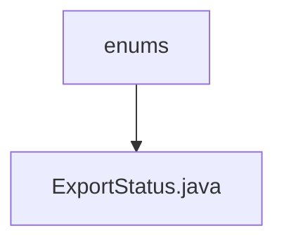

# Basic Information

|      |      |
|------|------|
| Name | enums |
| Language | .java |
| Code Path | WeFe/board/board-service/src/main/java/com/welab/wefe/board/service/fusion/enums |
| Package Name | docs.board.board-service.src.main.java.com.welab.wefe.board.service.fusion.enums |
| Brief Description | Export status enumeration: failure, success, exporting. |

# Description

This enumeration type defines three export states: failure indicates export failure, success indicates export success, and exporting indicates that the export is in progress. Each state has corresponding comments explaining its meaning.

### Package Internal Structure View

This flowchart illustrates the hierarchical relationship of enum classes in the WeFe project. The top-level node is the `enums` folder, which contains a specific enum class file `ExportStatus.java`. Such a structure is commonly used to organize enum definitions related to states and types within a project, ensuring code clarity and maintainability.

# File List

| Name   | Type  | Description |
|-------|------|-------------|
| [ExportStatus.java](ExportStatus.md) | file | Export status enumeration: failure, success, exporting. |

