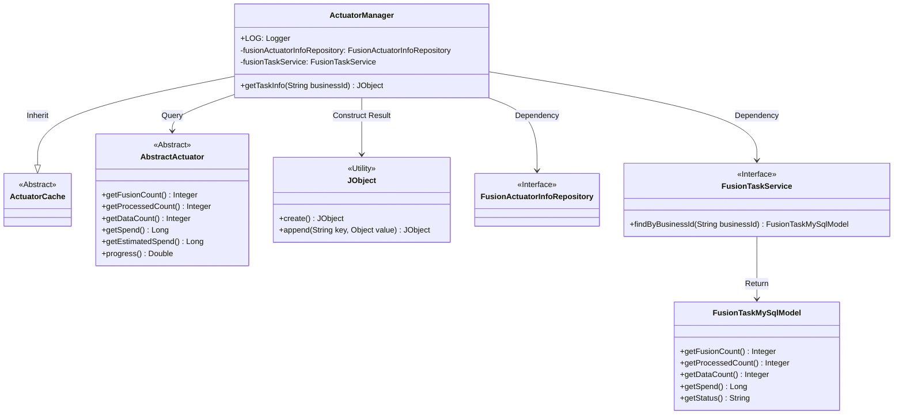
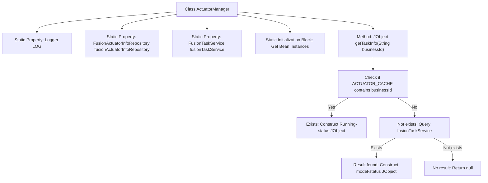

# Basic Information

|      |      |
|------|------|
| Name | ActuatorManager |
| Language | .java |
| Code Path | WeFe/board/board-service/src/main/java/com/welab/wefe/board/service/fusion/manager/ActuatorManager.java |
| Package Name | com.welab.wefe.board.service.fusion.manager |
| Dependencies | ['com.welab.wefe.board.service.database.entity.fusion.FusionActuatorInfoMySqlModel', 'com.welab.wefe.board.service.database.entity.fusion.FusionTaskMySqlModel', 'com.welab.wefe.board.service.database.repository.fusion.FusionActuatorInfoRepository', 'com.welab.wefe.board.service.fusion.actuator.ClientActuator', 'com.welab.wefe.board.service.fusion.actuator.psi.ServerActuator', 'com.welab.wefe.board.service.service.fusion.FusionTaskService', 'com.welab.wefe.common.exception.StatusCodeWithException', 'com.welab.wefe.common.util.JObject', 'com.welab.wefe.common.web.Launcher', 'com.welab.wefe.fusion.core.actuator.AbstractActuator', 'com.welab.wefe.fusion.core.actuator.ActuatorCache', 'org.slf4j.Logger', 'org.slf4j.LoggerFactory'] |
| Brief Description | The ActuatorManager class inherits from ActuatorCache and retrieves task information through the static method getTaskInfo. If the cache exists, it returns data of running tasks; otherwise, it queries the database to return task status and progress. |

# Description

The `ActuatorManager` class inherits from `ActuatorCache` and includes a static `Logger` along with two static member variables, `fusionActuatorInfoRepository` and `fusionTaskService`, initialized via `Launcher.CONTEXT`. It provides the `getTaskInfo` method to retrieve actuator information based on `businessId`: if the corresponding actuator exists in the cache, it returns a `JObject` containing the business ID, fusion count, processing count, data volume, time consumed, status, estimated time, and progress; if not, it queries the database and returns data in a similar structure. If neither exists, it returns `null`.

# Class Summary

| Name   | Type  | Description |
|-------|------|-------------|
| ActuatorManager | class | The ActuatorManager class inherits from ActuatorCache and retrieves task information through the static method getTaskInfo. If an actuator exists in the cache, it returns runtime status data; otherwise, it queries the database to return task status and progress. |

## Class ActuatorManager

|      |      |
|------|------|
| Access Modifier | public |
| Type | class |
| Name | ActuatorManager |
| Description | The ActuatorManager class inherits from ActuatorCache and retrieves task information through the static method getTaskInfo. If an actuator exists in the cache, it returns runtime status data; otherwise, it queries the database to return task status and progress. |

### UML Class Diagram

Class Diagram Description: ActuatorManager inherits from ActuatorCache and is responsible for managing actuator task information. It queries task models from the database via FusionTaskService or retrieves AbstractActuator instances from the cache, ultimately constructing task information in JObject format. The diagram illustrates core dependencies, including interactions with interfaces FusionTaskService and FusionActuatorInfoRepository, inheritance relationships, and the usage of utility class JObject.

### Internal Method Call Graph

Flowchart Description: This flowchart illustrates the structure of the ActuatorManager class and the main execution flow of the getTaskInfo method. The class contains a static logger and two Repository/Service components initialized via Spring context. The core method first checks whether the actuator with the specified business ID exists in the cache - if yes, it returns running status information; otherwise, it queries the database task records. If a record exists, it constructs task model information; if no record exists, it returns null. The diagram fully presents the method's branching logic and data flow path.

### Field List

| Name  | Type  | Description |
|-------|-------|------|
| fusionActuatorInfoRepository | FusionActuatorInfoRepository | Private Static Constant Fusion Executor Information Repository |
| LOG = LoggerFactory.getLogger(ActuatorManager.class) | Logger | Define the static log object LOG of the ActuatorManager class, created using LoggerFactory. |
| fusionTaskService | FusionTaskService | Private static immutable fused task service instance. |

### Method List

| Name  | Type  | Description |
|-------|-------|------|
| getTaskInfo | JObject | Method to obtain task information: Query task status, processing count, time consumption, and other data from cache or database based on businessId, returning a JSON object or null. |

