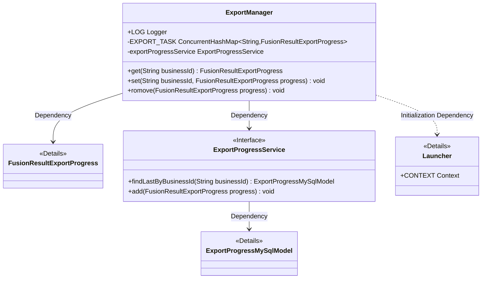
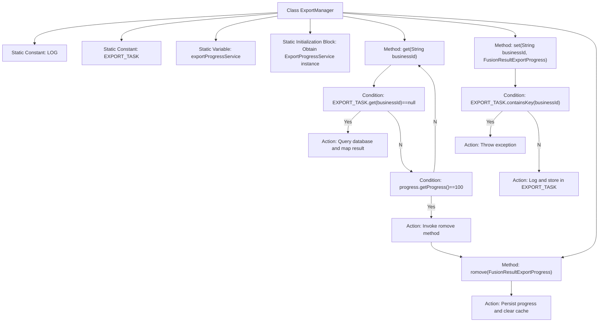

# Basic Information

|      |      |
|------|------|
| Name | ExportManager |
| Language | .java |
| Code Path | WeFe/board/board-service/src/main/java/com/welab/wefe/board/service/fusion/manager/ExportManager.java |
| Package Name | com.welab.wefe.board.service.fusion.manager |
| Dependencies | ['com.welab.wefe.board.service.database.entity.fusion.ExportProgressMySqlModel', 'com.welab.wefe.board.service.dto.fusion.FusionResultExportProgress', 'com.welab.wefe.board.service.service.fusion.ExportProgressService', 'com.welab.wefe.common.web.Launcher', 'com.welab.wefe.common.web.util.ModelMapper', 'org.slf4j.Logger', 'org.slf4j.LoggerFactory', 'java.util.concurrent.ConcurrentHashMap'] |
| Brief Description | The ExportManager class manages the progress of export tasks, using ConcurrentHashMap to store tasks. It supports retrieving, updating, and removing tasks, and automatically removes and saves completed tasks to the database. |

# Description

The `ExportManager` class is a utility class for managing export tasks, which uses `ConcurrentHashMap` to store the mapping between business IDs and export progress. It includes static methods `get`, `set`, and `romove`. The `get` method retrieves export progress based on a business ID, querying the database if the cache does not exist; the `set` method adds new tasks while preventing duplicate submissions; the `romove` method persists completed tasks to the database and removes them from the cache. During class initialization, an instance of `ExportProgressService` is obtained through the Spring context for database operations. Logging is handled by the Logger from `ActuatorManager`.

# Class Summary

| Name   | Type  | Description |
|-------|------|-------------|
| ExportManager | class | The `ExportManager` class manages the progress of export tasks, using `ConcurrentHashMap` to store tasks and providing methods for retrieval, setting, and removal. During retrieval, it checks the progress and removes the task if completed; during setting, it avoids duplicate tasks; during removal, it saves the progress and cleans up the cache. |

## Class ExportManager

|      |      |
|------|------|
| Access Modifier | public |
| Type | class |
| Name | ExportManager |
| Description | The `ExportManager` class manages the progress of export tasks, using `ConcurrentHashMap` to store tasks and providing methods for retrieval, setting, and removal. During retrieval, it checks the progress and removes the task if completed; during setting, it avoids duplicate tasks; during removal, it saves the progress and cleans up the cache. |

### UML Class Diagram

This code describes an export task manager ExportManager, which maintains the status of ongoing export tasks through ConcurrentHashMap and relies on the ExportProgressService interface for persistence operations. The class provides get/set/remove methods to manage task status, automatically removing and persisting records when task progress reaches 100%. The static initialization block obtains service instances via Launcher, with the entire design employing a dual mechanism of memory caching + database backup to ensure task status reliability.

### Internal Method Call Graph

This flowchart illustrates the core structure and logical flow of the ExportManager class. The class contains static constants and variable initialization, with service instances obtained through a static block. The main method get() implements cache query logic: querying the database when cache is absent, and triggering removal upon 100% progress; the set() method enforces duplicate submission validation; romove() clears cache after persistence. Arrows clearly express conditional judgments and operation invocations, fully presenting the business logic chain for export task management.

### Field List

| Name  | Type  | Description |
|-------|-------|------|
| exportProgressService | ExportProgressService | Private static constant export progress service instance. |
| EXPORT_TASK = new ConcurrentHashMap<>() | ConcurrentHashMap<String, FusionResultExportProgress> | Declare a thread-safe global static map with string keys and export progress object values. |
| LOG = LoggerFactory.getLogger(ActuatorManager.class) | Logger | Define the static log constant LOG for the ActuatorManager class, created using LoggerFactory. |

### Method List

| Name  | Type  | Description |
|-------|-------|------|
| get | FusionResultExportProgress | Query the export progress by business ID. If the cache does not exist, retrieve the data from the table and return it. Remove the cache when progress reaches 100%. |
| set | void | The static method `set` is used to set the export progress. If the business ID already exists, it throws an exception; otherwise, it logs and stores the progress. |
| romove | void | Remove export task: Add the progress object to the service and delete the corresponding business ID from the task list. |

