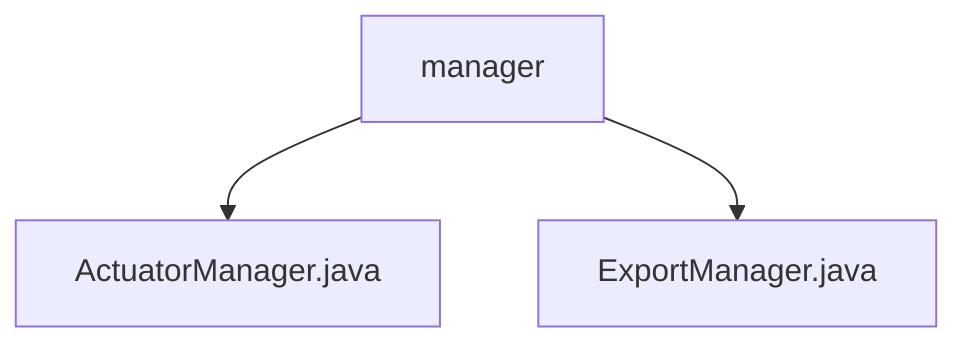

# Basic Information

|      |      |
|------|------|
| Name | manager |
| Language | .java |
| Code Path | WeFe/board/board-service/src/main/java/com/welab/wefe/board/service/fusion/manager |
| Package Name | docs.board.board-service.src.main.java.com.welab.wefe.board.service.fusion.manager |
| Brief Description | The ActuatorManager class inherits from ActuatorCache, retrieves actuator information via businessId, and returns a JObject after caching or database query. The ExportManager class manages export task progress, utilizes ConcurrentHashMap for caching, provides CRUD methods, and implements database persistence through ExportProgressService. |

# Description

## Overview  
The core responsibility of this module is to manage actuator status and export task progress, employing a cache-first strategy to enhance query efficiency. The interface specifications include: ActuatorManager provides the getTaskInfo method to return actuator information in JObject format; ExportManager manages export progress through get/set/remove methods. Key data structures consist of JObject (storing actuator status) and ConcurrentHashMap (maintaining export progress mapping). External dependencies involve database operations (obtaining Repository/Service instances via Spring context) and logging components (shared static Logger). For example, ActuatorManager prioritizes cache queries, while ExportManager uses memory mapping to avoid duplicate task submissions.  

## Primary Business Scenarios  
The module primarily handles two types of processes: actuator status tracking (similar to the observer pattern) and export task lifecycle management. Both interaction modes adopt a "cache-database" dual-layer validation, such as getTaskInfo checking memory first before querying the database. Typical applications include real-time retrieval of fusion task progress (covering 8 metrics like estimated duration) and export task deduplication control. API types encompass status queries (GET class) and task operations (SET class), with integration examples visible in data fusion dashboards and batch export functionalities.

### Package Internal Structure View

This flowchart illustrates the file structure of the fusion manager under the board-service module in the WeFe project. The parent node "manager" contains two Java class files: ActuatorManager.java and ExportManager.java, representing the actuator manager and export manager functional modules respectively. The entire structure presents the core file composition of the manager module in a concise and clear manner.

# File List

| Name   | Type  | Description |
|-------|------|-------------|
| [ActuatorManager.java](ActuatorManager.md) | file | The ActuatorManager class inherits from ActuatorCache and retrieves task information through the static method getTaskInfo. If the cache exists, it returns data of running tasks; otherwise, it queries the database to return the task status and progress. |
| [ExportManager.java](ExportManager.md) | file | The ExportManager class manages the progress of export tasks, uses ConcurrentHashMap to store tasks, supports retrieving, updating, and removing tasks, and automatically removes and saves completed tasks to the database. |

