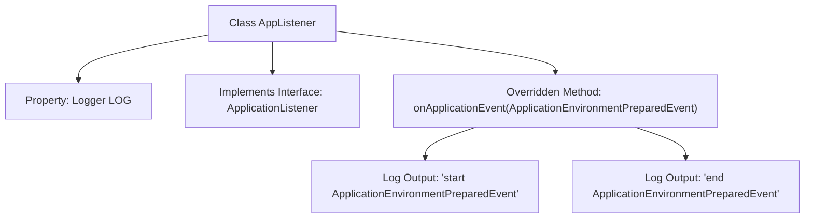

# Basic Information

|      |      |
|------|------|
| Name | AppListener |
| Language | .java |
| Code Path | WeFe/board/board-service/src/main/java/com/welab/wefe/board/service/listener/AppListener.java |
| Package Name | com.welab.wefe.board.service.listener |
| Dependencies | ['org.slf4j.Logger', 'org.slf4j.LoggerFactory', 'org.springframework.boot.context.event.ApplicationEnvironmentPreparedEvent', 'org.springframework.context.ApplicationListener', 'org.springframework.stereotype.Component'] |
| Brief Description | The Java class AppListener monitors application environment readiness events and logs the start and end timestamps. |

# Description

The content describes a Spring component class named AppListener, which implements the ApplicationListener interface to listen for ApplicationEnvironmentPreparedEvent events. The class includes a static logger for outputting log messages. When the event is triggered, the onApplicationEvent method is executed, logging messages at both the start and end of the event. The overall class structure is concise, focusing on listening for environment preparation events and logging functionality.

# Class Summary

| Name   | Type  | Description |
|-------|------|-------------|
| AppListener | class | The Java class AppListener monitors application environment readiness events and logs start and end timestamps. |


## Class AppListener

|      |      |
|------|------|
| Access Modifier | @Component;public |
| Type | class |
| Name | AppListener |
| Description | The Java class AppListener monitors application environment readiness events and logs start and end timestamps. |


### UML Class Diagram

```mermaid
classDiagram
    class ApplicationEnvironmentPreparedEvent {
        <<Event>>
    }

    class AppListener {
        -Logger LOG
        +onApplicationEvent(ApplicationEnvironmentPreparedEvent event) void
    }

    <<interface>> ApplicationListener~T~ {
        <<Interface>>
        +onApplicationEvent(T event) void
    }

    AppListener --> ApplicationListener~ApplicationEnvironmentPreparedEvent~ : implements
    AppListener --> ApplicationEnvironmentPreparedEvent : processes event
```

This class diagram illustrates the typical event listening mechanism in the Spring framework. The AppListener class implements the generic interface ApplicationListener<ApplicationEnvironmentPreparedEvent>, specifically designed to handle application environment preparation events. The listener receives event objects of type ApplicationEnvironmentPreparedEvent through the onApplicationEvent method and logs the start and end of event processing within the method body. The diagram clearly shows the interface implementation relationship (using hollow triangle arrows) and event processing dependency (using dashed arrows), conforming to the event handling pattern during Spring application startup phases.


### Internal Method Call Graph



This code demonstrates a Spring component class AppListener that implements the ApplicationListener interface to handle ApplicationEnvironmentPreparedEvent. The flowchart clearly depicts the class structure, including the logger property declaration, interface implementation relationship, and the two log output steps within the event handling method. When the environment preparation event is triggered, it sequentially records start and end logs to track the lifecycle of the application environment preparation phase.

### Field List

| Name  | Type  | Description |
|-------|-------|------|
| LOG = LoggerFactory.getLogger(AppListener.class) | Logger | Define a private static log constant LOG for the AppListener class. |

### Method List

| Name  | Type  | Description |
|-------|-------|------|
| onApplicationEvent | void | Java method overriding, handling application environment preparation events, logging start and end. |


