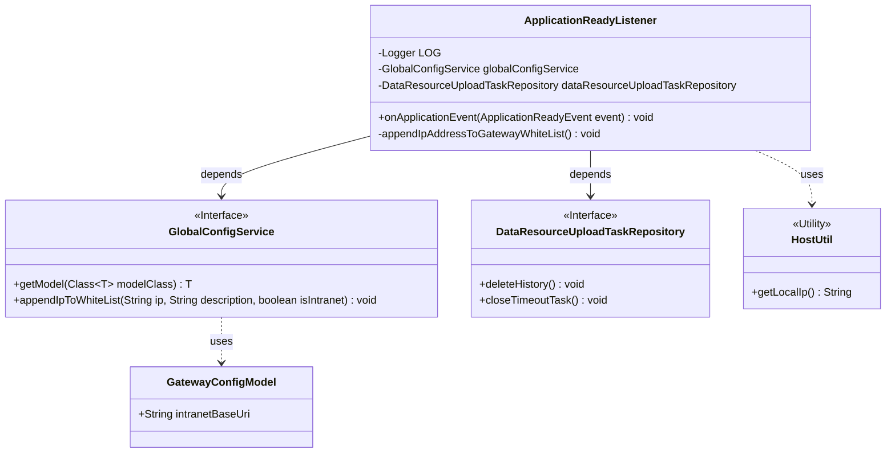
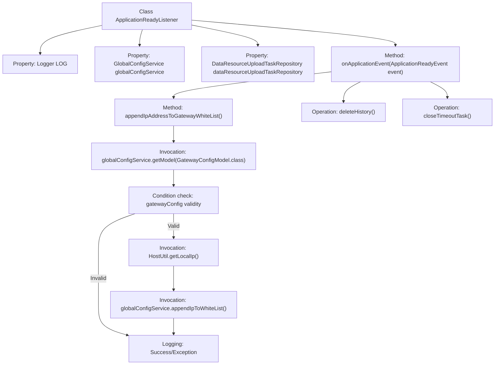

# Basic Information

|      |      |
|------|------|
| Name | ApplicationReadyListener |
| Language | .java |
| Code Path | WeFe/board/board-service/src/main/java/com/welab/wefe/board/service/listener/ApplicationReadyListener.java |
| Package Name | com.welab.wefe.board.service.listener |
| Dependencies | ['com.welab.wefe.board.service.database.repository.data_resource.DataResourceUploadTaskRepository', 'com.welab.wefe.board.service.service.globalconfig.GlobalConfigService', 'com.welab.wefe.common.util.HostUtil', 'com.welab.wefe.common.util.StringUtil', 'com.welab.wefe.common.wefe.dto.global_config.GatewayConfigModel', 'org.slf4j.Logger', 'org.slf4j.LoggerFactory', 'org.springframework.beans.factory.annotation.Autowired', 'org.springframework.boot.context.event.ApplicationReadyEvent', 'org.springframework.context.ApplicationListener', 'org.springframework.stereotype.Component'] |
| Brief Description | The ApplicationReadyListener monitors application startup events, executing tasks such as IP whitelist registration and historical data cleanup. It retrieves gateway configurations via globalConfigService, adds the local IP to the whitelist, and invokes dataResourceUploadTaskRepository to delete historical records and terminate timed-out tasks. |

# Description

The code defines a Spring component class `ApplicationReadyListener`, which is used to listen for application startup completion events. Its main functionalities include: 1. Retrieving gateway configurations via `globalConfigService` and adding the local intranet IP to the whitelist; 2. Deleting historical records and closing timed-out tasks through `dataResourceUploadTaskRepository`. If gateway configurations are missing, an error log will be recorded, and exceptions caught during the IP registration process will also be logged. The entire workflow involves configuration validation, IP retrieval, whitelist registration, and other steps.

# Class Summary

| Name   | Type  | Description |
|-------|------|-------------|
| ApplicationReadyListener | class | The ApplicationReadyListener monitors application startup events, executing tasks for IP whitelist registration and historical data cleanup. It invokes the globalConfigService to add internal network IPs to the gateway whitelist and utilizes the dataResourceUploadTaskRepository to delete historical records and terminate timed-out tasks. |

## Class ApplicationReadyListener

|      |      |
|------|------|
| Access Modifier | @Component;public |
| Type | class |
| Name | ApplicationReadyListener |
| Description | The ApplicationReadyListener monitors application startup events, executing tasks for IP whitelist registration and historical data cleanup. It invokes the globalConfigService to add internal network IPs to the gateway whitelist and utilizes the dataResourceUploadTaskRepository to delete historical records and terminate timed-out tasks. |

### UML Class Diagram

This code demonstrates a Spring Boot application startup listener `ApplicationReadyListener`, which performs two main operations when the application is ready: 1) Adds the current server IP to the gateway whitelist; 2) Cleans up historical records of data resource upload tasks. The listener relies on `GlobalConfigService` for gateway configuration management and whitelist operations, and depends on `DataResourceUploadTaskRepository` for task management. The code includes robust error handling and logging, retrieves the local IP address via the `HostUtil` utility class, and reflects attention to network configuration and resource cleanup.

### Internal Method Call Graph

Flowchart description: This flowchart illustrates the workflow of a Spring Boot application startup listener. Upon detecting an ApplicationReadyEvent, it first invokes the appendIpAddressToGatewayWhiteList() method to handle gateway whitelist IP registration, including retrieving gateway configuration, validating configuration effectiveness, obtaining local IP and registering it to the whitelist. Subsequently, it executes two data cleanup operations: deleteHistory() and closeTimeoutTask(). The entire process incorporates exception handling and logging mechanisms to ensure reliability of critical initialization operations during system startup.

### Field List

| Name  | Type  | Description |
|-------|-------|------|
| globalConfigService | GlobalConfigService | Use @Autowired to automatically inject an instance of GlobalConfigService. |
| LOG = LoggerFactory.getLogger(ApplicationReadyListener.class) | Logger | Define a static constant LOG, using LoggerFactory to obtain the logger instance for the ApplicationReadyListener class. |
| dataResourceUploadTaskRepository | DataResourceUploadTaskRepository | Automatically inject data resource upload task repository instance. |

### Method List

| Name  | Type  | Description |
|-------|-------|------|
| onApplicationEvent | void | Override the application startup event to perform adding IP to the gateway whitelist, deleting historical records, and terminating timeout tasks. |
| appendIpAddressToGatewayWhiteList | void | Method to add the local IP to the gateway whitelist. After checking the configuration, obtain the local IP and register it. If successful, log the event; if failed, report an error. |

