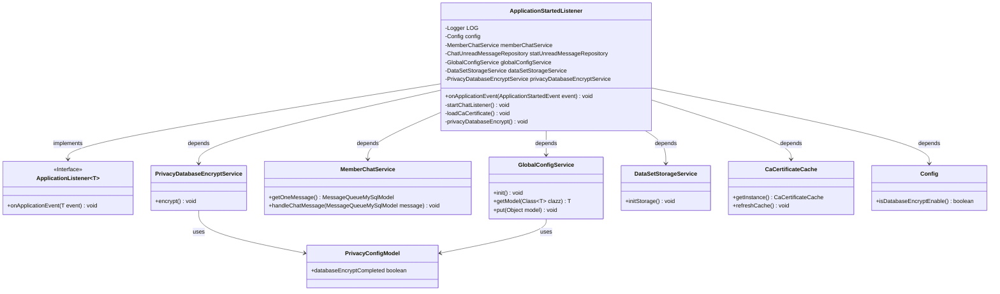

# Basic Information

|      |      |
|------|------|
| Name | ApplicationStartedListener |
| Language | .java |
| Code Path | WeFe/board/board-service/src/main/java/com/welab/wefe/board/service/listener/ApplicationStartedListener.java |
| Package Name | com.welab.wefe.board.service.listener |
| Dependencies | ['cn.hutool.core.thread.ThreadUtil', 'com.welab.wefe.board.service.cache.CaCertificateCache', 'com.welab.wefe.board.service.constant.Config', 'com.welab.wefe.board.service.database.entity.chat.MessageQueueMySqlModel', 'com.welab.wefe.board.service.database.repository.ChatUnreadMessageRepository', 'com.welab.wefe.board.service.service.DataSetStorageService', 'com.welab.wefe.board.service.service.MemberChatService', 'com.welab.wefe.board.service.service.PrivacyDatabaseEncryptService', 'com.welab.wefe.board.service.service.globalconfig.GlobalConfigService', 'com.welab.wefe.common.wefe.dto.global_config.PrivacyConfigModel', 'org.slf4j.Logger', 'org.slf4j.LoggerFactory', 'org.springframework.beans.factory.annotation.Autowired', 'org.springframework.boot.context.event.ApplicationStartedEvent', 'org.springframework.context.ApplicationListener', 'org.springframework.stereotype.Component', 'java.util.concurrent.TimeUnit'] |
| Brief Description | The application startup listener initializes global configurations, database encryption, and dataset storage, launches the chat monitoring thread, and loads CA certificates. Exception handling ensures stable system operation. |

# Description

This is a Spring application listener class designed to handle application startup events. It incorporates multiple auto-wired service components, such as global configuration service, dataset storage service, and privacy database encryption service. Key functionalities include initializing global configurations, activating database encryption, initializing data storage, loading CA certificates, and launching a chat message listener thread. The chat listener continuously retrieves and processes messages from the message queue. The privacy database encryption feature checks configuration status and performs encryption operations when necessary. All operations feature robust exception handling and logging mechanisms.

# Class Summary

| Name   | Type  | Description |
|-------|------|-------------|
| ApplicationStartedListener | class | Application startup listener, initializes global configurations, database encryption, and storage services, starts the chat message monitoring thread, and loads the CA certificate cache. |

## Class ApplicationStartedListener

|      |      |
|------|------|
| Access Modifier | @Component;public |
| Type | class |
| Name | ApplicationStartedListener |
| Description | Application startup listener, initializes global configurations, database encryption, and storage services, starts the chat message monitoring thread, and loads the CA certificate cache. |

### UML Class Diagram

This class diagram illustrates the ApplicationStartedListener class and its related dependencies. The class implements the ApplicationListener interface to monitor application startup events and executes multiple initialization tasks during startup, including global configuration initialization, privacy database encryption, and dataset storage initialization. It obtains instances of various services such as GlobalConfigService and MemberChatService through dependency injection, coordinating these services to complete critical operations during system startup. The diagram clearly shows implementation and dependency relationships between classes, as well as the invocation paths of key methods.

### Internal Method Call Graph

This code represents a Spring Boot application startup listener primarily handling initialization tasks during application launch. The flowchart illustrates class structure, property dependencies, and method invocation relationships, covering core processes such as global configuration initialization, privacy database encryption, dataset storage initialization, chat message listening, and CA certificate loading. The listener continuously processes chat messages via asynchronous threads and implements complete error handling mechanisms with system termination or logging upon exceptions, demonstrating a well-ordered resource initialization sequence.

### Field List

| Name  | Type  | Description |
|-------|-------|------|
| dataSetStorageService | DataSetStorageService | Use @Autowired to automatically inject an instance of DataSetStorageService. |
| statUnreadMessageRepository | ChatUnreadMessageRepository | Automatically inject the ChatUnreadMessageRepository instance into the statUnreadMessageRepository variable. |
| config | Config | Automatically inject configuration object instances. |
| privacyDatabaseEncryptService | PrivacyDatabaseEncryptService | Using @Autowired to automatically inject the PrivacyDatabaseEncryptService instance. |
| memberChatService | MemberChatService | Using @Autowired to automatically inject an instance of MemberChatService. |
| LOG = LoggerFactory.getLogger(ApplicationStartedListener.class) | Logger | Define a static constant LOG, using LoggerFactory to obtain the logger instance for the ApplicationStartedListener class. |
| globalConfigService | GlobalConfigService | Use @Autowired to automatically inject an instance of GlobalConfigService. |

### Method List

| Name  | Type  | Description |
|-------|-------|------|
| onApplicationEvent | void | Initialize global configurations, encrypt the private database, initialize dataset storage, start chat monitoring, and load CA certificates during application startup. Log any exceptions that occur. |
| startChatListener | void | Start the chat listener to asynchronously process chat messages in the message queue, sleep on exceptions, and log error messages. |
| loadCaCertificate | void | The method `loadCaCertificate` refreshes the CA certificate cache and logs the start and end events. |
| privacyDatabaseEncrypt | void | This method is used for encrypting privacy databases. It checks the configuration status: if encryption is completed but not enabled, it reports an error and exits; if encryption is not enabled or already completed, it returns. Otherwise, it performs encryption and updates the configuration status. In case of exceptions, it logs the error and exits. |

