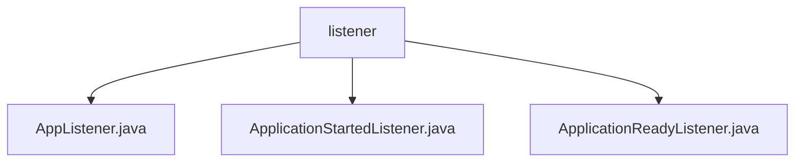

# Basic Information

|      |      |
|------|------|
| Name | listener |
| Language | .java |
| Code Path | WeFe/board/board-service/src/main/java/com/welab/wefe/board/service/listener |
| Package Name | docs.board.board-service.src.main.java.com.welab.wefe.board.service.listener |
| Brief Description | AppListener monitors environment preparation events and logs them. ApplicationStartedListener handles application startup, initializes configurations, encrypts databases, loads certificates, etc. ApplicationReadyListener manages gateway whitelists and cleanup tasks after the startup is completed. |

# Description

## Overview  
This module is a collection of Spring application listeners, with its core responsibilities being to handle critical application lifecycle events (environment preparation, startup, and readiness phases), execute initialization configurations, perform security checks, and manage resource cleanup. The interface specification adheres to Spring's ApplicationListener, uniformly listening for events of the ApplicationEvent subclass. Key data structures include global configurations, gateway whitelists, and task records. External dependencies involve the Spring framework, logging components, and database services. For example, the AppListener logs environment events, the ApplicationStartedListener initializes encryption services, and the ApplicationReadyListener manages IP whitelists.  

## Key Business Scenarios  
The module collaboratively handles the entire application startup process: during the environment preparation phase, it logs events (similar to an event bus pattern); during the startup phase, it loads CA certificates and initializes storage; and during the readiness phase, it maintains IP whitelists and cleanup tasks. The typical interaction pattern is event-driven, triggering cascading operations through listeners. Functional completeness is reflected in three aspects: configuration management, security encryption, and resource maintenance. The API type is Spring event callbacks, with integration examples including the startup and shutdown of database encryption services and the launch of message queue listener threads. For instance, the private database encryption service dynamically performs encryption operations based on configuration status.

### Package Internal Structure View

This flowchart illustrates the directory structure of the listener package under the board-service module in the WeFe project, which includes three Java listener files: AppListener, ApplicationStartedListener, and ApplicationReadyListener. All files reside at the same level, directly subordinate to the listener directory, clearly presenting the distribution of event listener components within this module.

# File List

| Name   | Type  | Description |
|-------|------|-------------|
| [AppListener.java](AppListener.md) | file | The Java class AppListener monitors application environment readiness events and logs the start and end timestamps. |
| [ApplicationStartedListener.java](ApplicationStartedListener.md) | file | Application startup listener, initializes global configurations, database encryption, dataset storage, starts the chat monitoring thread, and loads CA certificates. Exception handling ensures stable system operation. |
| [ApplicationReadyListener.java](ApplicationReadyListener.md) | file | The ApplicationReadyListener monitors application startup events, performing tasks such as IP whitelist registration and historical data cleanup. It retrieves gateway configurations via globalConfigService, adds the local IP to the whitelist, and invokes dataResourceUploadTaskRepository to delete historical records and terminate timed-out tasks. |

