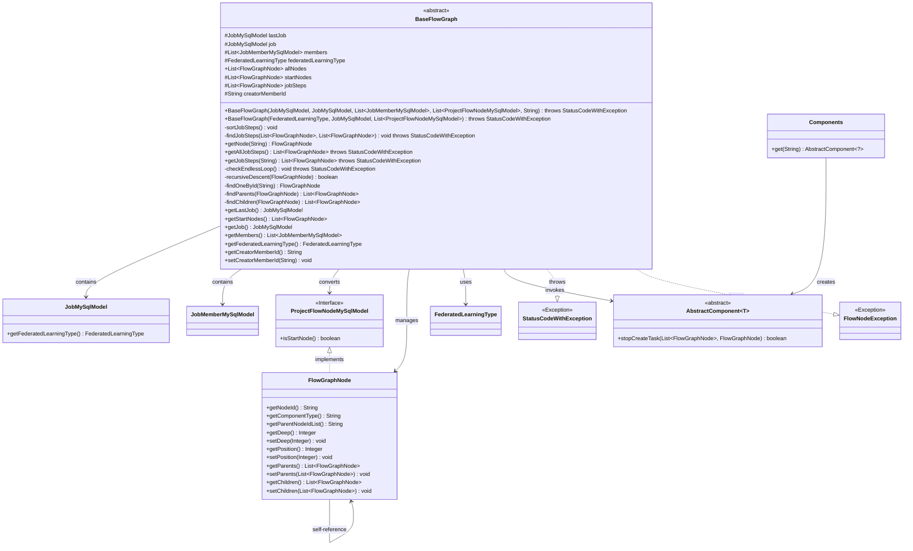

# Basic Information

|      |      |
|------|------|
| Name | BaseFlowGraph |
| Language | .java |
| Code Path | WeFe/board/board-service/src/main/java/com/welab/wefe/board/service/model/BaseFlowGraph.java |
| Package Name | com.welab.wefe.board.service.model |
| Dependencies | ['com.welab.wefe.board.service.component.Components', 'com.welab.wefe.board.service.component.base.AbstractComponent', 'com.welab.wefe.board.service.database.entity.job.JobMemberMySqlModel', 'com.welab.wefe.board.service.database.entity.job.JobMySqlModel', 'com.welab.wefe.board.service.database.entity.job.ProjectFlowNodeMySqlModel', 'com.welab.wefe.board.service.exception.FlowNodeException', 'com.welab.wefe.common.StatusCode', 'com.welab.wefe.common.exception.StatusCodeWithException', 'com.welab.wefe.common.util.StringUtil', 'com.welab.wefe.common.web.util.ModelMapper', 'com.welab.wefe.common.wefe.enums.FederatedLearningType', 'org.apache.commons.collections4.CollectionUtils', 'java.util.ArrayList', 'java.util.Comparator', 'java.util.List', 'java.util.stream.Collectors'] |
| Brief Description | BaseFlowGraph is an abstract base class designed to manage flow chart nodes, incorporating functionalities for node relationship processing, dead loop detection, and task node sorting. It supports retrieving execution path nodes and member information. |

# Description

BaseFlowGraph is an abstract base class designed to manage the flow graph structure in federated learning tasks. It includes core attributes such as the current task, previous task, member list, and federated learning type, as well as a collection of flow graph nodes, start nodes, and a list of execution nodes. This class initializes flow graph nodes through its constructor, handles parent-child relationships between nodes, checks for dead loops, and organizes the list of nodes to be executed. It provides methods for retrieving nodes and task execution paths, supports sorting nodes by depth and setting execution order. Additionally, it contains private logic for recursive cycle checks, searching for parent and child nodes, along with getter/setter methods for various attributes.

# Class Summary

| Name   | Type  | Description |
|-------|------|-------------|
| BaseFlowGraph | class | BaseFlowGraph is an abstract base class designed to manage flow chart nodes, incorporating functionalities such as node relationship processing, dead loop detection, and task execution path sorting. |

## Class BaseFlowGraph

|      |      |
|------|------|
| Access Modifier | public abstract |
| Type | class |
| Name | BaseFlowGraph |
| Description | BaseFlowGraph is an abstract base class designed to manage flow chart nodes, incorporating functionalities such as node relationship processing, dead loop detection, and task execution path sorting. |

### UML Class Diagram

This code defines an abstract class BaseFlowGraph for managing flow chart nodes in federated learning tasks. Its main functionalities include initializing flow nodes, checking cyclic dependencies, sorting execution steps, and retrieving node information. It associates with multiple model classes like JobMySqlModel and FlowGraphNode through composition, and uses the Components factory to obtain specific component implementations. Exception handling is achieved via StatusCodeWithException and FlowNodeException. The overall design demonstrates hierarchical management and execution path control capabilities for flow chart nodes.

### Internal Method Call Graph

```mermaid
graph TD
    A["Abstract Class BaseFlowGraph"]
    B["Property: JobMySqlModel lastJob"]
    C["Property: JobMySqlModel job"]
    D["Property: List<JobMemberMySqlModel> members"]
    E["Property: FederatedLearningType federatedLearningType"]
    F["Property: List<FlowGraphNode> allNodes"]
    G["Property: List<FlowGraphNode> startNodes"]
    H["Property: List<FlowGraphNode> jobSteps"]
    I["Property: String creatorMemberId"]
    J["Constructor: BaseFlowGraph(JobMySqlModel, JobMySqlModel, List<JobMemberMySqlModel>, List<ProjectFlowNodeMySqlModel>, String)"]
    K["Constructor: BaseFlowGraph(FederatedLearningType, JobMySqlModel, List<ProjectFlowNodeMySqlModel>)"]
    L["Private Method: sortJobSteps()"]
    M["Private Method: findJobSteps(List<FlowGraphNode>, List<FlowGraphNode>)"]
    N["Private Method: checkEndlessLoop()"]
    O["Private Method: recursiveDescent(FlowGraphNode)"]
    P["Private Method: findOneById(String)"]
    Q["Private Method: findParents(FlowGraphNode)"]
    R["Private Method: findChildren(FlowGraphNode)"]
    S["Public Method: getNode(String)"]
    T["Public Method: getAllJobSteps()"]
    U["Public Method: getJobSteps(String)"]
    V["Getter/Setter Methods"]

    A --> B
    A --> C
    A --> D
    A --> E
    A --> F
    A --> G
    A --> H
    A --> I
    A --> J
    A --> K
    K --> L
    K --> M
    K --> N
    N --> O
    K --> Q
    K --> R
    Q --> P
    R --> P
    A --> S
    A --> T
    A --> U
    A --> V
```

This flowchart illustrates the core structure and method invocation relationships of the BaseFlowGraph abstract class. The class contains 9 key properties and 2 constructors, where the primary constructor K initializes flow graph nodes and triggers core logic including node relationship processing and endless loop checking. Private methods L-M handle node sorting and execution path finding, N-O are used for endless loop detection, while Q-R manage parent-child node relationship lookup. Public methods S-U provide node query and execution path retrieval functionality. The overall design employs a recursive descent algorithm to process node topological relationships, ensuring the flow graph is cycle-free with valid execution paths.

### Field List

| Name  | Type  | Description |
|-------|-------|------|
| lastJob | JobMySqlModel | The last worked JobMySqlModel instance. |
| job | JobMySqlModel | Defined a protected JobMySqlModel type variable named job. |
| members | List<JobMemberMySqlModel> | Member list, storing objects of type JobMemberMySqlModel. |
| creatorMemberId | String | Protect the member variable creatorMemberId, of type String. |
| startNodes | List<FlowGraphNode> | List of protected FlowGraphNode types startNodes. |
| allNodes = new ArrayList<>() | List<FlowGraphNode> | Declare a List variable named allNodes to store elements of type FlowGraphNode, initialized as an empty ArrayList. |
| federatedLearningType | FederatedLearningType | The type variable `federatedLearningType`, used for federated learning types. |
| jobSteps = new ArrayList<>() | List<FlowGraphNode> | Defined a protected list variable jobSteps for storing objects of type FlowGraphNode. |

### Method List

| Name  | Type  | Description |
|-------|-------|------|
| getLastJob | JobMySqlModel | Get the MySQL model object of the most recent task. |
| recursiveDescent | boolean | Recursively check flowchart nodes for dead loops: Filter child nodes, if the depth of a child node is less than or equal to the parent node, it is identified as a dead loop; otherwise, update the child node's depth and recursively check, terminating when no child nodes remain. |
| sortJobSteps | void | The method `sortJobSteps` sorts the `jobSteps` by depth and assigns a sequence number to each node. |
| findChildren | List<FlowGraphNode> | Find all child nodes of a given node by filtering nodes whose parent node ID list includes the ID of that node. |
| findJobSteps | void | This method recursively traverses the process node graph, skips processed nodes, and determines whether to stop generating tasks based on component rules to avoid loops. If new tasks exist at the current level, it continues exploring nodes upward or downward. |
| checkEndlessLoop | void | Check if there is an infinite loop in the flowchart: report an error if the starting node has a parent node, and report an error if a loop is detected during recursive traversal of child nodes. |
| getJobSteps | List<FlowGraphNode> | Get the list of job steps, filtered by the end node ID. If the ID is invalid or lacks location information, an exception will be thrown. Returns all steps when no ID is provided. |
| findParents | List<FlowGraphNode> | Find all parent nodes of a node. Return null if there are no parent nodes; otherwise, retrieve and return the collection of parent nodes by searching through the ID list one by one. |
| getNode | FlowGraphNode | This method searches for and returns the node with the specified ID from the node collection through streaming operations, returning null if not found. |
| getStartNodes | List<FlowGraphNode> | Get the list of start nodes in the flowchart. |
| findOneById | FlowGraphNode | The method searches for and returns the node with the specified ID from the node list through stream processing, returning null if not found. |
| getAllJobSteps | List<FlowGraphNode> | Get all task steps. If no parameters are provided, call the parameterized method, which may throw an exception. |
| getJob | JobMySqlModel | Methods to obtain the current job object, returning an instance of JobMySqlModel type. |
| getMembers | List<JobMemberMySqlModel> | The method to obtain the member list returns a collection of type JobMemberMySqlModel. |
| getFederatedLearningType | FederatedLearningType | This is a Java method that returns an enum type object named federatedLearningType. |
| getCreatorMemberId | String | Methods to obtain the creator member ID, returns a string-type creatorMemberId. |
| setCreatorMemberId | void | The method to set the creator member ID assigns the parameter value to the class member variable `creatorMemberId`. |

