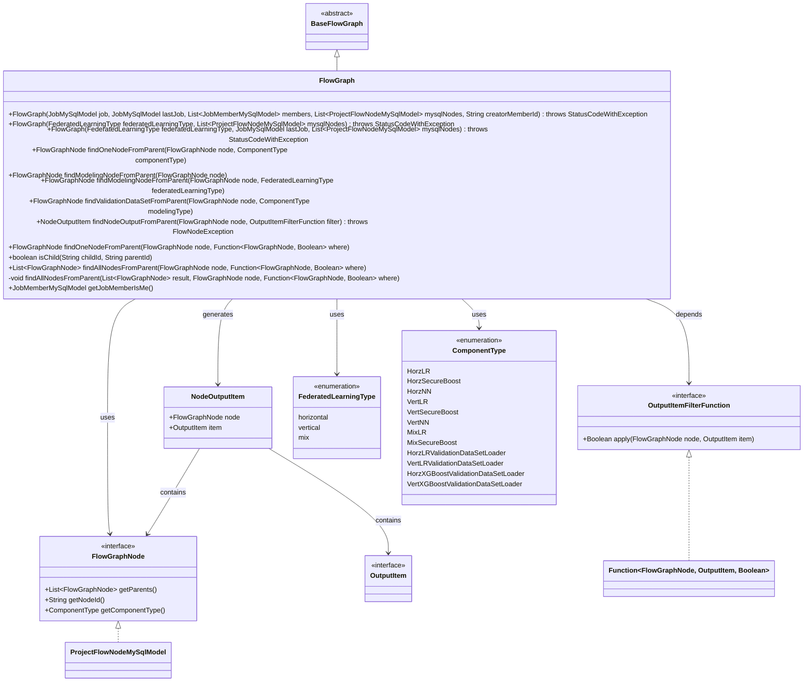

# Basic Information

|      |      |
|------|------|
| Name | FlowGraph |
| Language | .java |
| Code Path | WeFe/board/board-service/src/main/java/com/welab/wefe/board/service/model/FlowGraph.java |
| Package Name | com.welab.wefe.board.service.model |
| Dependencies | ['com.welab.wefe.board.service.component.base.filter.OutputItemFilterFunction', 'com.welab.wefe.board.service.component.base.io.NodeOutputItem', 'com.welab.wefe.board.service.component.base.io.OutputItem', 'com.welab.wefe.board.service.database.entity.job.JobMemberMySqlModel', 'com.welab.wefe.board.service.database.entity.job.JobMySqlModel', 'com.welab.wefe.board.service.database.entity.job.ProjectFlowNodeMySqlModel', 'com.welab.wefe.board.service.exception.FlowNodeException', 'com.welab.wefe.board.service.service.CacheObjects', 'com.welab.wefe.common.exception.StatusCodeWithException', 'com.welab.wefe.common.wefe.enums.ComponentType', 'com.welab.wefe.common.wefe.enums.FederatedLearningType', 'org.apache.commons.collections4.CollectionUtils', 'java.util.ArrayList', 'java.util.List', 'java.util.function.Function'] |
| Brief Description | The FlowGraph class inherits from BaseFlowGraph, providing multiple construction methods. It supports finding specific types of nodes from parent nodes, modeling nodes, validating datasets and output items, as well as supporting parent-child relationship judgment and member filtering functionality. |

# Description

The FlowGraph class inherits from BaseFlowGraph and provides multiple construction methods, supporting initialization based on tasks, members, and node lists. It includes node lookup functionalities: finding specific types of nodes from parent nodes, modeling nodes, validation dataset nodes, and output items that meet conditions. It supports determining parent-child node relationships, finding all parent nodes that satisfy conditions, and retrieving current user information from task member lists. The methods cover horizontal, vertical, and hybrid federated learning types, handling node lookup logic for different component types.

# Class Summary

| Name   | Type  | Description |
|-------|------|-------------|
| FlowGraph | class | The FlowGraph class inherits from BaseFlowGraph, providing multiple construction methods. It supports finding specific types of nodes from parent nodes, validating datasets and output items, and includes parent-child relationship determination and member filtering functionality. |

## Class FlowGraph

|      |      |
|------|------|
| Access Modifier | public |
| Type | class |
| Name | FlowGraph |
| Description | The FlowGraph class inherits from BaseFlowGraph, providing multiple construction methods. It supports finding specific types of nodes from parent nodes, validating datasets and output items, and includes parent-child relationship determination and member filtering functionality. |

### UML Class Diagram

This code describes a flowchart processing class `FlowGraph`, which inherits from the abstract base class `BaseFlowGraph` and is primarily used for handling node relationship queries in federated learning scenarios. The class diagram illustrates its core functionalities: initializing flowcharts through multiple constructors, providing node search methods (such as searching by component type, finding modeling nodes, validation dataset nodes, etc.), supporting output item filtering, and parent-child relationship validation. The enumeration types `FederatedLearningType` and `ComponentType` define federated learning types and component types, which, together with the `FlowGraphNode` interface, form the foundation for node operations. The overall design employs a recursive query pattern to handle node hierarchy relationships, making it suitable for managing complex federated learning workflows.

### Internal Method Call Graph

```mermaid
graph TD
    A["Class FlowGraph"]
    B["Inheritance: BaseFlowGraph"]
    C["Constructor: FlowGraph(JobMySqlModel, JobMySqlModel, List<JobMemberMySqlModel>, List<ProjectFlowNodeMySqlModel>, String)"]
    D["Constructor: FlowGraph(FederatedLearningType, List<ProjectFlowNodeMySqlModel>)"]
    E["Constructor: FlowGraph(FederatedLearningType, JobMySqlModel, List<ProjectFlowNodeMySqlModel>)"]
    F["Method: findOneNodeFromParent(FlowGraphNode, ComponentType)"]
    G["Method: findModelingNodeFromParent(FlowGraphNode)"]
    H["Method: findModelingNodeFromParent(FlowGraphNode, FederatedLearningType)"]
    I["Method: findValidationDataSetFromParent(FlowGraphNode, ComponentType)"]
    J["Method: findNodeOutputFromParent(FlowGraphNode, OutputItemFilterFunction)"]
    K["Method: findOneNodeFromParent(FlowGraphNode, Function<FlowGraphNode, Boolean>)"]
    L["Method: isChild(String, String)"]
    M["Method: findAllNodesFromParent(FlowGraphNode, Function<FlowGraphNode, Boolean>)"]
    N["Private Method: findAllNodesFromParent(List<FlowGraphNode>, FlowGraphNode, Function<FlowGraphNode, Boolean>)"]
    O["Method: getJobMemberIsMe()"]

    A --> B
    A --> C
    A --> D
    A --> E
    A --> F
    A --> G
    A --> H
    A --> I
    A --> J
    A --> K
    A --> L
    A --> M
    M --> N
    A --> O
```

The flowchart illustrates the structure of the FlowGraph class and its method invocation relationships. This class inherits from BaseFlowGraph and includes 3 constructors along with multiple functional methods for node retrieval. Key methods involve finding parent nodes by type (findModelingNodeFromParent), validation dataset nodes (findValidationDataSetFromParent), and output items (findNodeOutputFromParent). These methods implement node search functionality through recursion or conditional checks, supporting horizontal/vertical/hybrid federated learning types. The class also contains auxiliary methods for member information retrieval and parent-child relationship determination.

### Field List

| Name  | Type  | Description |
|-------|-------|------|

### Method List

| Name  | Type  | Description |
|-------|-------|------|
| isChild | boolean | The method `isChild` checks whether `childId` is a child node of `parentId` by searching for a parent node that matches `parentId`, returning a boolean result. |
| findAllNodesFromParent | void | Recursively search for parent nodes that meet the conditions and store the results in a list. If the parent node is empty, return; otherwise, traverse and check the conditions, then recursively process each parent node. |
| findOneNodeFromParent | FlowGraphNode | The method `findOneNodeFromParent` retrieves a node matching the specified component type by searching from the parent node, utilizing a conditional judgment function for evaluation. |
| findModelingNodeFromParent | FlowGraphNode | Locate the modeling nodes in the parent node based on the federated learning type. For horizontal types, search in sequence for HorzLR, HorzSecureBoost, and HorzNN. For vertical types, search for VertLR, VertSecureBoost, and VertNN. For hybrid types, search for MixLR, MixSecureBoost. |
| findModelingNodeFromParent | FlowGraphNode | The method findModelingNodeFromParent searches for a modeling node from the parent node by invoking the overloaded method with the federated learning type parameter passed in. |
| findValidationDataSetFromParent | FlowGraphNode | The method searches for the corresponding validation dataset loader node from the parent node based on the component type and returns null if no match is found. |
| findNodeOutputFromParent | NodeOutputItem | Search for output items in parent nodes that meet the filtering criteria, recursively traversing all parent nodes. Returns empty if no match is found. |
| findOneNodeFromParent | FlowGraphNode | Recursively find the first node that meets the condition from the given parent node, and return null if the parent node list is empty or no matching node is found. |
| findAllNodesFromParent | List<FlowGraphNode> | This method recursively searches for all child nodes that meet the specified conditions under a parent node and returns a result list. The parameters are the starting node and a condition function. |
| getJobMemberIsMe | JobMemberMySqlModel | This method filters the member list to retrieve the member object that matches the current user and role, returning null if none is found. |

