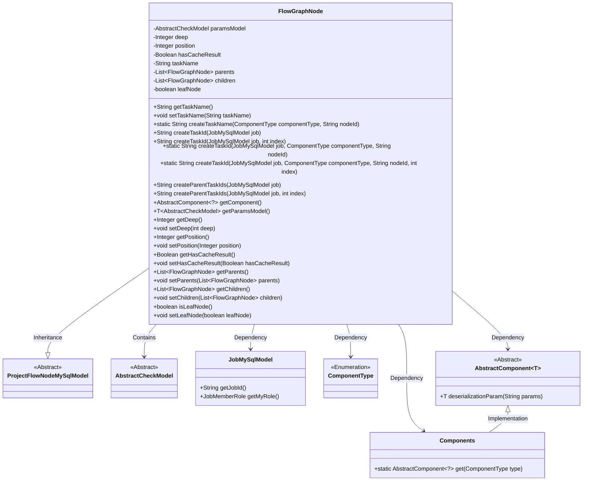

# Basic Information

|      |      |
|------|------|
| Name | FlowGraphNode |
| Language | .java |
| Code Path | WeFe/board/board-service/src/main/java/com/welab/wefe/board/service/model/FlowGraphNode.java |
| Package Name | com.welab.wefe.board.service.model |
| Dependencies | ['cn.hutool.core.collection.CollectionUtil', 'com.welab.wefe.board.service.component.Components', 'com.welab.wefe.board.service.component.base.AbstractComponent', 'com.welab.wefe.board.service.database.entity.job.JobMySqlModel', 'com.welab.wefe.board.service.database.entity.job.ProjectFlowNodeMySqlModel', 'com.welab.wefe.common.exception.StatusCodeWithException', 'com.welab.wefe.common.fieldvalidate.AbstractCheckModel', 'com.welab.wefe.common.wefe.enums.ComponentType', 'com.welab.wefe.common.wefe.enums.JobMemberRole', 'org.apache.commons.lang3.StringUtils', 'java.util.ArrayList', 'java.util.List', 'java.util.stream.Collectors'] |
| Brief Description | The FlowGraphNode class represents a node in a flow chart, containing attributes such as depth, position, and cached results. It supports parent-child node relationship management and provides task ID generation and parameter processing functionalities. |

# Description

The `FlowGraphNode` class inherits from `ProjectFlowNodeMySqlModel` and is used to represent nodes in a flow chart. Key attributes include the node parameter model `paramsModel`, depth `deep`, execution sequence number `position`, cached result flag `hasCacheResult`, task name `taskName`, parent node list `parents`, child node list `children`, and leaf node flag `leafNode`. It provides methods for generating task names and task IDs, supporting the creation of unique identifiers based on component types and node IDs. It also includes functionality to retrieve parent task ID lists, with special handling for arbitrator roles that have no parent nodes. The class manages node depth, position, cache status, and parent-child relationships through getter and setter methods, automatically marking a node as a leaf node when its child list is empty.

# Class Summary

| Name   | Type  | Description |
|-------|------|-------------|
| FlowGraphNode | class | The FlowGraphNode class represents a node in a flowchart, containing attributes such as parameter models, depth, position, cached results, task names, and parent/child nodes. It provides methods for generating task IDs, concatenating parent task IDs, and retrieving components. |

## Class FlowGraphNode

|      |      |
|------|------|
| Access Modifier | public |
| Type | class |
| Name | FlowGraphNode |
| Description | The FlowGraphNode class represents a node in a flowchart, containing attributes such as parameter models, depth, position, cached results, task names, and parent/child nodes. It provides methods for generating task IDs, concatenating parent task IDs, and retrieving components. |

### UML Class Diagram

This code describes a flowchart node class `FlowGraphNode`, which inherits from `ProjectFlowNodeMySqlModel` and represents a node in a workflow. The class includes attributes such as node depth, position, cached results, and lists of parent and child nodes. It provides methods for creating task IDs, parent task IDs, and can retrieve component objects and parameter models. The class is associated with several other classes, including `JobMySqlModel`, `ComponentType`, and `AbstractComponent`, forming a comprehensive workflow node management system.

### Internal Method Call Graph

```mermaid
graph TD
    A["Class FlowGraphNode"]
    B["Attribute: AbstractCheckModel paramsModel"]
    C["Attribute: Integer deep"]
    D["Attribute: Integer position"]
    E["Attribute: Boolean hasCacheResult"]
    F["Attribute: String taskName"]
    G["Attribute: List<FlowGraphNode> parents"]
    H["Attribute: List<FlowGraphNode> children"]
    I["Attribute: boolean leafNode"]
    J["Method: String getTaskName()"]
    K["Method: void setTaskName(String)"]
    L["Static Method: String createTaskName(ComponentType, String)"]
    M["Method: String createTaskId(JobMySqlModel)"]
    N["Method: String createTaskId(JobMySqlModel, int)"]
    O["Static Method: String createTaskId(JobMySqlModel, ComponentType, String)"]
    P["Static Method: String createTaskId(JobMySqlModel, ComponentType, String, int)"]
    Q["Method: String createParentTaskIds(JobMySqlModel)"]
    R["Method: String createParentTaskIds(JobMySqlModel, int)"]
    S["Method: AbstractComponent<?> getComponent()"]
    T["Method: <T> T getParamsModel()"]
    U["Getter/Setter Method Group"]

    A --> B
    A --> C
    A --> D
    A --> E
    A --> F
    A --> G
    A --> H
    A --> I
    A --> J
    A --> K
    A --> L
    A --> M
    A --> N
    A --> O
    A --> P
    A --> Q
    A --> R
    A --> S
    A --> T
    A --> U

    J -->|calls| L
    M -->|calls| O
    N -->|calls| P
    Q -->|calls| M
    R -->|calls| N
    T -->|depends on| S
```

This flowchart illustrates the complete structure of the FlowGraphNode class, comprising 9 core attributes and 12 primary methods. Inheriting from ProjectFlowNodeMySqlModel, its core functionalities include task name/ID generation, parent-child node management, and parameter model processing. Notably, it features multiple overloaded forms of task ID generation methods and a bidirectional linked list structure for handling parent-child node relationships. The flowchart clearly depicts method invocation relationships, such as getTaskName() calling createTaskName(), and the associations between various createTaskId methods. The attribute section fully displays critical state information including node depth, position, and cache status.

### Field List

| Name  | Type  | Description |
|-------|-------|------|
| leafNode = false | boolean | The boolean variable leafNode is initialized to false, indicating a non-leaf node. |
| taskName | String | Declare a private string variable taskName. |
| paramsModel | AbstractCheckModel | The private member variable `paramsModel`, of type `AbstractCheckModel`. |
| deep | Integer | Private integer variable deep |
| position | Integer | The private integer variable `position` is used to store location information. |
| children = new ArrayList<>() | List<FlowGraphNode> | Declare a private list variable children to store elements of type FlowGraphNode, initialized as an empty ArrayList. |
| parents = new ArrayList<>() | List<FlowGraphNode> | Define a private list variable named `parents`, which stores elements of type `FlowGraphNode`, initialized as an empty ArrayList. |
| hasCacheResult | Boolean | Private boolean variable indicating whether cached results exist. |

### Method List

| Name  | Type  | Description |
|-------|-------|------|
| getChildren | List<FlowGraphNode> | Get the list of child nodes. If depth and child nodes exist, update the child node depth. When child nodes are empty, initialize the list and return. |
| setChildren | void | Set the child node list, and mark it as a leaf node if empty. |
| isLeafNode | boolean | The method isLeafNode returns a boolean value leafNode, indicating whether it is a leaf node. |
| setLeafNode | void | Method to set whether a node is a leaf node, with a boolean parameter leafNode. |
| createParentTaskIds | String | Method to generate parent task ID: The arbiter role returns empty, while other roles collect parent task IDs and concatenate them with commas. |
| getComponent | AbstractComponent<?> | The method getComponent returns an abstract component instance obtained from Components via the parent class type. |
| createTaskId | String | Method for generating task ID: Combine task ID, role, and component type node ID. |
| createTaskId | String | This method generates a task ID based on the task model, component type, and node ID, and calls internal methods to achieve this. |
| getParents | List<FlowGraphNode> | Get the parent node list. If both depth and parent node exist, set the parent node depth to current depth minus 1; if the parent node is empty, initialize an empty list and return. |
| setDeep | void | This is a Java method used to set the value of the class member variable `deep`. The method is named `setDeep`, which takes an `int` type parameter `deep` and assigns it to the `deep` property of the current object. |
| createTaskId | String | Method for generating task ID: Combine task ID, role, component type, node ID, and index with underscores. |
| getDeep | Integer | Get the integer value of deep. |
| createParentTaskIds | String | The method `createParentTaskIds` generates a parent task ID string based on the task role. If the role is arbiter and there are no special circumstances (such as serial horizontal modeling), it returns an empty string; otherwise, it returns a comma-separated string concatenated from all parent task IDs. |
| getPosition | Integer | Methods to obtain position information, returns an integer value `position`. |
| getHasCacheResult | Boolean | The method returns a boolean value hasCacheResult, indicating whether there is a cached result. |
| createTaskName | String | This method generates task names based on component type and node ID, in the format of "ComponentType_NodeID". |
| getParamsModel | T | This method returns the generic parameter model. If paramsModel is not null, it returns directly; otherwise, it creates the model by deserializing parameters from the component, returning null on failure or the model instance on success. |
| getTaskName | String | The method `getTaskName` checks if `taskName` is empty; if it is, it calls `createTaskName` to generate a new name and returns it. |
| createTaskId | String | The method `createTaskId` generates a task ID based on the task model, component type, node ID, and index by invoking an internal overloaded method. |
| setPosition | void | Set the position properties of the object. The parameters are integer values. |
| setHasCacheResult | void | Method for setting the cache result flag, with a boolean parameter. |
| setParents | void | The method to set the parent node list assigns the input parameter `parents` to the `parents` property of the current object. |
| setTaskName | void | The method `setTaskName` is used to set the task name, assigning the passed `taskName` to the `taskName` property of the current object. |

