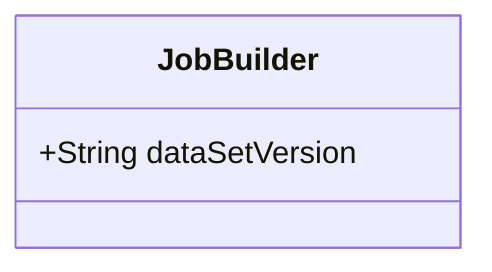
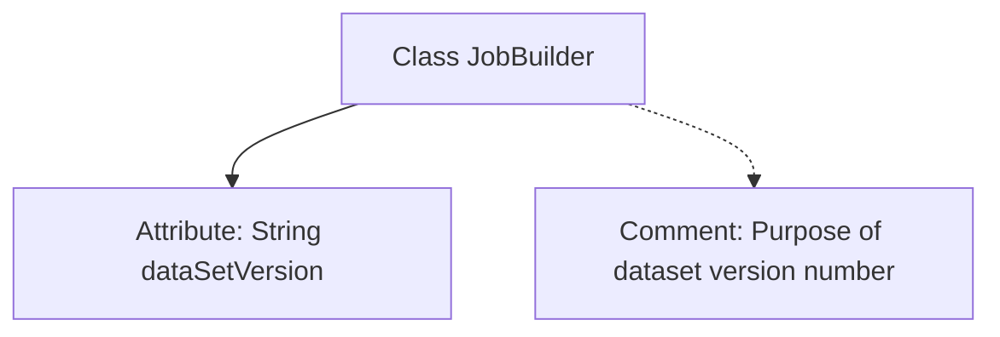

# Basic Information

|      |      |
|------|------|
| Name | JobBuilder |
| Language | .java |
| Code Path | WeFe/board/board-service/src/main/java/com/welab/wefe/board/service/model/JobBuilder.java |
| Package Name | com.welab.wefe.board.service.model |
| Dependencies | [] |
| Brief Description | The JobBuilder class includes a dataSetVersion field, which is used to mark the version number of the image dataset, helping the visual fl service reduce download frequency. |

# Description

The JobBuilder class contains a string-type field named dataSetVersion, which is used to store the version number of the dataset. This version number is primarily utilized for image datasets. By tagging the version number, the visual fl service can reduce the frequency of downloading image datasets based on the version number, thereby optimizing performance.

# Class Summary

| Name   | Type  | Description |
|-------|------|-------------|
| JobBuilder | class | The JobBuilder class includes a dataSetVersion field, which is used to mark the version number of the image dataset and optimize download counts. |

## Class JobBuilder

|      |      |
|------|------|
| Access Modifier | public |
| Type | class |
| Name | JobBuilder |
| Description | The JobBuilder class includes a dataSetVersion field, which is used to mark the version number of the image dataset and optimize download counts. |

### UML Class Diagram

This code defines a simple JobBuilder class containing a public string-type member variable `dataSetVersion`. The variable is used to store the version number of a dataset, primarily applied in image dataset scenarios. Version tagging helps the visual fl service optimize download counts for image datasets. The class diagram displays the only public attribute of JobBuilder without defining any methods, representing a basic data-carrying class.

### Internal Method Call Graph

This flowchart illustrates the core structure of the JobBuilder class, which includes a string-type attribute `dataSetVersion` and its explanatory comment. The comment explicitly states that this version number is used for image datasets, optimizing the download efficiency of visual FL services through version tagging. The class structure is concise, containing only one public attribute and related documentation, primarily used to mark dataset versions to reduce redundant downloads.

### Field List

| Name  | Type  | Description |
|-------|-------|------|
| dataSetVersion | String | Dataset version string variable. |

### Method List

| Name  | Type  | Description |
|-------|-------|------|

