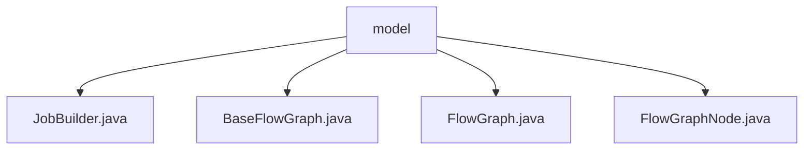

# Basic Information

|      |      |
|------|------|
| Name | model |
| Language | .java |
| Code Path | WeFe/board/board-service/src/main/java/com/welab/wefe/board/service/model |
| Package Name | docs.board.board-service.src.main.java.com.welab.wefe.board.service.model |
| Brief Description | The JobBuilder class includes a dataSetVersion field to mark the image dataset version, optimizing download performance. BaseFlowGraph is an abstract base class for managing federated learning flow graphs, containing core attributes and methods such as tasks and nodes. FlowGraph inherits from BaseFlowGraph, supporting multiple initialization and node lookup functionalities. FlowGraphNode represents a flow graph node, containing attributes like depth and parent-child nodes, as well as task generation methods. |

# Description

## Overview  
The core responsibility of this module is to construct and manage the flowchart structure of federated learning tasks, supporting multi-version dataset processing and node relationship management. The interface specifications include flowchart initialization, node lookup, parent-child relationship handling, and execution order setup, resembling a workflow engine pattern. Key data structures include the dataset version number in JobBuilder, task attributes and node collections in BaseFlowGraph, and properties such as depth/position/parent-child relationships in FlowGraphNode. External dependencies involve federated learning task models and database entity classes. For example, JobBuilder optimizes image dataset downloads via dataSetVersion, while FlowGraphNode generates unique task identifiers through taskName.

## Primary Business Scenarios  
The module supports flowchart construction for horizontal/vertical/hybrid federated learning. Typical scenarios include: initializing task nodes and checking cyclic dependencies (e.g., recursive checks in BaseFlowGraph), executing nodes sorted by depth (e.g., findNodesByType in FlowGraph), and dynamically retrieving parent node data (e.g., getParentTaskIds in FlowGraphNode). Interaction modes cover APIs such as fetching user information from member lists and locating modeling/validation nodes, e.g., FlowGraph can identify specific types of parent nodes. Functional completeness is reflected in handling edge cases like arbiter role processing and automatic leaf node tagging.

### Package Internal Structure View

This flowchart illustrates the hierarchical structure of the model directory under the board-service module in the WeFe project. The model serves as the root node and contains four Java class files: JobBuilder, BaseFlowGraph, FlowGraph, and FlowGraphNode. These class files reside at the same level without further subdirectory nesting, reflecting the peer relationship among the core components of the model layer.

# File List

| Name   | Type  | Description |
|-------|------|-------------|
| [JobBuilder.java](JobBuilder.md) | file | The JobBuilder class includes a dataSetVersion field, which is used to mark the version number of the image dataset, helping the visual fl service reduce download frequency. |
| [BaseFlowGraph.java](BaseFlowGraph.md) | file | BaseFlowGraph is an abstract base class designed to manage flowchart nodes, incorporating functionalities for handling node relationships, dead-loop detection, and task node sequencing. It supports retrieving execution path nodes and member information. |
| [FlowGraph.java](FlowGraph.md) | file | The FlowGraph class inherits from BaseFlowGraph, providing multiple construction methods. It supports finding specific types of nodes from parent nodes, modeling nodes, validating datasets and output items, as well as supporting parent-child relationship determination and member filtering functionality. |
| [FlowGraphNode.java](FlowGraphNode.md) | file | The FlowGraphNode class represents a node in a flow chart, containing attributes such as depth, position, and cached results. It supports parent-child node relationship management and provides task ID generation and parameter processing functionality. |

