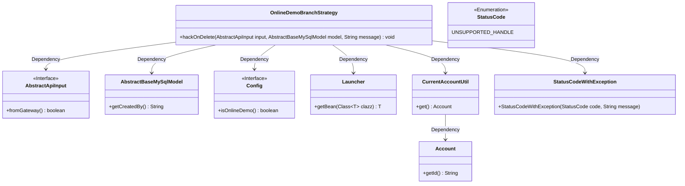
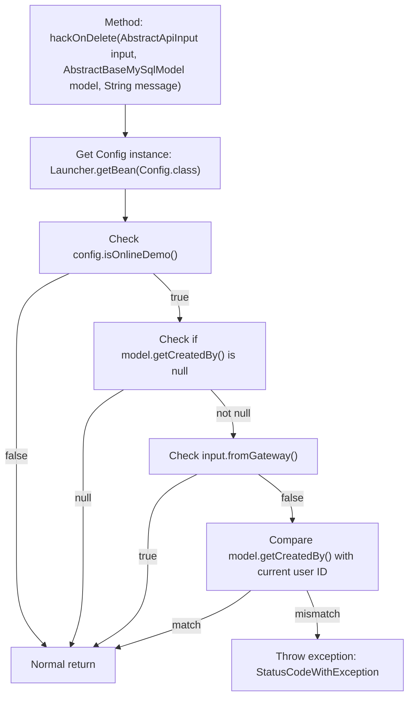

# Basic Information

|      |      |
|------|------|
| Name | OnlineDemoBranchStrategy |
| Language | .java |
| Code Path | WeFe/board/board-service/src/main/java/com/welab/wefe/board/service/onlinedemo/OnlineDemoBranchStrategy.java |
| Package Name | com.welab.wefe.board.service.onlinedemo |
| Dependencies | ['com.welab.wefe.board.service.constant.Config', 'com.welab.wefe.board.service.database.entity.base.AbstractBaseMySqlModel', 'com.welab.wefe.common.StatusCode', 'com.welab.wefe.common.exception.StatusCodeWithException', 'com.welab.wefe.common.util.StringUtil', 'com.welab.wefe.common.web.Launcher', 'com.welab.wefe.common.web.dto.AbstractApiInput', 'com.welab.wefe.common.web.util.CurrentAccountUtil'] |
| Brief Description | The OnlineDemoBranchStrategy class prevents accidental data deletion in the online demo environment, allowing only the creator to delete and requiring non-gateway requests. |

# Description

The `hackOnDelete` method in the `OnlineDemoBranchStrategy` class is used to control data deletion permissions in the online demo environment. The method first checks whether it is in online demo mode; if not, it returns directly. Then it verifies whether the data creator field is empty or the request comes from a gateway, returning if either condition is met. The core logic checks whether the current user ID matches the data creator ID; if not, it throws a `StatusCodeWithException` to prevent the deletion. Through multi-layer conditional validation, this method ensures only the data creator can delete corresponding data.

# Class Summary

| Name   | Type  | Description |
|-------|------|-------------|
| OnlineDemoBranchStrategy | class | The `hackOnDelete` method in the `OnlineDemoBranchStrategy` class checks data deletion permissions in online demo mode, only allowing the creator to delete data, otherwise throwing an exception. |

## Class OnlineDemoBranchStrategy

|      |      |
|------|------|
| Access Modifier | public |
| Type | class |
| Name | OnlineDemoBranchStrategy |
| Description | The `hackOnDelete` method in the `OnlineDemoBranchStrategy` class checks data deletion permissions in online demo mode, only allowing the creator to delete data, otherwise throwing an exception. |

### UML Class Diagram

This code defines an `OnlineDemoBranchStrategy` class containing a static method `hackOnDelete`, which checks data deletion permissions in an online demo environment. The method determines whether it's in demo mode via `Config`, verifies if the data creator matches the current user, and checks the request source through `AbstractApiInput`. The class diagram clearly illustrates dependencies with components such as the `AbstractApiInput` interface, base class `AbstractBaseMySqlModel`, configuration class `Config`, and the exception handling flow. The core logic involves 5 conditional checks, potentially throwing a `StatusCodeWithException` as the final outcome.

### Internal Method Call Graph

This code flowchart illustrates the complete execution logic of the hackOnDelete method in the OnlineDemoBranchStrategy class. The method first retrieves system configuration, then sequentially checks three conditions: whether it's in online demo mode, whether the model creator is null, and whether the request comes from a gateway. Only when the first two conditions are true and the third is false will it compare the model creator with the current user ID, throwing an exception if they don't match. This multi-layered conditional judgment implements fine-grained permission control for delete operations, ensuring data security in the online demo environment.

### Field List

| Name  | Type  | Description |
|-------|-------|------|

### Method List

| Name  | Type  | Description |
|-------|-------|------|
| hackOnDelete | void | The static method `hackOnDelete` checks the online demo environment, data creator, and request source. If the current user is not the data creator, it throws an exception to prevent deletion. |

