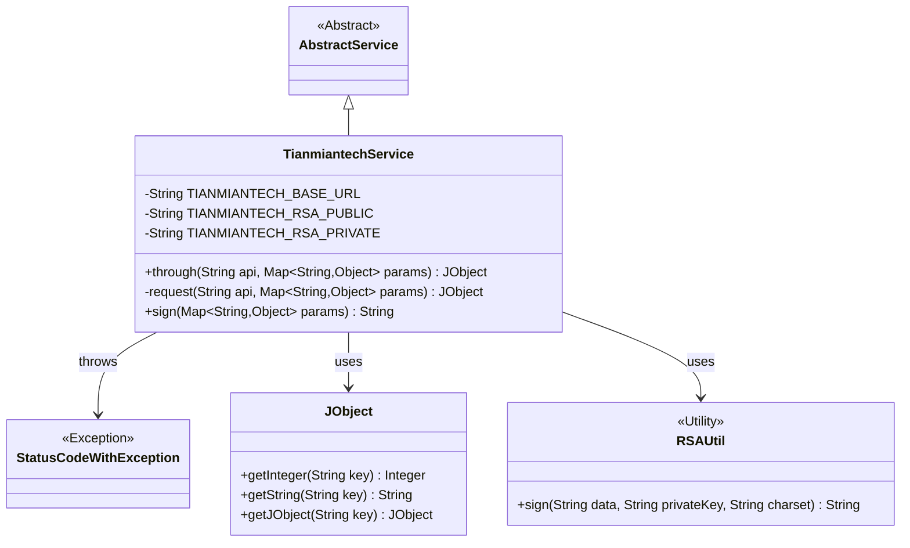
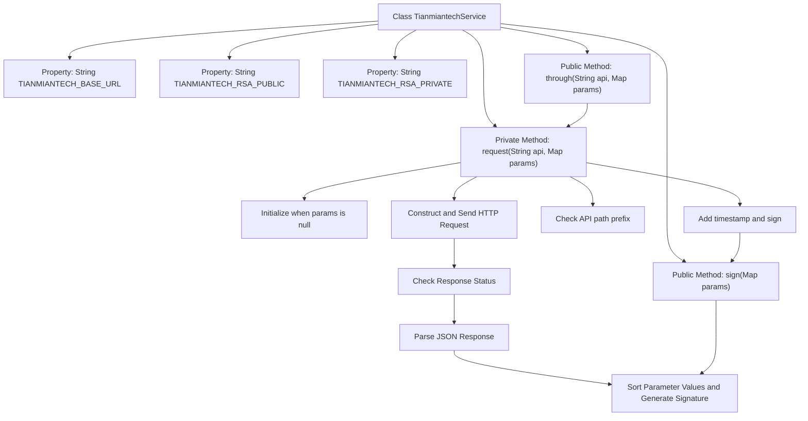

# Basic Information

|      |      |
|------|------|
| Name | TianmiantechService |
| Language | .java |
| Code Path | WeFe/board/board-service/src/main/java/com/welab/wefe/board/service/onlinedemo/TianmiantechService.java |
| Package Name | com.welab.wefe.board.service.onlinedemo |
| Dependencies | ['com.alibaba.fastjson.JSON', 'com.alibaba.fastjson.JSONException', 'com.welab.wefe.board.service.service.AbstractService', 'com.welab.wefe.common.StatusCode', 'com.welab.wefe.common.exception.StatusCodeWithException', 'com.welab.wefe.common.http.HttpRequest', 'com.welab.wefe.common.http.HttpResponse', 'com.welab.wefe.common.util.JObject', 'com.welab.wefe.common.util.RSAUtil', 'org.springframework.beans.factory.annotation.Value', 'org.springframework.stereotype.Service', 'java.util.Arrays', 'java.util.List', 'java.util.Map', 'java.util.stream.Collectors'] |
| Brief Description | Tianmian Technology Service Class, inherits from AbstractService, provides request interfaces and signature functionality by configuring the API base URL and RSA keys. The request method handles parameter signing, exceptions, and response data. |

# Description

This service class is used to call the Tianmian Technology API interface and inherits from the abstract service class. It includes three configuration properties: base URL, RSA public key, and private key. It provides two core methods: the `through` method serves as the public interface, while the `request` method handles the actual request. The request process involves adding a timestamp, generating a signature, concatenating the URL, sending a POST request, and processing the response. The response must verify that the status code is 200; otherwise, an exception is thrown. The `sign` method implements RSA signing by sorting parameter values, concatenating them into a string, and signing with the private key. Exception handling covers network request failures and response data parsing errors.

# Class Summary

| Name   | Type  | Description |
|-------|------|-------------|
| TianmiantechService | class | Tianmian Technology Services provide API calling functionality, including RSA signature and request processing, with support for parameter validation and exception handling. |

## Class TianmiantechService

|      |      |
|------|------|
| Access Modifier | @Service;public |
| Type | class |
| Name | TianmiantechService |
| Description | Tianmian Technology Services provide API calling functionality, including RSA signature and request processing, with support for parameter validation and exception handling. |

### UML Class Diagram

This code demonstrates a service class named TianmiantechService, which inherits from AbstractService and is primarily used for interacting with Tianmian Tech's APIs. The class contains three private configuration parameters (API base URL, RSA public and private keys), provides the `through` method as a public interface, internally handles HTTP requests via the `request` method, and generates RSA signatures using the `sign` method. When API calls fail, it throws a `StatusCodeWithException` exception, and returned data is encapsulated using `JObject`. The class relies on the `RSAUtil` utility class for signing operations, collectively implementing secure third-party API calls and data parsing functionality.

### Internal Method Call Graph

This flowchart illustrates the core structure and request processing flow of the TianmiantechService class. The class contains 3 configuration properties and 3 main methods, where through() serves as the public entry point, internally invoking the request() method to complete request processing. The request flow includes key steps such as parameter initialization, signature generation, API path processing, HTTP request sending, response parsing, and status verification. The sign() method is responsible for sorting parameter values and generating signatures with RSA private keys, forming the core security verification component. All exceptions are uniformly handled through StatusCodeWithException to ensure consistent error handling.

### Field List

| Name  | Type  | Description |
|-------|-------|------|
| TIANMIANTECH_RSA_PRIVATE | String | The code defines a private string variable TIANMIANTECH_RSA_PRIVATE, whose value is injected from the configuration item tianmiantech.rsa.private via Spring's @Value annotation, with a default value of empty. |
| TIANMIANTECH_BASE_URL | String | The code defines a private string variable TIANMIANTECH_BASE_URL, whose value is injected via the @Value annotation from the configuration item tianmiantech.api.base-url, with a default value of empty. |
| TIANMIANTECH_RSA_PUBLIC | String | The code defines a private string variable TIANMIANTECH_RSA_PUBLIC, which retrieves the RSA public key from configuration via the @Value annotation, with an empty string as the default value. |

### Method List

| Name  | Type  | Description |
|-------|-------|------|
| through | JObject | The Java method `through` calls `request`, passing in the API and parameters, and may throw the `StatusCodeWithException` exception. |
| request | JObject | The private method `request` sends an HTTP request to the specified API, automatically adding a timestamp and signature. It validates the response status and JSON format, returning the `data` field upon success or throwing an exception upon failure. |
| sign | String | The method sorts the Map parameter values and concatenates them into a string, then signs it using an RSA private key, throwing an error if an exception occurs. |

