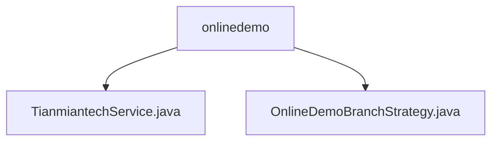

# Basic Information

|      |      |
|------|------|
| Name | onlinedemo |
| Language | .java |
| Code Path | WeFe/board/board-service/src/main/java/com/welab/wefe/board/service/onlinedemo |
| Package Name | docs.board.board-service.src.main.java.com.welab.wefe.board.service.onlinedemo |
| Brief Description | Tianmian Tech service class inherits from an abstract class, containing URL and RSA key configurations, providing `through` and `request` methods to handle signed requests. The `hackOnDelete` method in `OnlineDemoBranchStrategy` verifies user permissions during online demos, allowing only creators to delete data. |

# Description

## Overview  
The core responsibility of this module is to integrate the API calls of Tianmian Technology and manage data security in the online demo environment. The interface specifications include the RSA signature mechanism (e.g., signing parameters with a private key after sorting) and HTTP request processing (e.g., verifying the 200 status code). Key data structures involve API configuration attributes (base URL, RSA key pairs) and permission validation fields (user ID, creator ID). External dependencies include the Tianmian Technology API and RSA encryption libraries. For example, the `sign` method implements parameter signing, while the `through` method serves as the service entry point.

## Primary Business Scenarios  
The module primarily handles two types of processes: API call chains (similar to a gateway proxy pattern, involving signature generation → request sending → response validation) and demo environment permission control (similar to a sandbox mechanism). Typical interactions include multi-layered conditional validation for data deletion permissions (e.g., the `hackOnDelete` method verifies user identity) and handling network request exceptions (e.g., response parsing errors). Integration cases cover external API calls (e.g., POST requests with RSA signatures) and internal security policies (e.g., preventing non-creators from deleting data).

### Package Internal Structure View

This flowchart illustrates the hierarchical structure of the onlinedemo package under the board-service module in the WeFe project. The parent node onlinedemo contains two child nodes: TianmiantechService.java and OnlineDemoBranchStrategy.java, which are Java class files. The entire structure clearly demonstrates the dependency relationship between the service class and strategy class related to the online demo functionality.

# File List

| Name   | Type  | Description |
|-------|------|-------------|
| [TianmiantechService.java](TianmiantechService.md) | file | Tianmian Technology Service class, inheriting AbstractService, provides request interfaces and signature functionality by configuring the API base URL and RSA keys. The request method handles parameter signing, exceptions, and response data. |
| [OnlineDemoBranchStrategy.java](OnlineDemoBranchStrategy.md) | file | The OnlineDemoBranchStrategy class prevents accidental data deletion in the online demo environment, allowing only the creator to delete and requiring non-gateway requests. |

