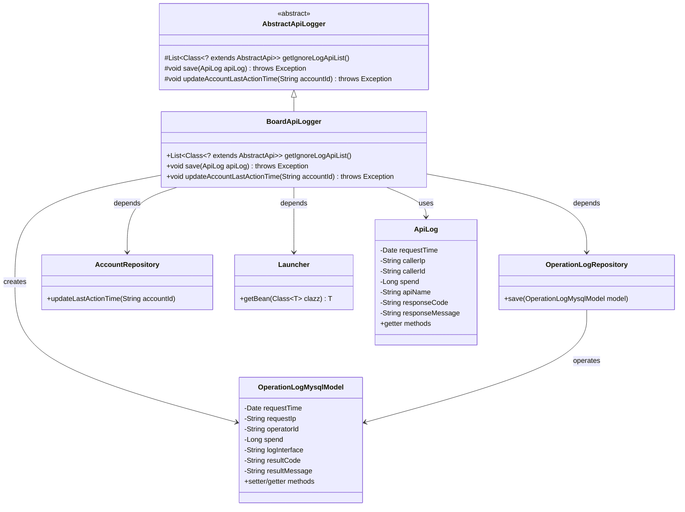
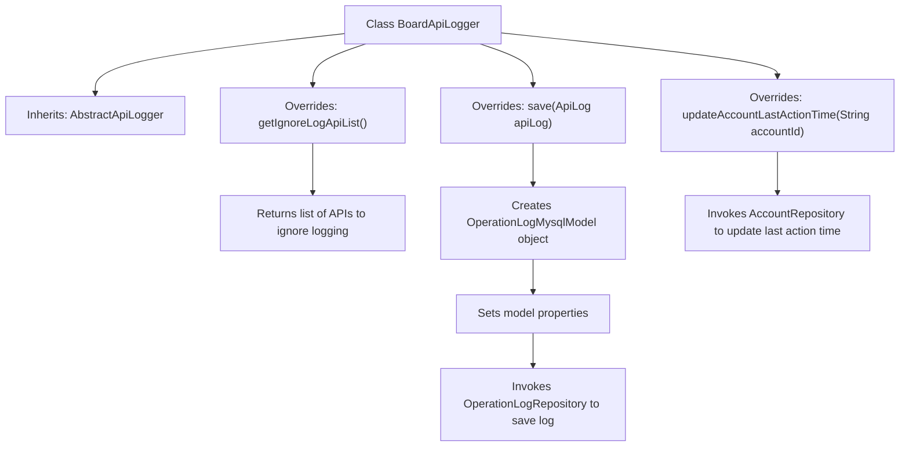

# Basic Information

|      |      |
|------|------|
| Name | BoardApiLogger |
| Language | .java |
| Code Path | WeFe/board/board-service/src/main/java/com/welab/wefe/board/service/operation/BoardApiLogger.java |
| Package Name | com.welab.wefe.board.service.operation |
| Dependencies | ['com.welab.wefe.board.service.api.data_resource.upload_task.DataResourceUploadTaskDetailApi', 'com.welab.wefe.board.service.api.data_resource.upload_task.DataResourceUploadTaskQueryApi', 'com.welab.wefe.board.service.api.file.FileUploadApi', 'com.welab.wefe.board.service.api.file.MergeApi', 'com.welab.wefe.board.service.api.member.MemberAvailableCheckApi', 'com.welab.wefe.board.service.api.project.flow.FlowQueryApi', 'com.welab.wefe.board.service.api.project.job.GetJobProgressApi', 'com.welab.wefe.board.service.api.project.job.task.TaskProgressDetailApi', 'com.welab.wefe.board.service.api.project.member.audit.ProjectMemberAuditListApi', 'com.welab.wefe.board.service.api.service.ServiceAvailableApi', 'com.welab.wefe.board.service.database.entity.OperationLogMysqlModel', 'com.welab.wefe.board.service.database.repository.AccountRepository', 'com.welab.wefe.board.service.database.repository.OperationLogRepository', 'com.welab.wefe.common.web.Launcher', 'com.welab.wefe.common.web.api.base.AbstractApi', 'com.welab.wefe.common.web.delegate.api_log.AbstractApiLogger', 'com.welab.wefe.common.web.delegate.api_log.ApiLog', 'org.springframework.stereotype.Component', 'java.util.Arrays', 'java.util.List'] |
| Brief Description | BoardApiLogger inherits from AbstractApiLogger, ignores logging for specific APIs, saves operation logs to the database, and updates the account's last operation time. |

# Description

BoardApiLogger is a component class that inherits from AbstractApiLogger, primarily used for recording API logs. It defines a list of APIs to be excluded from logging, including 10 specific API classes such as FlowQueryApi. When saving logs, it stores information such as request time, caller IP, operator ID, duration, interface name, response code, and message into an OperationLogMysqlModel object, which is then persisted via OperationLogRepository. Additionally, it updates the last operation time of specified accounts through AccountRepository.

# Class Summary

| Name   | Type  | Description |
|-------|------|-------------|
| BoardApiLogger | class | The BoardApiLogger class inherits from AbstractApiLogger, ignores logging for specific APIs, saves operation logs to the database, and updates the account's last operation time. |

## Class BoardApiLogger

|      |      |
|------|------|
| Access Modifier | @Component;public |
| Type | class |
| Name | BoardApiLogger |
| Description | The BoardApiLogger class inherits from AbstractApiLogger, ignores logging for specific APIs, saves operation logs to the database, and updates the account's last operation time. |

### UML Class Diagram

This code illustrates a logging system where BoardApiLogger inherits from AbstractApiLogger, responsible for filtering logs of specific APIs and persisting operation logs to the database. The class diagram clearly depicts component relationships: BoardApiLogger obtains Repository instances via Launcher, transforms ApiLog into OperationLogMysqlModel for storage, and updates account last action timestamps. The system employs dependency injection for component collaboration, demonstrating well-layered design.

### Internal Method Call Graph

This code demonstrates a Spring component `BoardApiLogger` that inherits from `AbstractApiLogger` and implements three core functionalities: 1) Defining the list of APIs to exclude from logging; 2) Converting API call logs into database models for storage; 3) Updating the account's last action time. The flowchart clearly reflects the class inheritance relationship and method call chain, where the `save()` method involves multi-step data conversion and storage operations, while `updateAccountLastActionTime()` directly delegates to the repository layer.

### Field List

| Name  | Type  | Description |
|-------|-------|------|

### Method List

| Name  | Type  | Description |
|-------|-------|------|
| getIgnoreLogApiList | List<Class<? extends AbstractApi>> | The method returns a list of API classes that ignore logging, including 10 classes such as FlowQueryApi. |
| save | void | This method converts the data of the ApiLog object into an OperationLogMysqlModel object and saves it to the database, including key information such as request time, IP, operator ID, time consumed, interface name, response code, and message. |
| updateAccountLastActionTime | void | Rewrite the method to call AccountRepository for updating the last operation time of the specified account. |

