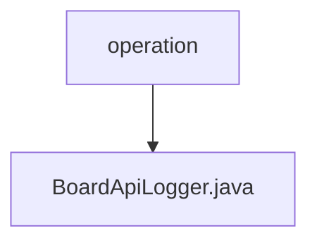

# Basic Information

|      |      |
|------|------|
| Name | operation |
| Language | .java |
| Code Path | WeFe/board/board-service/src/main/java/com/welab/wefe/board/service/operation |
| Package Name | docs.board.board-service.src.main.java.com.welab.wefe.board.service.operation |
| Brief Description | BoardApiLogger inherits from AbstractApiLogger, ignores logging for specific APIs, saves operation logs to the database, and updates the account's last operation time. |

# Description

BoardApiLogger is a component class that inherits from AbstractApiLogger, primarily used for logging API calls. It defines a list of APIs to exclude from logging, including specific API classes such as FlowQueryApi and nine others. When saving logs, it stores information such as request time, caller IP, operator ID, execution time, interface name, response code, and message into an OperationLogMysqlModel object, which is then persisted via OperationLogRepository. Additionally, it updates the last operation time of specified accounts through AccountRepository.

### Package Internal Structure View

This flowchart illustrates the package structure of the `operation` directory in the `board-service` module of the WeFe project, where `operation` is the root directory containing a `BoardApiLogger.java` file. Such a structure is commonly used in service implementations related to logging or operation tracking, reflecting the design philosophy of the Single Responsibility Principle.

# File List

| Name   | Type  | Description |
|-------|------|-------------|
| [BoardApiLogger.java](BoardApiLogger.md) | file | BoardApiLogger inherits from AbstractApiLogger, ignores logging for specific APIs, saves operation logs to the database, and updates the account's last operation time. |

