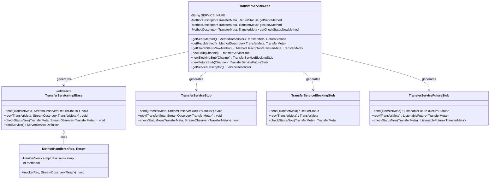

# Basic Information

|      |      |
|------|------|
| Name | TransferServiceGrpc |
| Language | .java |
| Code Path | WeFe/board/board-service/src/main/java/com/welab/wefe/board/service/proto/TransferServiceGrpc.java |
| Package Name | com.welab.wefe.board.service.proto |
| Dependencies | ['com.welab.wefe.board.service.proto.meta.basic.BasicMetaProto', 'com.welab.wefe.board.service.proto.meta.basic.GatewayMetaProto', 'io.grpc.MethodDescriptor.generateFullMethodName', 'io.grpc.stub.ClientCalls.asyncUnaryCall', 'io.grpc.stub.ClientCalls.blockingUnaryCall', 'io.grpc.stub.ClientCalls.futureUnaryCall', 'io.grpc.stub.ServerCalls.asyncUnaryCall', 'io.grpc.stub.ServerCalls.asyncUnimplementedUnaryCall'] |
| Brief Description | The TransferServiceGrpc class defines a gRPC service, which includes three methods: send, recv, and checkStatusNow, supporting asynchronous, blocking, and Future invocation modes. |

# Description

The code defines a gRPC service named TransferServiceGrpc, which includes three methods: send, recv, and checkStatusNow. The send method accepts a TransferMeta request and returns a ReturnStatus response, while both recv and checkStatusNow methods handle TransferMeta type data for both input and output. The service supports three invocation modes: asynchronous, blocking, and Future, with corresponding stubs created via static methods. The class also incorporates lazy-loading logic for method descriptors and a thread-safe service descriptor construction process. All methods are of the UNARY call type and utilize Protocol Buffers for serialization.

# Class Summary

| Name   | Type  | Description |
|-------|------|-------------|
| TransferServiceGrpc | class | The TransferServiceGrpc class, generated based on gRPC 1.29.0, provides three UNARY methods: send, recv, and checkStatusNow, supporting asynchronous, blocking, and Future invocation modes. |

## Class TransferServiceGrpc

|      |      |
|------|------|
| Access Modifier | @javax.annotation.Generated(;    value = "by gRPC proto compiler (version 1.29.0)",;    comments = "Source: gateway-service.proto");public final |
| Type | class |
| Name | TransferServiceGrpc |
| Description | The TransferServiceGrpc class, generated based on gRPC 1.29.0, provides three UNARY methods: send, recv, and checkStatusNow, supporting asynchronous, blocking, and Future invocation modes. |

### UML Class Diagram

This code represents the server and client stub classes for the TransferService generated by the gRPC framework. The core class TransferServiceGrpc provides static methods to create three types of stubs (asynchronous, synchronous, and Future mode) and defines three RPC method descriptors. TransferServiceImplBase is the server-side implementation base class, while the three Stub classes correspond to different invocation modes. MethodHandlers implements the server-side method routing logic, distinguishing between different RPC method calls via methodId. The overall structure reflects gRPC's typical service definition-stub generation-method routing pattern, supporting multiple invocation modes.

### Internal Method Call Graph

```mermaid
graph TD
    A["Class TransferServiceGrpc"]
    B["Constant: SERVICE_NAME"]
    C["Static Method: getSendMethod"]
    D["Static Method: getRecvMethod"]
    E["Static Method: getCheckStatusNowMethod"]
    F["Factory Method: newStub"]
    G["Factory Method: newBlockingStub"]
    H["Factory Method: newFutureStub"]
    I["Inner Class: TransferServiceImplBase"]
    J["Inner Class: TransferServiceStub"]
    K["Inner Class: TransferServiceBlockingStub"]
    L["Inner Class: TransferServiceFutureStub"]
    M["Inner Class: MethodHandlers"]
    N["Inner Class: TransferServiceBaseDescriptorSupplier"]
    O["Static Method: getServiceDescriptor"]

    A --> B
    A --> C
    A --> D
    A --> E
    A --> F
    A --> G
    A --> H
    A --> I
    A --> J
    A --> K
    A --> L
    A --> M
    A --> N
    A --> O

    C --> C1["Double-checked locking creates MethodDescriptor"]
    D --> D1["Double-checked locking creates MethodDescriptor"]
    E --> E1["Double-checked locking creates MethodDescriptor"]
    I --> I1["Implements bindService() for gRPC method registration"]
    J --> J1["Handles async calls for send/recv/checkStatusNow"]
    K --> K1["Handles blocking calls for send/recv/checkStatusNow"]
    L --> L1["Handles Future calls for send/recv/checkStatusNow"]
    M --> M1["Routes requests based on methodId"]
    O --> O1["Double-checked locking creates ServiceDescriptor"]
```

This flowchart illustrates the core structure of gRPC server stub code. The TransferServiceGrpc class creates three client stubs (async/blocking/Future) via static factory methods, using double-checked locking for lazy initialization of MethodDescriptor. Core functionality is implemented by inner classes: TransferServiceImplBase handles service binding, three Stub subclasses manage different invocation modes, and MethodHandlers implements method routing. Service descriptors also employ double-checked locking to ensure thread-safe initialization.

### Field List

| Name  | Type  | Description |
|-------|-------|------|
| getSendMethod | io.grpc.MethodDescriptor<GatewayMetaProto.TransferMeta,
      BasicMetaProto.ReturnStatus> | Private static mutable gRPC method descriptor for the send method from GatewayMetaProto.TransferMeta to BasicMetaProto.ReturnStatus. |
| serviceDescriptor | io.grpc.ServiceDescriptor | Private static volatile variable storing the gRPC service descriptor. |
| METHODID_CHECK_STATUS_NOW = 2 | int | The private static constant METHODID_CHECK_STATUS_NOW with a value of 2 is used to identify the instant status check method. |
| SERVICE_NAME = "com.welab.wefe.gateway.api.service.proto.TransferService" | String | Define a static constant SERVICE_NAME with the value being the full protocol service name of TransferService. |
| METHODID_RECV = 1 | int | The private static constant METHODID_RECV has a value of 1. |
| METHODID_SEND = 0 | int | The private static constant METHODID_SEND has a value of 0. |
| getCheckStatusNowMethod | io.grpc.MethodDescriptor<GatewayMetaProto.TransferMeta,
      GatewayMetaProto.TransferMeta> | Private static volatile variable storing the gRPC method descriptor for handling requests and responses of TransferMeta type. |
| getRecvMethod | io.grpc.MethodDescriptor<GatewayMetaProto.TransferMeta,
      GatewayMetaProto.TransferMeta> | The private static volatile variable getRecvMethod, of type io.grpc.MethodDescriptor, handles the transfer of GatewayMetaProto.TransferMeta. |

### Method List

| Name  | Type  | Description |
|-------|-------|------|
| getCheckStatusNowMethod | io.grpc.MethodDescriptor<GatewayMetaProto.TransferMeta,
      GatewayMetaProto.TransferMeta> | Define the gRPC method `getCheckStatusNowMethod` for checking status, where both the request and response types are `TransferMeta`, using the UNARY call mode, with thread safety ensured via double-checked locking. |
| newBlockingStub | TransferServiceBlockingStub | Static method to create a gRPC blocking stub TransferServiceBlockingStub, which instantiates and returns a stub object based on the specified channel through the factory pattern. |
| getSendMethod | io.grpc.MethodDescriptor<GatewayMetaProto.TransferMeta,
      BasicMetaProto.ReturnStatus> | Define a gRPC unary call method `send` with request type `TransferMeta` and return type `ReturnStatus`, ensuring thread-safe initialization of the method descriptor via double-checked locking. |
| newStub | TransferServiceStub | Create a static method `TransferServiceStub` that generates a gRPC stub instance through the factory pattern, accepts a `Channel` parameter, and returns a new stub object. |
| getRecvMethod | io.grpc.MethodDescriptor<GatewayMetaProto.TransferMeta,
      GatewayMetaProto.TransferMeta> | Define the gRPC method `recv`, with both request and response types as `TransferMeta`, method type as `UNARY`, ensuring thread safety through double-checked locking. |
| newFutureStub | TransferServiceFutureStub | Create a static method that returns a TransferServiceFutureStub, instantiating it via a gRPC channel and factory pattern. |
| getServiceDescriptor | io.grpc.ServiceDescriptor | Static method for obtaining gRPC service descriptors, employing double-checked locking to ensure thread safety, including three methods: Send, Recv, and CheckStatusNow. |

