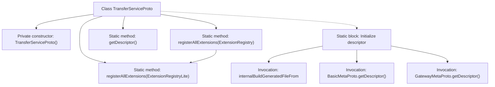

# Basic Information

|      |      |
|------|------|
| Name | TransferServiceProto |
| Language | .java |
| Code Path | WeFe/board/board-service/src/main/java/com/welab/wefe/board/service/proto/TransferServiceProto.java |
| Package Name | com.welab.wefe.board.service.proto |
| Dependencies | ['com.welab.wefe.board.service.proto.meta.basic.BasicMetaProto', 'com.welab.wefe.board.service.proto.meta.basic.GatewayMetaProto'] |
| Brief Description | The `TransferServiceProto` class defines a data transfer service, including `send`, `recv`, and `checkStatusNow` methods for processing `TransferMeta` and `ReturnStatus` messages. It also contains the `NetworkDataTransferProxyService` service, which provides `push` and `pushDataSource` methods. |

# Description

This is a Java class named TransferServiceProto, designed to define Protobuf service descriptions. The class includes a static method `registerAllExtensions` for registering extensions, and a `getDescriptor` method to retrieve the file descriptor. The file descriptor is initialized via a static code block, referencing three protocol files: `gateway-service.proto`, `basic-meta.proto`, and `gateway-meta.proto`. The class defines two gRPC services: `TransferService`, which provides `send`, `recv`, and `checkStatusNow` methods; and `NetworkDataTransferProxyService`, which offers `push` and `pushDataSource` methods, both using `TransferMeta` as the request and response type. Finally, the descriptor is generated through the Protobuf mechanism, and relevant dependencies are registered.

# Class Summary

| Name   | Type  | Description |
|-------|------|-------------|
| TransferServiceProto | class | The TransferServiceProto class defines the data transfer service protocol, including extension method registration, file descriptors, and static initialization blocks, involving metadata interactions such as TransferMeta and ReturnStatus. |


## Class TransferServiceProto

|      |      |
|------|------|
| Access Modifier | public final |
| Type | class |
| Name | TransferServiceProto |
| Description | The TransferServiceProto class defines the data transfer service protocol, including extension method registration, file descriptors, and static initialization blocks, involving metadata interactions such as TransferMeta and ReturnStatus. |


### UML Class Diagram

```mermaid
classDiagram
    class TransferServiceProto {
        -TransferServiceProto()
        +registerAllExtensions(ExtensionRegistryLite registry) void
        +registerAllExtensions(ExtensionRegistry registry) void
        +getDescriptor() FileDescriptor
        -descriptor: FileDescriptor
        -static descriptorData: String[]
        -static {...}
    }
    class ExtensionRegistryLite {
        <<Interface>>
    }
    class ExtensionRegistry {
        <<Interface>>
    }
    class FileDescriptor {
        <<Interface>>
    }
    class BasicMetaProto {
        +getDescriptor() FileDescriptor
    }
    class GatewayMetaProto {
        +getDescriptor() FileDescriptor
    }

    TransferServiceProto --> ExtensionRegistryLite : Dependency
    TransferServiceProto --> ExtensionRegistry : Dependency
    TransferServiceProto --> FileDescriptor : Dependency
    TransferServiceProto --> BasicMetaProto : Dependency
    TransferServiceProto --> GatewayMetaProto : Dependency
```

This code defines a final class named TransferServiceProto, primarily used for Protocol Buffers-related service registration and descriptor management. The class includes static methods for registering extensions and retrieving file descriptors, while depending on interfaces such as ExtensionRegistryLite, ExtensionRegistry, and FileDescriptor, as well as interacting with BasicMetaProto and GatewayMetaProto. The core functionality resides in the static initialization block, where the file descriptor is constructed from descriptorData and linked to both basic metadata and gateway metadata descriptors.


### Internal Method Call Graph



This flowchart illustrates the core structure of the TransferServiceProto class, emphasizing the static initialization process and extension registration functionality. The class initializes protocol descriptors through a static block, invokes Protobuf internal methods to build file descriptors, and relies on metadata from BasicMetaProto and GatewayMetaProto. The overloaded registration methods support two registry types, with the type-converted call demonstrating backward compatibility design.

### Field List

| Name  | Type  | Description |
|-------|-------|------|
| descriptor | com.google.protobuf.Descriptors.FileDescriptor | The private static variable `descriptor`, of type `com.google.protobuf.Descriptors.FileDescriptor`. |

### Method List

| Name  | Type  | Description |
|-------|-------|------|
| getDescriptor | com.google.protobuf.Descriptors.FileDescriptor | This is a static method that returns the Protocol Buffers file descriptor object `descriptor`. |
| registerAllExtensions | void | The static method `registerAllExtensions` is used to register extensions with Protobuf's `ExtensionRegistryLite`, currently implemented as an empty method. |
| registerAllExtensions | void | This is a Java static method used to register all extensions to a given Protocol Buffers extension registry. Internally, it calls another overloaded method that converts the full registry into a lightweight registry for registration. |


