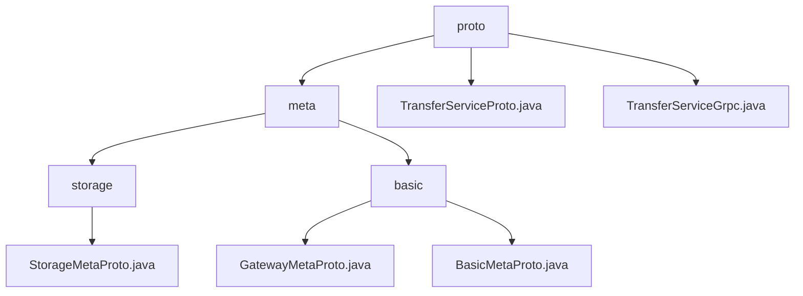

# Basic Information

|      |      |
|------|------|
| Name | proto |
| Language | .java |
| Code Path | WeFe/board/board-service/src/main/java/com/welab/wefe/board/service/proto |
| Package Name | docs.board.board-service.src.main.java.com.welab.wefe.board.service.proto |
| Brief Description | Distributed Communication and Storage Metadata Protocol, including endpoint management, state machine, and storage locator. Based on Protobuf, supports asynchronous event-driven architecture for cross-node routing and heterogeneous storage access. Includes gRPC service interfaces. |

# Description

## Overview  
This module is a metadata protocol framework for distributed communication and storage, with core responsibilities including standardized network endpoint management, transmission state control, and heterogeneous storage abstraction. It employs Protobuf encoding for cross-language communication, resembling a hybrid architecture combining service discovery mechanisms and message buses.  

The interface specifications are categorized into communication-type (TransferServiceGrpc's send/recv) and storage-type (StorageLocator resolution), both based on Protobuf serialization. Key data structures include network endpoint triples, transmission state machines (6 enumerated types), storage quadruple locators, and TransferMeta shard control units.  

External dependencies are limited to Protobuf and the gRPC framework. For example, TransferServiceProto integrates gateway-meta.proto to define services, while TransferServiceGrpc implements UNARY call patterns, supporting dual asynchronous/blocking channels.  

## Primary Business Scenarios  
A typical workflow involves: 1) Endpoint registration (Endpoints), 2) Data transmission (TransferMeta sharding), and 3) Status callback (ReturnStatus). The interaction model resembles a message queue, achieving bidirectional flow control through TransferService's send/recv methods, while NetworkDataProxyService provides a push-based delivery mode.  

Functional completeness is reflected across three layers: network addressing (endpoint triples), transmission control (shard state machines), and storage adaptation (LMDB/CLICK_HOUSE enumerations). For instance, in big data scenarios, KeyValueData sharding combines with TransferStatus tracking, and storage operations dynamically switch engines via StorageType.

### Package Internal Structure View

This flowchart illustrates the hierarchical structure under the proto directory in the WeFe project. The root node proto contains a meta subdirectory and two service files. The meta directory is further divided into storage and basic subdirectories. The storage directory includes the StorageMetaProto.java file, while the basic directory contains two foundational metadata files: GatewayMetaProto.java and BasicMetaProto.java. The overall structure clearly reflects the organization of metadata and service files within the proto module.

# File List

| Name   | Type  | Description |
|-------|------|-------------|
| [TransferServiceProto.java](TransferServiceProto.md) | file | The `TransferServiceProto` class defines a data transfer service, including the `send`, `recv`, and `checkStatusNow` methods for processing `TransferMeta` and `ReturnStatus` messages. It also includes the `NetworkDataTransferProxyService` service, which provides the `push` and `pushDataSource` methods. |
| [TransferServiceGrpc.java](TransferServiceGrpc.md) | file | The TransferServiceGrpc class defines the gRPC service, which includes three methods: send, recv, and checkStatusNow, supporting asynchronous, blocking, and Future invocation modes. |
| [meta](meta/_module.md) | package | StorageMetaProto is a Java class that defines the storage metadata protocol, including the StorageType enumeration and StorageLocator message, supporting serialization and the builder pattern. The module standardizes network endpoint information, containing both basic and gateway-specific message structures, relying on Protobuf for cross-node data routing. |

