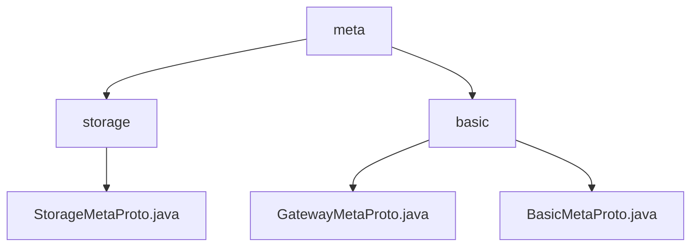

# Basic Information

|      |      |
|------|------|
| Name | meta |
| Language | .java |
| Code Path | WeFe/board/board-service/src/main/java/com/welab/wefe/board/service/proto/meta |
| Package Name | docs.board.board-service.src.main.java.com.welab.wefe.board.service.proto.meta |
| Brief Description | StorageMetaProto is a Java class that defines the storage metadata protocol, including the StorageType enumeration and StorageLocator message, supporting serialization and the builder pattern. The module standardizes network endpoint information, containing both basic and gateway-specific message structures, relying on Protobuf for cross-node data routing. |

# Description

## Overview  
This module is a metadata protocol framework for distributed communication and storage, with core responsibilities including standardizing network endpoint information, managing transmission states, and defining storage metadata. The protocol employs Protobuf encoding, supporting terminal address management (similar to a service discovery mechanism) and storage type abstraction.  

The interface specifications cover two categories: communication-type (Endpoint/TransferMeta) and storage-type (StorageLocator). Key data structures include the network endpoint triplet (IP, port, hostname), transmission state machine enumeration (6 states), storage type enumeration (LMDB/CLICK_HOUSE), and a quadruple locator (type/namespace/name/shard).  

The only external dependency is the Protobuf framework. For example, BasicMetaProto handles communication metadata, while StorageMetaProto defines storage protocols, with both enabling data exchange through builder patterns and serialization capabilities.  

## Primary Business Scenarios  
Typical applications include cross-node data routing and heterogeneous storage access. The complete workflow involves: terminal registration (Endpoints), transmission initialization (TransferMeta shard tagging), storage location resolution (StorageLocator parsing), and state synchronization (ReturnStatus callback). The interaction model adopts an asynchronous event-driven approach, similar to the publish/subscribe mechanism of message queues.  

Functional completeness is reflected in: 1) the network layer (endpoint addressing), 2) the transport layer (shard control), and 3) the storage layer (type adaptation). For instance, large-scale data transmission combines KeyValueData sharding with TransferStatus tracking, while storage operations leverage the StorageType enumeration for multi-engine switching.

### Package Internal Structure View

This flowchart illustrates the hierarchical structure of proto metadata files in the WeFe project. The root node "meta" contains two subdirectories: "storage" and "basic". The storage directory includes the StorageMetaProto.java file, while the basic directory comprises two metadata protocol files: GatewayMetaProto.java and BasicMetaProto.java. The entire structure clearly reflects the categorized storage approach of the protocol files.

# File List

| Name   | Type  | Description |
|-------|------|-------------|
| [basic](basic/_module.md) | package | GatewayMetaProto defines the gateway communication metadata protocol, including transmission status, member information, content body, and core metadata structure. BasicMetaProto contains endpoint details, return status, and key-value pair data, suitable for network communication. |
| [storage](storage/_module.md) | package | StorageMetaProto defines the storage metadata protocol, including the StorageLocator message and StorageType enumeration. StorageLocator contains type, namespace, name, and shard information. StorageType supports two storage types: LMDB and CLICK_HOUSE. |

