# Basic Information

|      |      |
|------|------|
| Name | GatewayMetaProto |
| Language | .java |
| Code Path | WeFe/board/board-service/src/main/java/com/welab/wefe/board/service/proto/meta/basic/GatewayMetaProto.java |
| Package Name | com.welab.wefe.board.service.proto.meta.basic |
| Dependencies | [] |
| Brief Description | GatewayMetaProto defines the protocol structure for gateway transmission metadata, containing the following core components:  1. **TransferStatus Enum**: Defines 6 transmission states (Unprocessed/Initializing/Processing/Completed/Error/Canceled).  2. **Member Message**: Represents member information, including member ID, name, and endpoint.  3. **Content Message**: The carrier for transmission content, supporting string/binary data or key-value pair lists.  4. **TransferMeta Message**: Gateway transmission metadata, including:     - Sender and receiver Member information     - Transmission Content     - Processor name, transmission status, session ID     - Timestamp, sequence number, tags, and other control fields  This protocol is used for structured data transmission between gateway services, supporting large data chunking and state tracking. |

# Description

GatewayMetaProto is a metadata protocol designed for gateway communication, defining message structures and enumeration types related to data transmission. It primarily includes the following components:  

1. **TransferStatus Enumeration**: Defines transmission states, including Unprocessed, Initializing, Processing, Completed, Error, and Canceled.  

2. **Member Message**: Represents member information, containing member ID, member name, and endpoint address.  

3. **Content Message**: Represents transmission content, supporting small data types (strings and binary data) and large data (key-value pair lists).  

4. **TransferMeta Message**: The core metadata structure for gateway transmission, containing the following fields:  
   - Sender and receiver information  
   - Transmission content body  
   - Processor name (replacing the legacy action field)  
   - Transmission status  
   - Session ID  
   - Reception time and expiration time  
   - Large data chunk index and end flag  
   - Tag variable name, tags, and extension fields  

This protocol supports extension registration and provides comprehensive data transmission control capabilities, including features such as status tracking, data chunking, and expiration management.

# Class Summary

| Name   | Type  | Description |
|-------|------|-------------|
| GatewayMetaProto | class | GatewayMetaProto defines the protocol structure for gateway transmission metadata, consisting of three main components: Member (member information), Content (transmission content), and TransferMeta (transmission metadata). The TransferStatus enumeration defines transmission states (Pending, Initializing, Processing, Completed, Error, Canceled). TransferMeta includes fields such as sender, receiver, content body, processor, status, session ID, and timestamp, which collectively describe the complete context of data transmission between gateways. |


## Class GatewayMetaProto

|      |      |
|------|------|
| Access Modifier | public final |
| Type | class |
| Name | GatewayMetaProto |
| Description | GatewayMetaProto defines the protocol structure for gateway transmission metadata, consisting of three main components: Member (member information), Content (transmission content), and TransferMeta (transmission metadata). The TransferStatus enumeration defines transmission states (Pending, Initializing, Processing, Completed, Error, Canceled). TransferMeta includes fields such as sender, receiver, content body, processor, status, session ID, and timestamp, which collectively describe the complete context of data transmission between gateways. |


### UML Class Diagram

```mermaid
classDiagram
    class GatewayMetaProto {
        <<final>>
        -GatewayMetaProto()
        +registerAllExtensions(ExtensionRegistryLite registry) void
        +registerAllExtensions(ExtensionRegistry registry) void
    }

    enum TransferStatus {
        <<enumeration>>
        NOT_PROCESSED = 0
        INITIALIZING = 1
        PROCESSING = 2
        COMPLETE = 3
        ERROR = 4
        CANCELLED = 5
        UNRECOGNIZED = -1
    }

    interface MemberOrBuilder {
        <<Interface>>
        +getMemberId() String
        +getMemberIdBytes() ByteString
        +getMemberName() String
        +getMemberNameBytes() ByteString
        +hasEndpoint() boolean
        +getEndpoint() Endpoint
        +getEndpointOrBuilder() EndpointOrBuilder
    }

    class Member {
        -String memberId_
        -String memberName_
        -Endpoint endpoint_
        +Member(GeneratedMessageV3.Builder~?~ builder)
        +getMemberId() String
        +getMemberIdBytes() ByteString
        +getMemberName() String
        +getMemberNameBytes() ByteString
        +hasEndpoint() boolean
        +getEndpoint() Endpoint
        +getEndpointOrBuilder() EndpointOrBuilder
    }

    interface ContentOrBuilder {
        <<Interface>>
        +getStrData() String
        +getStrDataBytes() ByteString
        +getByteData() ByteString
        +getKeyValueDatasList() List~KeyValueData~
        +getKeyValueDatasCount() int
    }

    class Content {
        -String strData_
        -ByteString byteData_
        -List~KeyValueData~ keyValueDatas_
        +Content(GeneratedMessageV3.Builder~?~ builder)
        +getStrData() String
        +getStrDataBytes() ByteString
        +getByteData() ByteString
        +getKeyValueDatasList() List~KeyValueData~
    }

    interface TransferMetaOrBuilder {
        <<Interface>>
        +hasSrc() boolean
        +getSrc() Member
        +getSrcOrBuilder() MemberOrBuilder
        +hasDst() boolean
        +getDst() Member
        +getDstOrBuilder() MemberOrBuilder
        +hasContent() boolean
        +getContent() Content
        +getContentOrBuilder() ContentOrBuilder
        +getProcessor() String
        +getProcessorBytes() ByteString
        +getTransferStatusValue() int
        +getTransferStatus() TransferStatus
        +getSessionId() String
        +getSessionIdBytes() ByteString
        +getReceiveDate() long
        +getExpireDate() long
        +getSequenceNo() int
        +getSequenceIsEnd() boolean
        +getTaggedVariableName() ByteString
        +getTag() String
        +getTagBytes() ByteString
        +getExtField() String
        +getExtFieldBytes() ByteString
    }

    class TransferMeta {
        -Member src_
        -Member dst_
        -Content content_
        -String processor_
        -int transferStatus_
        -String sessionId_
        -long receiveDate_
        -long expireDate_
        -int sequenceNo_
        -boolean sequenceIsEnd_
        -ByteString taggedVariableName_
        -String tag_
        -String extField_
        +TransferMeta(GeneratedMessageV3.Builder~?~ builder)
        +hasSrc() boolean
        +getSrc() Member
        +getSrcOrBuilder() MemberOrBuilder
        +hasDst() boolean
        +getDst() Member
        +getDstOrBuilder() MemberOrBuilder
        +hasContent() boolean
        +getContent() Content
        +getContentOrBuilder() ContentOrBuilder
        +getProcessor() String
        +getProcessorBytes() ByteString
        +getTransferStatusValue() int
        +getTransferStatus() TransferStatus
        +getSessionId() String
        +getSessionIdBytes() ByteString
        +getReceiveDate() long
        +getExpireDate() long
        +getSequenceNo() int
        +getSequenceIsEnd() boolean
        +getTaggedVariableName() ByteString
        +getTag() String
        +getTagBytes() ByteString
        +getExtField() String
        +getExtFieldBytes() ByteString
    }

    Member --> Endpoint : contains
    Content --> KeyValueData : contains
    TransferMeta --> Member : contains
    TransferMeta --> Content : contains
    Member ..|> MemberOrBuilder : implements
    Content ..|> ContentOrBuilder : implements
    TransferMeta ..|> TransferMetaOrBuilder : implements
```

This code defines the structure of a gateway metadata protocol, primarily consisting of the following core components:
1. GatewayMetaProto is the main class containing extension registration methods
2. TransferStatus enumeration defines 6 transfer states
3. Member class represents member information, including ID, name, and endpoint
4. Content class encapsulates transfer content, supporting string, binary, and key-value pair data
5. TransferMeta is the core transfer metadata, containing complete transmission information such as sender, receiver, content, and status
Through an interface-implementation separation design, these classes provide flexible extensibility to meet the data transmission requirements of gateway systems.


### Internal Method Call Graph

```mermaid
graph TD
    A["Class GatewayMetaProto"]
    B["Enum TransferStatus"]
    C["Interface MemberOrBuilder"]
    D["Class Member"]
    E["Interface ContentOrBuilder"]
    F["Class Content"]
    G["Interface TransferMetaOrBuilder"]
    H["Class TransferMeta"]

    A --> B
    A --> D
    A --> F
    A --> H
    D --> C
    F --> E
    H --> G
    B -->|contains| B1["NOT_PROCESSED=0"]
    B -->|contains| B2["INITIALIZING=1"]
    B -->|contains| B3["PROCESSING=2"]
    B -->|contains| B4["COMPLETE=3"]
    B -->|contains| B5["ERROR=4"]
    B -->|contains| B6["CANCELLED=5"]
    D -->|attribute| D1["String memberId"]
    D -->|attribute| D2["String memberName"]
    D -->|attribute| D3["Endpoint endpoint"]
    F -->|attribute| F1["String strData"]
    F -->|attribute| F2["bytes byteData"]
    F -->|attribute| F3["repeated KeyValueData keyValueDatas"]
    H -->|attribute| H1["Member src"]
    H -->|attribute| H2["Member dst"]
    H -->|attribute| H3["Content content"]
    H -->|attribute| H4["String processor"]
    H -->|attribute| H5["TransferStatus transferStatus"]
    H -->|attribute| H6["String sessionId"]
    H -->|attribute| H7["long receiveDate"]
    H -->|attribute| H8["long expireDate"]
    H -->|attribute| H9["int sequenceNo"]
    H -->|attribute| H10["bool sequenceIsEnd"]
    H -->|attribute| H11["bytes taggedVariableName"]
    H -->|attribute| H12["String tag"]
    H -->|attribute| H13["String extField"]
```



This code defines the metadata structure for gateway communication, comprising four main components: 1) TransferStatus enum defining 6 states; 2) Member class representing participant information with ID, name, and endpoint; 3) Content class as data carrier supporting string/binary/key-value formats; 4) TransferMeta as core transmission metadata containing complete context including sender/receiver, content, processor, status, etc. The structure implements efficient serialization via Protocol Buffers, supports large data chunking (sequenceNo/sequenceIsEnd), and provides extensibility fields (tag/extField) for enhanced flexibility.

### Field List

| Name  | Type  | Description |
|-------|-------|------|
| descriptor | com.google.protobuf.Descriptors.FileDescriptor | The static variable `descriptor`, of type `com.google.protobuf.Descriptors.FileDescriptor`. |
| internal_static_com_welab_wefe_gateway_api_meta_basic_TransferMeta_fieldAccessorTable | com.google.protobuf.GeneratedMessageV3.FieldAccessorTable | Private static constant, of type Protobuf-generated FieldAccessorTable, used for field access of internal metadata TransferMeta. |
| internal_static_com_welab_wefe_gateway_api_meta_basic_Content_descriptor | com.google.protobuf.Descriptors.Descriptor | Private static final variable, descriptor type, used to define the protocol buffer structure of the Content class. |
| internal_static_com_welab_wefe_gateway_api_meta_basic_Member_descriptor | com.google.protobuf.Descriptors.Descriptor | Private static constant describing the protocol buffer metadata of the Member class. |
| internal_static_com_welab_wefe_gateway_api_meta_basic_Content_fieldAccessorTable | com.google.protobuf.GeneratedMessageV3.FieldAccessorTable | Protobuf-generated Content class field accessor table for internal metadata operations. |
| internal_static_com_welab_wefe_gateway_api_meta_basic_TransferMeta_descriptor | com.google.protobuf.Descriptors.Descriptor | Private static final descriptor variables, defining the internal structure description of TransferMeta. |
| internal_static_com_welab_wefe_gateway_api_meta_basic_Member_fieldAccessorTable | com.google.protobuf.GeneratedMessageV3.FieldAccessorTable | Private static final field of type protobuf FieldAccessorTable, used for metadata access of Member class. |

### Method List

| Name  | Type  | Description |
|-------|-------|------|
| registerAllExtensions | void | This is a static method used to register all extensions into the given Protobuf extension registry. Internally, it invokes another overloaded method that converts the registry into a Lite version for processing. |
| registerAllExtensions | void | The static method `registerAllExtensions` is used to register extensions with the Protobuf extension registry, currently implemented as an empty operation. |
| getDescriptor | com.google.protobuf.Descriptors.FileDescriptor | This is a static method that returns the Protocol Buffers file descriptor object. |


