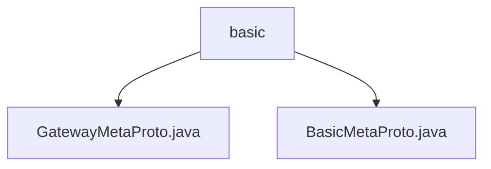

# Basic Information

|      |      |
|------|------|
| Name | basic |
| Language | .java |
| Code Path | WeFe/board/board-service/src/main/java/com/welab/wefe/board/service/proto/meta/basic |
| Package Name | docs.board.board-service.src.main.java.com.welab.wefe.board.service.proto.meta.basic |
| Brief Description | GatewayMetaProto defines the gateway communication metadata protocol, including transmission status, member information, content body, and core metadata structure. BasicMetaProto contains endpoint details, return status, and key-value pair data, suitable for network communication. |

# Description

## Overview  
This module is a metadata protocol framework designed for distributed gateway communication, with its core responsibility being the standardization of network endpoint information, transmission states, and content formats. The protocol employs Protobuf encoding and provides terminal address management (similar to a service discovery mechanism) and full lifecycle monitoring capabilities for transmissions.  

The interface specification includes two types of message structures: basic (Endpoint/ReturnStatus) and gateway-specific (TransferMeta/Member). Key data structures consist of the network endpoint triplet (IP, port, hostname), a transmission state machine enumeration (6 states), and a sharded content carrier (supporting key-value pairs and binary data).  

External dependencies are limited to the Protobuf serialization framework. For example, BasicMetaProto handles basic communication metadata, while GatewayMetaProto extends functionalities for large data sharding and session management, with both linked through a unified status code mechanism.  

## Primary Business Scenarios  
A typical application is cross-node data routing, with the complete workflow including: terminal registration (via Endpoints), transmission initialization (constructing TransferMeta), shard processing (Content shard sequence marking), and state synchronization (ReturnStatus callbacks). The interaction model adopts an asynchronous event-driven approach, similar to the publish/subscribe mechanism of message queues.  

Functional completeness is reflected in: 1) the network layer (Endpoint addressing), 2) the transport layer (sharding/timeout control), and 3) the business layer (tags/extension fields). For instance, large data transfers combine the use of KeyValueData shards and TransferStatus state tracking, while simple queries directly return results via ReturnStatus.

### Package Internal Structure View

This flowchart illustrates the hierarchical relationship of proto metadata files in the WeFe project. The root node "basic" contains two Java files: GatewayMetaProto.java and BasicMetaProto.java, which reside at the same directory level and serve as foundational metadata protocol definition files. The entire structure is clear and concise, reflecting the organization of proto files within the project.

# File List

| Name   | Type  | Description |
|-------|------|-------------|
| [GatewayMetaProto.java](GatewayMetaProto.md) | file | GatewayMetaProto defines the protocol structure for gateway transmission metadata, containing the following core components:1. TransferStatus enum: Defines 6 transmission states (Pending/Initializing/Processing/Completed/Error/Canceled)2. Member message: Represents member information, including member ID, name, and endpoint3. Content message: Transmission content carrier, supporting string/binary data or key-value pair lists4. TransferMeta message: Gateway transmission metadata, including:   - Sender and receiver Member information   - Transmission Content   - Processor name, transfer status, session ID   - Control fields such as timestamp, sequence number, and tagsThis protocol is used for structured data transmission between gateway services, supporting large data chunk transfer and status tracking. |
| [BasicMetaProto.java](BasicMetaProto.md) | file | BasicMetaProto defines the basic structures for network endpoints, return statuses, and key-value data. Endpoint includes IP, port, and hostname; Endpoints is a list of Endpoint; ReturnStatus contains status code, message, session ID, and data; KeyValueData consists of key-value pairs. These structures are used for metadata interaction in gateway APIs. |

