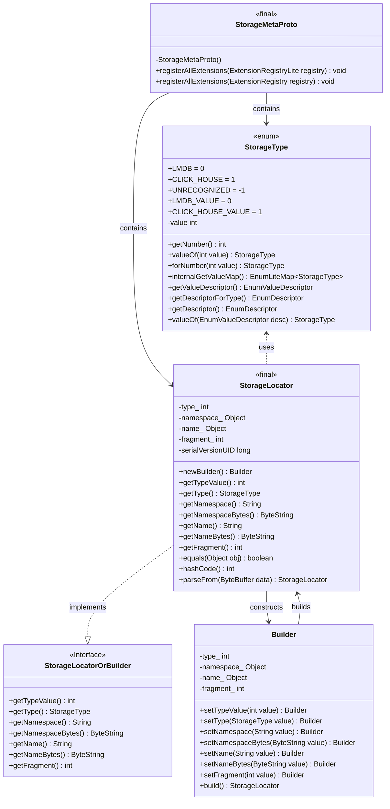

# Basic Information

|      |      |
|------|------|
| Name | StorageMetaProto |
| Language | .java |
| Code Path | WeFe/board/board-service/src/main/java/com/welab/wefe/board/service/proto/meta/storage/StorageMetaProto.java |
| Package Name | com.welab.wefe.board.service.proto.meta.storage |
| Dependencies | [] |
| Brief Description | StorageMetaProto defines the storage metadata protocol, including the StorageLocator message and StorageType enumeration. StorageLocator contains type, namespace, name, and shard information. StorageType supports two storage types: LMDB and CLICK_HOUSE. |

# Description

StorageMetaProto is a Protocol Buffers-based Java class designed to define storage metadata protocols. It includes an enum type StorageType (supporting two storage types: LMDB and CLICK_HOUSE) and a message type StorageLocator. The StorageLocator contains four fields: type (storage type enum value), namespace (namespace string), name (name string), and fragment (shard identifier integer). This class provides comprehensive support for serialization, deserialization, builder patterns, and implements methods such as equals and hashCode. Leveraging Protocol Buffers' code generation mechanism, the class enables efficient handling of binary data exchange.

# Class Summary

| Name   | Type  | Description |
|-------|------|-------------|
| StorageMetaProto | class | StorageMetaProto defines the storage metadata protocol, including the StorageLocator message body and StorageType enumeration, supporting two storage types: LMDB and CLICK_HOUSE. StorageLocator contains type, namespace, name, and sharding information. |

## Class StorageMetaProto

|      |      |
|------|------|
| Access Modifier | public final |
| Type | class |
| Name | StorageMetaProto |
| Description | StorageMetaProto defines the storage metadata protocol, including the StorageLocator message body and StorageType enumeration, supporting two storage types: LMDB and CLICK_HOUSE. StorageLocator contains type, namespace, name, and sharding information. |

### UML Class Diagram

This code implements a Protocol Buffers-based storage metadata protocol, including the StorageType enum definition and StorageLocator message structure. The StorageLocator is constructed via the Builder pattern, containing type, namespace, name, and fragment fields, with serialization/deserialization capabilities. The class diagram illustrates relationships between core classes, including enum definitions, interface implementations, and builder pattern applications, collectively forming a complete protobuf message definition system.

### Internal Method Call Graph

```mermaid
graph TD
    A["Class StorageMetaProto"]
    B["Private Constructor: StorageMetaProto()"]
    C["Static Method: registerAllExtensions(ExtensionRegistryLite)"]
    D["Static Method: registerAllExtensions(ExtensionRegistry)"]
    E["Enum Class: StorageType"]
    F["Enum Value: LMDB(0)"]
    G["Enum Value: CLICK_HOUSE(1)"]
    H["Enum Value: UNRECOGNIZED(-1)"]
    I["Enum Method: getNumber()"]
    J["Enum Method: valueOf(int)"]
    K["Enum Method: forNumber(int)"]
    L["Enum Method: internalGetValueMap()"]
    M["Interface: StorageLocatorOrBuilder"]
    N["Method: getTypeValue()"]
    O["Method: getType()"]
    P["Method: getNamespace()"]
    Q["Method: getNamespaceBytes()"]
    R["Method: getName()"]
    S["Method: getNameBytes()"]
    T["Method: getFragment()"]
    U["Static Inner Class: StorageLocator"]
    V["Constructor: StorageLocator(GeneratedMessageV3.Builder)"]
    W["Constructor: StorageLocator()"]
    X["Method: getTypeValue()"]
    Y["Method: getType()"]
    Z["Method: getNamespace()"]
    AA["Method: getNamespaceBytes()"]
    AB["Method: getName()"]
    AC["Method: getNameBytes()"]
    AD["Method: getFragment()"]
    AE["Method: writeTo(CodedOutputStream)"]
    AF["Method: equals(Object)"]
    AG["Method: hashCode()"]
    AH["Static Inner Class: Builder"]
    AI["Constructor: Builder()"]
    AJ["Constructor: Builder(BuilderParent)"]
    AK["Method: setTypeValue(int)"]
    AL["Method: setType(StorageType)"]
    AM["Method: setNamespace(String)"]
    AN["Method: setNamespaceBytes(ByteString)"]
    AO["Method: setName(String)"]
    AP["Method: setNameBytes(ByteString)"]
    AQ["Method: setFragment(int)"]

    A --> B
    A --> C
    A --> D
    A --> E
    E --> F
    E --> G
    E --> H
    E --> I
    E --> J
    E --> K
    E --> L
    A --> M
    M --> N
    M --> O
    M --> P
    M --> Q
    M --> R
    M --> S
    M --> T
    A --> U
    U --> V
    U --> W
    U --> X
    U --> Y
    U --> Z
    U --> AA
    U --> AB
    U --> AC
    U --> AD
    U --> AE
    U --> AF
    U --> AG
    U --> AH
    AH --> AI
    AH --> AJ
    AH --> AK
    AH --> AL
    AH --> AM
    AH --> AN
    AH --> AO
    AH --> AP
    AH --> AQ
```

This flowchart illustrates the complete structure of the StorageMetaProto class, including private constructors, extension registration methods, StorageType enum definition, and the core StorageLocator message structure. As the primary message class, StorageLocator contains fields such as type, namespace, name, and fragment, providing chain-style construction capability through the Builder pattern while implementing core functionalities like serialization and equality comparison. The entire structure reflects the typical pattern of Protocol Buffers message definition, encompassing key components such as field access, serialization processing, and the builder pattern.

### Field List

| Name  | Type  | Description |
|-------|-------|------|
| internal_static_com_welab_gateway_api_meta_storage_StorageLocator_descriptor | com.google.protobuf.Descriptors.Descriptor | Private static final descriptor, defining the metadata storage structure of the StorageLocator class. |
| internal_static_com_welab_gateway_api_meta_storage_StorageLocator_fieldAccessorTable | com.google.protobuf.GeneratedMessageV3.FieldAccessorTable | Protobuf-generated StorageLocator field accessor table for the metadata storage gateway API. |
| descriptor | com.google.protobuf.Descriptors.FileDescriptor | Static constant descriptor, of type protobuf file descriptor. |

### Method List

| Name  | Type  | Description |
|-------|-------|------|
| registerAllExtensions | void | This is a Java static method designed to register all extensions into Protobuf's extension registry. The method accepts an ExtensionRegistry parameter and invokes another overloaded method to complete the registration. |
| registerAllExtensions | void | The static method `registerAllExtensions` is used to register extensions with Protobuf's `ExtensionRegistryLite`, currently implemented as an empty method. |
| getDescriptor | com.google.protobuf.Descriptors.FileDescriptor | Java Method: Returns the protobuf file descriptor. |

