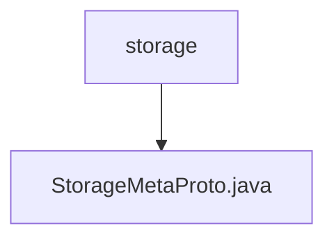

# Basic Information

|      |      |
|------|------|
| Name | storage |
| Language | .java |
| Code Path | WeFe/board/board-service/src/main/java/com/welab/wefe/board/service/proto/meta/storage |
| Package Name | docs.board.board-service.src.main.java.com.welab.wefe.board.service.proto.meta.storage |
| Brief Description | StorageMetaProto defines the storage metadata protocol, including the StorageLocator message and StorageType enumeration. StorageLocator contains type, namespace, name, and shard information. StorageType supports two storage types: LMDB and CLICK_HOUSE. |

# Description

StorageMetaProto is a Protocol Buffers-based Java class designed to define storage metadata protocols. It includes an enum type StorageType (supporting two storage types: LMDB and CLICK_HOUSE) and a message type StorageLocator. The StorageLocator consists of four fields: type (storage type enum value), namespace (namespace string), name (name string), and fragment (shard identifier integer). This class provides comprehensive serialization, deserialization, builder pattern support, and implements methods such as equals and hashCode. Leveraging Protocol Buffers' code generation mechanism, the class enables efficient binary data exchange.

### Package Internal Structure View

This flowchart illustrates the file structure related to storage metadata in the WeFe project. The root node is the storage folder, which contains a StorageMetaProto.java file, representing the Protocol Buffers definition file for storage metadata. Such a structure is commonly used to define data storage formats and protocols, serving as a typical data definition approach in microservices architectures.

# File List

| Name   | Type  | Description |
|-------|------|-------------|
| [StorageMetaProto.java](StorageMetaProto.md) | file | StorageMetaProto defines the storage metadata protocol, including the StorageLocator message and StorageType enum. StorageLocator contains type, namespace, name, and shard information. StorageType supports two storage types: LMDB and CLICK_HOUSE. |

