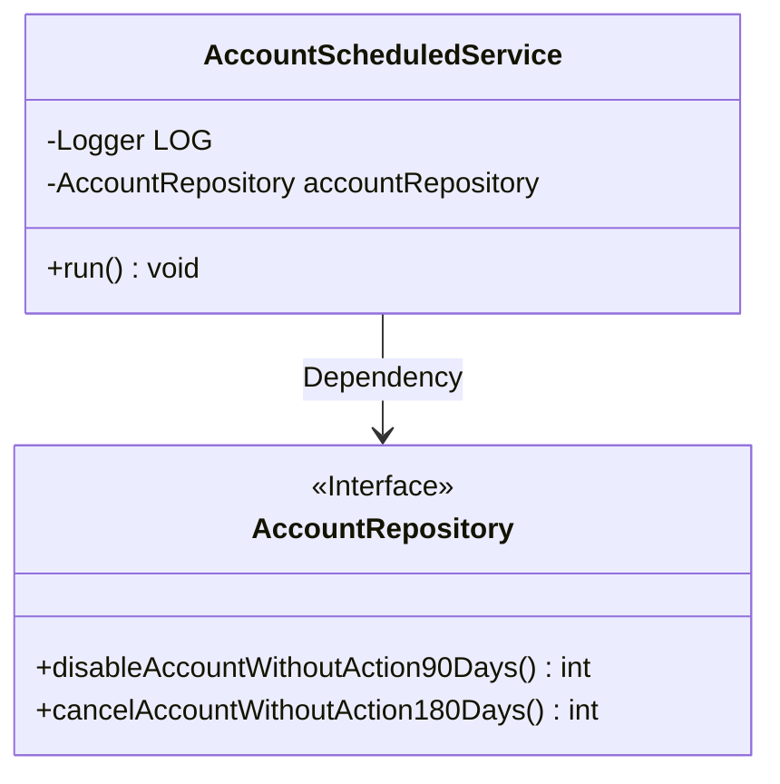
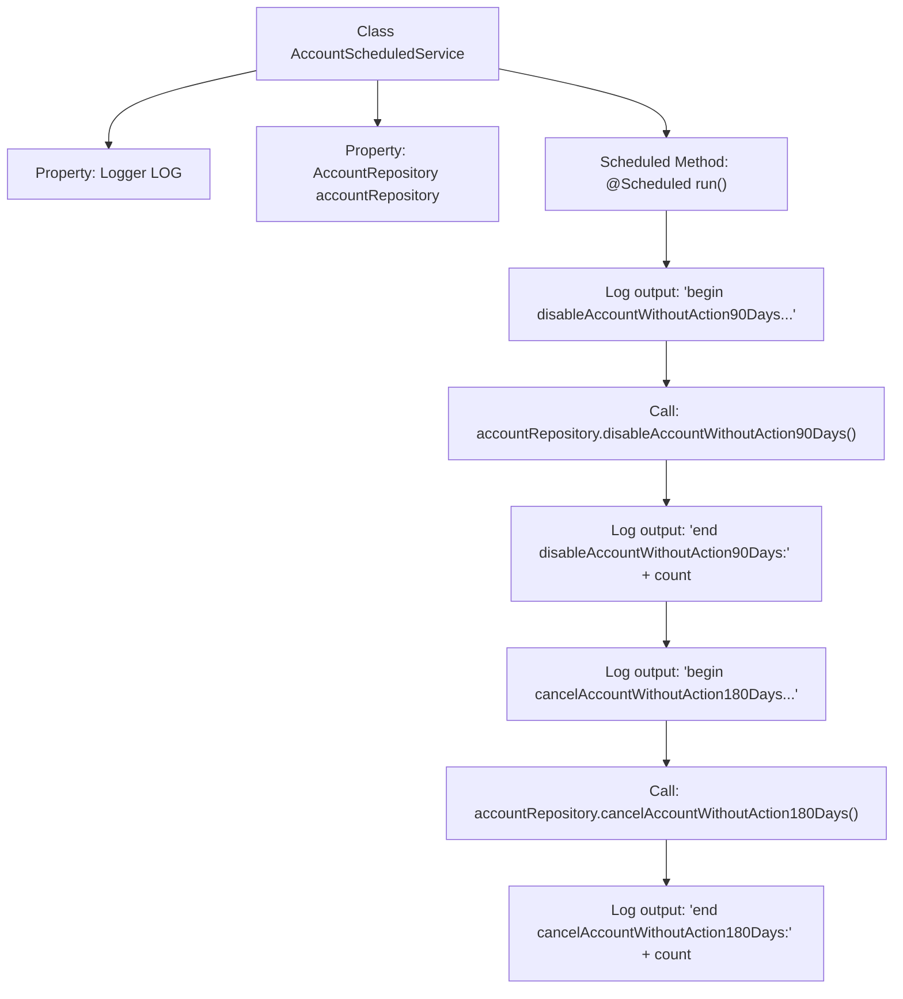

# Basic Information

|      |      |
|------|------|
| Name | AccountScheduledService |
| Language | .java |
| Code Path | WeFe/board/board-service/src/main/java/com/welab/wefe/board/service/scheduled/AccountScheduledService.java |
| Package Name | com.welab.wefe.board.service.scheduled |
| Dependencies | ['com.welab.wefe.board.service.database.repository.AccountRepository', 'org.slf4j.Logger', 'org.slf4j.LoggerFactory', 'org.springframework.beans.factory.annotation.Autowired', 'org.springframework.context.annotation.Lazy', 'org.springframework.scheduling.annotation.Scheduled', 'org.springframework.stereotype.Component'] |
| Brief Description | AccountScheduledService is a scheduled task class that runs hourly with an initial delay of 10 seconds. It invokes the accountRepository method to disable accounts inactive for 90 days and deactivate accounts inactive for 180 days, while logging execution records. |

# Description

The content describes a Spring component class named AccountScheduledService, which is used for scheduled execution of account management tasks. The class is marked as non-lazy initialized and includes an auto-wired AccountRepository dependency. A scheduled task configured via the @Scheduled annotation runs hourly with an initial delay of 10 seconds. During task execution, it sequentially calls two repository methods: disabling accounts inactive for 90 days and closing accounts inactive for 180 days, while logging information before and after each operation. The logs output the start, completion status, and result count of each operation.

# Class Summary

| Name   | Type  | Description |
|-------|------|-------------|
| AccountScheduledService | class | The AccountScheduledService scheduled task class executes hourly with a 10-second initial delay. It automatically injects AccountRepository to check and deactivate accounts inactive for 90 days, delete accounts inactive for 180 days, and logs execution records. |

## Class AccountScheduledService

|      |      |
|------|------|
| Access Modifier | @Component;@Lazy(false);public |
| Type | class |
| Name | AccountScheduledService |
| Description | The AccountScheduledService scheduled task class executes hourly with a 10-second initial delay. It automatically injects AccountRepository to check and deactivate accounts inactive for 90 days, delete accounts inactive for 180 days, and logs execution records. |

### UML Class Diagram

This code snippet illustrates a scheduled task service class AccountScheduledService, which periodically executes account management operations via Spring's @Scheduled annotation. The class relies on the AccountRepository interface to perform specific database operations, including disabling accounts inactive for 90 days and terminating accounts inactive for 180 days. The class diagram clearly depicts this dependency relationship, where AccountRepository is explicitly marked as an interface, while AccountScheduledService is shown as a concrete implementation class containing logging and scheduled task methods.

### Internal Method Call Graph

This code demonstrates a Spring scheduled task class that executes hourly via @Scheduled annotation. The flowchart clearly illustrates the task sequence: first disabling accounts inactive for 90 days, then canceling accounts inactive for 180 days, with each operation logged before and after execution. The class relies on AccountRepository for database operations and outputs process information through Logger.

### Field List

| Name  | Type  | Description |
|-------|-------|------|
| accountRepository | AccountRepository | Use @Autowired to automatically inject an instance of AccountRepository. |
| LOG = LoggerFactory.getLogger(this.getClass()) | Logger | Define the logger instance of the current class with `protected final` modifiers to ensure accessibility by subclasses and immutability. |

### Method List

| Name  | Type  | Description |
|-------|-------|------|
| run | void | The scheduled task runs hourly with an initial delay of 10 seconds, disabling accounts inactive for 90 days and deleting those inactive for 180 days, while logging the execution count. |

