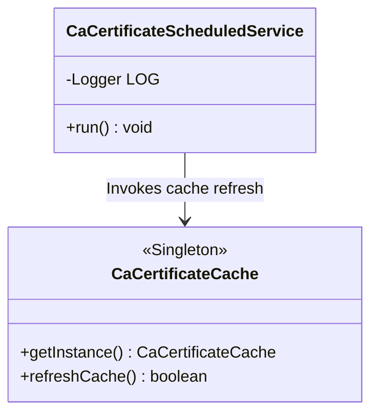
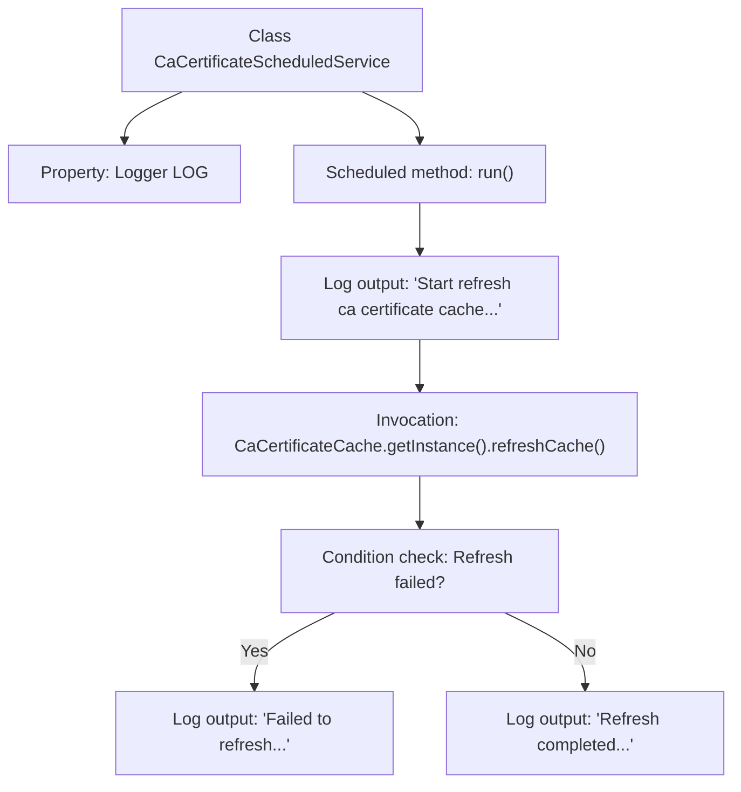

# Basic Information

|      |      |
|------|------|
| Name | CaCertificateScheduledService |
| Language | .java |
| Code Path | WeFe/board/board-service/src/main/java/com/welab/wefe/board/service/scheduled/CaCertificateScheduledService.java |
| Package Name | com.welab.wefe.board.service.scheduled |
| Dependencies | ['com.welab.wefe.board.service.cache.CaCertificateCache', 'org.slf4j.Logger', 'org.slf4j.LoggerFactory', 'org.springframework.scheduling.annotation.Scheduled', 'org.springframework.stereotype.Component'] |
| Brief Description | The scheduled task class `CaCertificateScheduledService` executes a CA certificate cache refresh operation every 30 seconds, logging both successful and failed attempts. |

# Description

This is a Spring component class named CaCertificateScheduledService, which includes a scheduled task method called run. This method executes every 30 seconds to refresh the CA certificate cache. Upon execution, it logs a start message; if the refresh fails, it logs an error message, and upon success, it logs a completion message. The cache refresh functionality is implemented through the refreshCache method of the singleton instance CaCertificateCache.

# Class Summary

| Name   | Type  | Description |
|-------|------|-------------|
| CaCertificateScheduledService | class | The scheduled task class `CaCertificateScheduledService` executes every 30 seconds, refreshing the CA certificate cache and logging success or failure records. |

## Class CaCertificateScheduledService

|      |      |
|------|------|
| Access Modifier | @Component;public |
| Type | class |
| Name | CaCertificateScheduledService |
| Description | The scheduled task class `CaCertificateScheduledService` executes every 30 seconds, refreshing the CA certificate cache and logging success or failure records. |

### UML Class Diagram

This class diagram illustrates the interaction between a scheduled service component CaCertificateScheduledService and a singleton cache class CaCertificateCache. The scheduled service executes its run() method every 30 seconds via @Scheduled annotation, invoking the cache class's refreshCache() method to update certificate cache while logging different levels based on the operation result. CaCertificateCache adopts singleton pattern to provide globally unique cache instance, exposing refresh interface for external calls. The diagram clearly demonstrates the dependency relationship between Spring component and singleton utility class, along with the method invocation chain.

### Internal Method Call Graph

This flowchart illustrates the core logic structure of the CaCertificateScheduledService class. The class contains a Logger property and a run() method marked with @Scheduled annotation. Upon execution, the method first logs a message, then invokes the refreshCache() method of CaCertificateCache to update the cache. Based on the result, it outputs either a success or failure log message. The entire process demonstrates the conditional branching of a scheduled task from initiation to completion, showcasing the full execution path of the cache refresh functionality.

### Field List

| Name  | Type  | Description |
|-------|-------|------|
| LOG = LoggerFactory.getLogger(this.getClass()) | Logger | Define the logger instance of the current class for outputting log information. |

### Method List

| Name  | Type  | Description |
|-------|-------|------|
| run | void | The scheduled task refreshes the CA certificate cache every 30 seconds, logging success or failure. |

