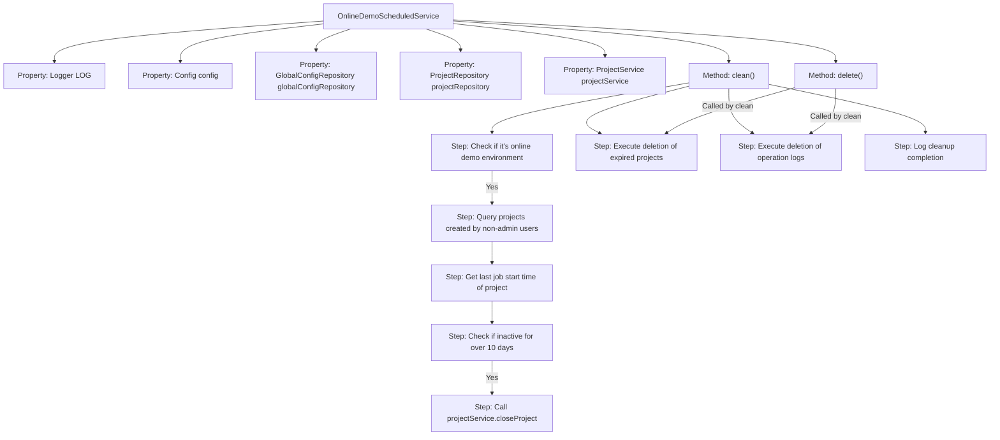
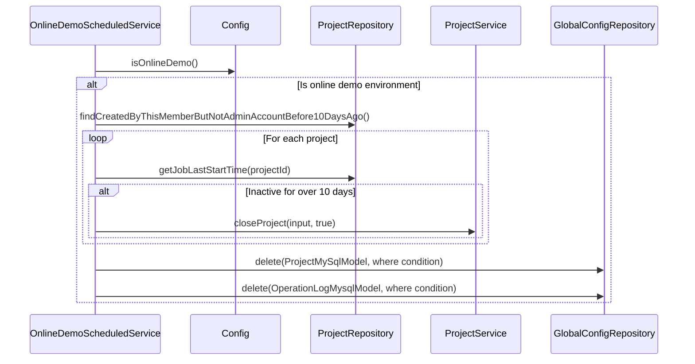

# Basic Information

|      |      |
|------|------|
| Name | OnlineDemoScheduledService |
| Language | .java |
| Code Path | WeFe/board/board-service/src/main/java/com/welab/wefe/board/service/scheduled/OnlineDemoScheduledService.java |
| Package Name | com.welab.wefe.board.service.scheduled |
| Dependencies | ['com.welab.wefe.board.service.api.project.project.CloseProjectApi', 'com.welab.wefe.board.service.constant.Config', 'com.welab.wefe.board.service.database.entity.OperationLogMysqlModel', 'com.welab.wefe.board.service.database.entity.base.AbstractMySqlModel', 'com.welab.wefe.board.service.database.entity.job.ProjectMySqlModel', 'com.welab.wefe.board.service.database.repository.GlobalConfigRepository', 'com.welab.wefe.board.service.database.repository.ProjectRepository', 'com.welab.wefe.board.service.service.ProjectService', 'com.welab.wefe.common.TimeSpan', 'org.slf4j.Logger', 'org.slf4j.LoggerFactory', 'org.springframework.beans.factory.annotation.Autowired', 'org.springframework.context.annotation.Lazy', 'org.springframework.scheduling.annotation.Scheduled', 'org.springframework.stereotype.Component', 'org.springframework.transaction.annotation.Transactional', 'javax.persistence.Entity', 'javax.persistence.Table', 'java.util.Date'] |
| Brief Description | The OnlineDemoScheduledService class periodically cleans up invalid data in demo environments: it checks and closes projects created by non-administrators that have been inactive for 10 days; deletes unused projects without workflows for 10 days; and clears operation logs older than 90 days. It executes every 10 minutes using the @Scheduled annotation. |

# Description

The OnlineDemoScheduledService is a Spring component designed to periodically clean up invalid data in the online demo environment. Its primary functions include: executing a cleanup task every 10 minutes, first verifying whether it is a demo environment. The cleanup logic consists of three parts: 1) Closing projects created by non-admin users that have been inactive for over 10 days; 2) Deleting projects created more than 10 days ago that either contain no workflows or have been closed; 3) Removing operation logs older than 90 days. The scheduled task is configured via the @Scheduled annotation, and data deletion operations are implemented using JPA, with a limit of 1000 records per deletion to avoid timeouts. All operations are logged, and error handling is performed in case of exceptions.

# Class Summary

| Name   | Type  | Description |
|-------|------|-------------|
| OnlineDemoScheduledService | class | Online Demo scheduled service class, non-lazy loading, cleans up invalid data every 10 minutes: closes non-admin projects inactive for 10 days, deletes projects not updated or without workflows for 10 days, and clears operation logs older than 90 days. Uses transactions to ensure data security. |


## Class OnlineDemoScheduledService

|      |      |
|------|------|
| Access Modifier | @Component;@Lazy(false);public |
| Type | class |
| Name | OnlineDemoScheduledService |
| Description | Online Demo scheduled service class, non-lazy loading, cleans up invalid data every 10 minutes: closes non-admin projects inactive for 10 days, deletes projects not updated or without workflows for 10 days, and clears operation logs older than 90 days. Uses transactions to ensure data security. |


### UML Class Diagram

```mermaid
classDiagram
    class OnlineDemoScheduledService {
        -Logger LOG
        -Config config
        -GlobalConfigRepository globalConfigRepository
        -ProjectRepository projectRepository
        -ProjectService projectService
        +clean()
        +delete(Class~? extends AbstractMySqlModel~ clazz, String where)
    }

    class Config {
        <<Interface>>
        +isOnlineDemo() boolean
    }

    class GlobalConfigRepository {
        <<Interface>>
        +deleteByQuery(String sql, Class~?~ clazz) int
    }

    class ProjectRepository {
        <<Interface>>
        +findCreatedByThisMemberButNotAdminAccountBefore10DaysAgo() List~ProjectMySqlModel~
        +getJobLastStartTime(String projectId) Date
    }

    class ProjectService {
        <<Interface>>
        +closeProject(CloseProjectApi.Input input, boolean flag)
    }

    class AbstractMySqlModel {
        <<Abstract>>
    }

    class ProjectMySqlModel {
        +getProjectId() String
    }

    class OperationLogMysqlModel {
    }

    class CloseProjectApi {
        class Input {
            +setProjectId(String projectId)
        }
    }

    OnlineDemoScheduledService --> Config : Dependency
    OnlineDemoScheduledService --> GlobalConfigRepository : Dependency
    OnlineDemoScheduledService --> ProjectRepository : Dependency
    OnlineDemoScheduledService --> ProjectService : Dependency
    OnlineDemoScheduledService --> AbstractMySqlModel : Dependency
    ProjectMySqlModel --|> AbstractMySqlModel
    OperationLogMysqlModel --|> AbstractMySqlModel
    CloseProjectApi.Input --> ProjectMySqlModel : Uses
```

This code illustrates a scheduled cleanup service `OnlineDemoScheduledService`, primarily used for removing invalid data generated in demo environments. The service relies on multiple repository interfaces and configuration services to execute data cleanup logic through scheduled tasks, including closing expired projects and deleting long-unused data. The class diagram clearly depicts the service's relationships with dependent components and the core inheritance structure of data models.


### Internal Method Call Graph





This code implements a scheduled cleanup service, primarily responsible for periodically removing expired data generated in the online demo environment. The flowchart illustrates the class structure and main method invocation relationships, while the sequence diagram details the execution process of the clean() method. The service first verifies if it's a demo environment, then performs data cleanup in two phases: 1) Closing non-admin projects inactive for over 10 days; 2) Directly deleting projects meeting criteria (created over 10 days ago with no updates/closed) and operation logs older than 90 days. Deletion operations are implemented through a unified delete method, which uses JPA query-then-delete approach to ensure data safety. The entire cleanup process is thoroughly logged.

### Field List

| Name  | Type  | Description |
|-------|-------|------|
| projectRepository | ProjectRepository | Using @Autowired to automatically inject an instance of ProjectRepository. |
| config | Config | Use @Autowired to automatically inject an instance of the Config configuration class. |
| globalConfigRepository | GlobalConfigRepository | Automatically inject global configuration repository instances. |
| projectService | ProjectService | Using @Autowired to automatically inject an instance of ProjectService. |
| LOG = LoggerFactory.getLogger(this.getClass()) | Logger | A protected final logger instance is defined in the class for logging output within the current class. |

### Method List

| Name  | Type  | Description |
|-------|-------|------|
| clean | void | Scheduled task for cleaning up demo data: Projects created by non-administrators and inactive for 10 days will be closed; projects not updated for 10 days and without workflows will be deleted; operation logs older than 3 months will be deleted. Only executed in the online demo environment. |
| delete | void | Methods annotated with transaction annotations obtain table names through annotations and construct SQL queries, limit the data to 1000 records, then perform the delete operation and record the number of deletions. |


