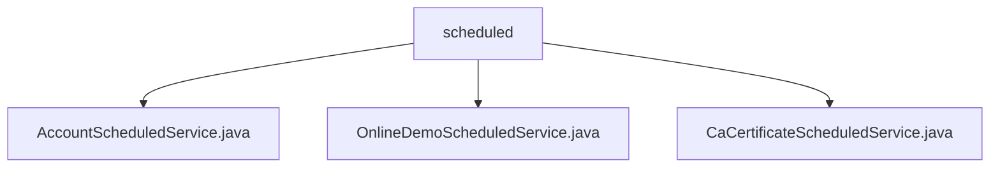

# Basic Information

|      |      |
|------|------|
| Name | scheduled |
| Language | .java |
| Code Path | WeFe/board/board-service/src/main/java/com/welab/wefe/board/service/scheduled |
| Package Name | docs.board.board-service.src.main.java.com.welab.wefe.board.service.scheduled |
| Brief Description | The AccountScheduledService manages accounts on a scheduled basis, executing hourly to disable inactive accounts after 90 days and delete them after 180 days. The OnlineDemoScheduledService cleans up demo environment data, including projects and logs, every 10 minutes. The CaCertificateScheduledService refreshes the CA certificate cache every 30 seconds. |

# Description

## Overview  
This module consists of multiple Spring scheduled task components, with its core responsibility being the execution of periodic system maintenance operations, akin to a background daemon process. The interface specification uniformly adopts the `@Scheduled` annotation to configure execution frequency, supporting initial delay settings. Key data structures include account status, project lifecycle, and CA certificate cache. External dependencies include `AccountRepository`, JPA, and `CaCertificateCache`. For example, `AccountScheduledService` processes idle accounts hourly, `OnlineDemoScheduledService` cleans up demo data every 10 minutes, and `CaCertificateScheduledService` refreshes the certificate cache every 30 seconds.  

## Primary Business Scenarios  
The module primarily handles three types of scheduled tasks: account lifecycle management (disabling/deactivating idle accounts), demo environment maintenance (cleaning up expired projects and logs), and certificate cache updates. It employs a unified interaction pattern: task triggering → environment check → batch processing → result recording. For instance, `OnlineDemoScheduledService` deletes expired data in phases, limiting each batch to 1,000 entries to prevent timeouts. Typical applications include system resource reclamation (similar to a GC mechanism) and critical data refresh, with all operations featuring complete logging and exception handling capabilities.

### Package Internal Structure View

This flowchart illustrates the hierarchical structure of the scheduled directory under the board-service module in the WeFe project. The parent node "scheduled" contains three scheduled task service classes: AccountScheduledService handles account-related scheduled tasks, OnlineDemoScheduledService manages online demo tasks, and CaCertificateScheduledService is responsible for CA certificate scheduled processing. All child nodes are Java class files directly belonging to the scheduled directory.

# File List

| Name   | Type  | Description |
|-------|------|-------------|
| [AccountScheduledService.java](AccountScheduledService.md) | file | AccountScheduledService is a scheduled task class that runs hourly with an initial delay of 10 seconds. It invokes the accountRepository method to disable accounts inactive for 90 days and deactivate accounts inactive for 180 days, while logging execution records. |
| [OnlineDemoScheduledService.java](OnlineDemoScheduledService.md) | file | The `OnlineDemoScheduledService` class periodically cleans up invalid demo environment data: it checks and closes projects created by non-administrators that have been inactive for 10 days; deletes projects unused for 10 days without any processes; and clears operation logs older than 90 days. It executes every 10 minutes using the `@Scheduled` annotation. |
| [CaCertificateScheduledService.java](CaCertificateScheduledService.md) | file | The scheduled task class CaCertificateScheduledService executes the CA certificate cache refresh operation every 30 seconds, logging both success and failure outcomes. |

