# Basic Information

|      |      |
|------|------|
| Name | AbstractUnionService |
| Language | .java |
| Code Path | WeFe/board/board-service/src/main/java/com/welab/wefe/board/service/sdk/AbstractUnionService.java |
| Package Name | com.welab.wefe.board.service.sdk |
| Dependencies | ['com.alibaba.fastjson.JSON', 'com.alibaba.fastjson.JSONException', 'com.alibaba.fastjson.JSONObject', 'com.welab.wefe.board.service.api.union.MemberListApi', 'com.welab.wefe.board.service.api.union.member_auth.MemberRealnameAuthApi', 'com.welab.wefe.board.service.constant.Config', 'com.welab.wefe.board.service.service.AbstractService', 'com.welab.wefe.board.service.service.CacheObjects', 'com.welab.wefe.board.service.service.globalconfig.GlobalConfigService', 'com.welab.wefe.common.StatusCode', 'com.welab.wefe.common.constant.SecretKeyType', 'com.welab.wefe.common.exception.StatusCodeWithException', 'com.welab.wefe.common.http.HttpContentType', 'com.welab.wefe.common.http.HttpRequest', 'com.welab.wefe.common.http.HttpResponse', 'com.welab.wefe.common.util', 'com.welab.wefe.common.wefe.dto.global_config.MemberInfoModel', 'net.jodah.expiringmap.ExpiringMap', 'org.apache.http.entity.ContentType', 'org.apache.http.entity.mime.content.InputStreamBody', 'org.springframework.beans.factory.annotation.Autowired', 'org.springframework.util.MultiValueMap', 'org.springframework.web.multipart.MultipartFile', 'java.io.IOException', 'java.util.Map', 'java.util.TreeMap', 'java.util.concurrent.TimeUnit'] |
| Brief Description | AbstractUnionService is an abstract class that provides member information management functionalities, including system initialization, information upload, public key reset, paginated queries, and more. It employs caching to optimize query performance, supports RSA signatures and file uploads, and interacts with the Union API via HTTP requests. |

# Description

AbstractUnionService is an abstract class that extends AbstractService, primarily designed for handling member information management and interactions with the Union API. It includes an ExpiringMap cache with a 60-second expiration and a maximum capacity of 500, and injects Config and GlobalConfigService. Key functionalities encompass: system initialization, reporting member information, resetting public keys, updating member information (with or without logo), paginated member queries, real-name authentication-related operations, and file uploads. All API requests support signature verification, handling HTTP requests and responses, including error handling and JSON parsing.

# Class Summary

| Name   | Type  | Description |
|-------|------|-------------|
| AbstractUnionService | class | AbstractUnionService is an abstract class that provides member information management functionalities, including system initialization, information upload, public key reset, paginated queries, etc., utilizing caching and signature mechanisms to ensure security. |


## Class AbstractUnionService

|      |      |
|------|------|
| Access Modifier | public abstract |
| Type | class |
| Name | AbstractUnionService |
| Description | AbstractUnionService is an abstract class that provides member information management functionalities, including system initialization, information upload, public key reset, paginated queries, etc., utilizing caching and signature mechanisms to ensure security. |


### UML Class Diagram

```mermaid
classDiagram
    class AbstractService {
        <<abstract>>
    }

    class AbstractUnionService {
        <<abstract>>
        -ExpiringMap~String, Object~ CACHE_MAP
        -Config config
        -GlobalConfigService globalConfigService
        +initializeSystem(MemberInfoModel model) void
        +uploadMemberInfo(MemberInfoModel model) void
        +resetPublicKey(MemberInfoModel model) void
        +uploadMemberInfoExcludeLogo(MemberInfoModel model) void
        +updateMemberLogo(MemberInfoModel model) void
        +queryMembers(MemberListApi.Input input) JSONObject
        +queryMemberById(String id) JSONObject
        +queryMember(String id, String name) JSONObject
        +queryMember(int pageIndex, int pageSize) JSONObject
        +queryMemberByPage(int pageIndex, int pageSize, String id, String name) JSONObject
        +request(String api) JSONObject
        +request(String api, JSONObject params) JSONObject
        #request(String api, JSONObject params, boolean needSign) JSONObject
        +queryMemberAuthTypeList() JSONObject
        +realnameAuth(MemberRealnameAuthApi.Input input) JSONObject
        +realnameAuthInfoQuery() JSONObject
        +realnameAuthAgreementTemplateQuery() JSONObject
        +uploadFile(MultiValueMap~String, MultipartFile~ files, JObject params) JSONObject
        -request(String api, JSONObject params, MultiValueMap~String, MultipartFile~ files, boolean needSign) JSONObject
    }

    class MemberInfoModel {
        +String memberId
        +String memberName
        +String memberMobile
        +Boolean memberAllowPublicDataSet
        +String rsaPublicKey
        +String memberEmail
        +String memberGatewayUri
        +String memberLogo
        +Boolean memberHidden
        +SecretKeyType secretKeyType
        +Boolean memberGatewayTlsEnable
    }

    class MemberListApi {
        class Input {
            +Integer pageIndex
            +Integer pageSize
            +String name
            +String id
        }
    }

    class MemberRealnameAuthApi {
        class Input {
            // Fields to be added as per actual implementation
        }
    }

    class ExpiringMap~K, V~ {
        <<Map>>
    }

    class Config {
        +String unionBaseUrl
    }

    class GlobalConfigService {
        // Service methods
    }

    class JSONObject {
        // JSON object methods
    }

    class JObject {
        +create() JObject
        +put(String key, Object value) JObject
    }

    class HttpResponse {
        +boolean success()
        +String getError()
        +int getCode()
        +String getMessage()
        +String getUrl()
        +JSONObject getBodyAsJson()
        +String getBodyAsString()
    }

    class HttpRequest {
        +create(String url) HttpRequest
        +setBody(String data) HttpRequest
        +postJson() HttpResponse
        +setContentType(String type) HttpRequest
        +appendParameter(String name, InputStreamBody body) HttpRequest
        +post() HttpResponse
    }

    class MultipartFile {
        +String getContentType()
        +String getOriginalFilename()
        +InputStream getInputStream()
    }

    class InputStreamBody {
        +InputStreamBody(InputStream stream, ContentType type, String filename)
    }

    AbstractUnionService --|> AbstractService
    AbstractUnionService --> Config : depends on
    AbstractUnionService --> GlobalConfigService : depends on
    AbstractUnionService --> MemberInfoModel : uses
    AbstractUnionService --> MemberListApi : uses
    AbstractUnionService --> MemberRealnameAuthApi : uses
    AbstractUnionService --> ExpiringMap : uses
    AbstractUnionService --> JSONObject : returns
    AbstractUnionService --> JObject : uses
    AbstractUnionService --> HttpResponse : uses
    AbstractUnionService --> HttpRequest : uses
    AbstractUnionService --> MultipartFile : uses
    AbstractUnionService --> InputStreamBody : uses
    MemberListApi *-- Input
    MemberRealnameAuthApi *-- Input
```

This code demonstrates an abstract class `AbstractUnionService` that inherits from `AbstractService`, primarily used for handling member information initialization, upload, query operations, etc. The class utilizes a caching mechanism `ExpiringMap` to optimize query performance and interacts with remote APIs via `HttpRequest`. Core functionalities include member information management, real-name authentication, and file uploads, with various overloaded `request` methods handling different types of HTTP requests. The class diagram clearly illustrates its dependencies with configuration services, data models, and network utility classes.


### Internal Method Call Graph

```mermaid
graph TD
    A["Abstract Class AbstractUnionService"]
    B["Static Cache: ExpiringMap<String, Object> CACHE_MAP"]
    C["Dependency Injection: Config config"]
    D["Dependency Injection: GlobalConfigService globalConfigService"]
    E["Method: initializeSystem(MemberInfoModel)"]
    F["Method: uploadMemberInfo(MemberInfoModel)"]
    G["Method: resetPublicKey(MemberInfoModel)"]
    H["Method: uploadMemberInfoExcludeLogo(MemberInfoModel)"]
    I["Method: updateMemberLogo(MemberInfoModel)"]
    J["Method: queryMembers(MemberListApi.Input)"]
    K["Method: queryMemberById(String)"]
    L["Method: queryMember(String, String)"]
    M["Method: queryMember(int, int)"]
    N["Method: queryMemberByPage(int, int, String, String)"]
    O["Method: request(String)"]
    P["Method: request(String, JSONObject)"]
    Q["Method: request(String, JSONObject, boolean)"]
    R["Method: queryMemberAuthTypeList()"]
    S["Method: realnameAuth(MemberRealnameAuthApi.Input)"]
    T["Method: realnameAuthInfoQuery()"]
    U["Method: realnameAuthAgreementTemplateQuery()"]
    V["Method: uploadFile(MultiValueMap, JObject)"]
    W["Private Method: request(String, JSONObject, MultiValueMap, boolean)"]

    A --> B
    A --> C
    A --> D
    A --> E
    A --> F
    A --> G
    A --> H
    A --> I
    A --> J
    A --> K
    K --> L
    A --> L
    A --> M
    M --> N
    A --> N
    A --> O
    O --> P
    P --> Q
    A --> R
    R --> Q
    A --> S
    S --> Q
    A --> T
    T --> Q
    A --> U
    U --> Q
    A --> V
    V --> W
    J --> Q
    E --> Q
    F --> Q
    G --> Q
    H --> Q
    I --> Q
```



This flowchart illustrates the core structure and invocation relationships of the AbstractUnionService class. This abstract class primarily provides member information management services, including core functionalities such as system initialization, uploading/updating member information, key reset, and paginated queries. All operations ultimately implement HTTP requests through the request method, supporting special handling with signatures and file uploads. The caching mechanism CACHE_MAP optimizes paginated query performance, while the dependency-injected config and globalConfigService provide foundational configuration support. The class methods exhibit a clear hierarchical structure, where basic query methods invoke lower-level paginated query implementations.

### Field List

| Name  | Type  | Description |
|-------|-------|------|
| globalConfigService | GlobalConfigService | Automatically inject global configuration service instances. |
| CACHE_MAP = ExpiringMap            .builder()            .expiration(60, TimeUnit.SECONDS)            .maxSize(500)            .build() | ExpiringMap<String, Object> | Define a protected static constant CACHE_MAP, implemented using ExpiringMap, with an expiration time of 60 seconds and a maximum capacity of 500. |
| config | Config | Automatically inject configuration object instances. |

### Method List

| Name  | Type  | Description |
|-------|-------|------|
| uploadMemberInfo | void | Method for uploading member information: Accepts a MemberInfoModel parameter, constructs a JSON object containing fields such as member ID, name, phone number, etc., and calls the member/update interface to submit the data. May throw a StatusCodeWithException. |
| realnameAuth | JSONObject | Real-name authentication interface, receives input parameters and returns JSON results, may throw exceptions. |
| queryMembers | JSONObject | The synchronous method `queryMembers` retrieves member information based on input parameters. It first checks the cache and returns cached data if a hit occurs. If no cache hit occurs, it constructs request parameters, invokes the API, stores the result in the cache, and then returns it. |
| realnameAuthInfoQuery | JSONObject | The method to query real-name authentication information is to call the interface member/realname/authInfo/query, which returns a JSONObject and may throw an exception. |
| queryMember | JSONObject | Methods for querying member information: Call the paginated query interface using ID and name parameters, return a JSON object, and may throw exceptions. |
| resetPublicKey | void | The method `resetPublicKey` updates the member's public key. It takes a `MemberInfoModel` parameter, constructs a JSON request containing the member ID and RSA public key, and calls the `member/update_public_key` interface. It may throw a `StatusCodeWithException` exception. |
| initializeSystem | void | Initialization system method, constructs a JSON object through the MemberInfoModel parameter and requests the member/add interface, including fields such as member ID, name, and phone number. |
| uploadMemberInfoExcludeLogo | void | Upload member information (excluding Logo), including fields such as ID, name, mobile number, public key, etc., by calling the member/update_exclude_logo interface. |
| request | JSONObject | Java Method: Returns a JSONObject via API request, may throw a StatusCodeWithException, with default parameters as null and true. |
| queryMember | JSONObject | The method `queryMember` retrieves member information through pagination by invoking `queryMemberByPage`, passing the page number and size as parameters with an empty string for other arguments, and may throw a `StatusCodeWithException` exception. |
| queryMemberById | JSONObject | The method `queryMemberById` retrieves member information by ID, returns a `JSONObject`, and may throw a `StatusCodeWithException`. Internally, it calls the `queryMember` method with the second parameter as an empty string. |
| request | JSONObject | This is a Java method designed to send a request to a specified API and return a JSONObject result. The method accepts an API path and parameters, and may throw a StatusCodeWithException. Internally, it calls another overloaded method with a certain feature enabled by default. |
| request | JSONObject | This method is used to send requests to a specified API, handling parameter signing, request sending, and response validation. If signing is required, it uses RSA to sign the data and encapsulates the request body. It checks the response status and return code, throws an exception upon failure, and returns the JSON result upon success. |
| queryMemberAuthTypeList | JSONObject | Query the list of member authentication types, returning a JSON object, which may throw a StatusCodeWithException. |
| queryMemberByPage | JSONObject | Paging query for member information, supports filtering by ID and name, returns results in JSON format. Parameters include page number, page size, ID, and name, all optional. |
| realnameAuthAgreementTemplateQuery | JSONObject | Query the interface for the real-name authentication agreement template, which returns a JSON object and may throw an exception. |
| updateMemberLogo | void | Method to update member logo: Receive the MemberInfoModel parameter, construct a JSON object containing the member ID and Logo, and call the member/update_logo interface. Throws StatusCodeWithException in case of exceptions. |
| uploadFile | JSONObject | The Java method `uploadFile` receives a file and parameters, invokes the `request` interface to upload the file to the `member/file/upload` path, and may throw an exception. |
| request | JSONObject | This method is used to send HTTP requests, handle parameter signing and file uploads, verify response status, and return JSON results. If signing is required, it generates an RSA signature, supports multipart requests with files, and throws exceptions upon failure. |


