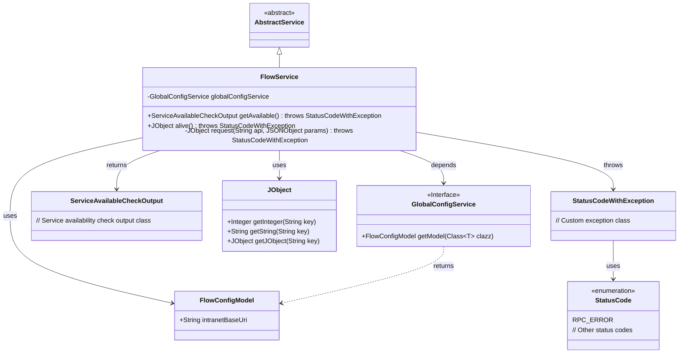
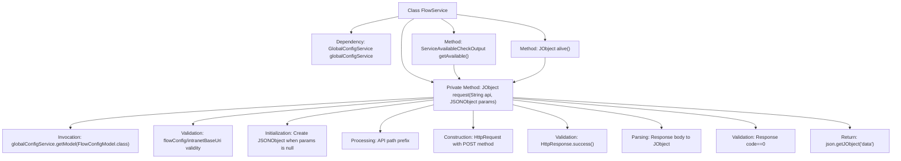

# Basic Information

|      |      |
|------|------|
| Name | FlowService |
| Language | .java |
| Code Path | WeFe/board/board-service/src/main/java/com/welab/wefe/board/service/sdk/FlowService.java |
| Package Name | com.welab.wefe.board.service.sdk |
| Dependencies | ['com.alibaba.fastjson.JSONException', 'com.alibaba.fastjson.JSONObject', 'com.welab.wefe.board.service.service.AbstractService', 'com.welab.wefe.board.service.service.globalconfig.GlobalConfigService', 'com.welab.wefe.common.StatusCode', 'com.welab.wefe.common.exception.StatusCodeWithException', 'com.welab.wefe.common.http.HttpRequest', 'com.welab.wefe.common.http.HttpResponse', 'com.welab.wefe.common.util.JObject', 'com.welab.wefe.common.util.StringUtil', 'com.welab.wefe.common.wefe.checkpoint.dto.ServiceAvailableCheckOutput', 'com.welab.wefe.common.wefe.dto.global_config.FlowConfigModel', 'org.springframework.beans.factory.annotation.Autowired', 'org.springframework.stereotype.Service'] |
| Brief Description | The FlowService provides methods to check service availability and liveness status by invoking APIs via internal network addresses and processing responses, throwing exceptions if configurations are missing or requests fail. |

# Description

FlowService is a service class that inherits from AbstractService, designed to handle HTTP requests related to flow services. It retrieves configuration information for flow services, including internal network addresses, through globalConfigService. The class primarily provides two public methods: `getAvailable` checks service availability and returns a `ServiceAvailableCheckOutput` object, while `alive` detects service liveliness and returns a `JObject` object. The internal `request` method handles the core request logic, including parameter validation, URL concatenation, HTTP request transmission, and response processing. If configuration is missing or a request fails, it throws a `StatusCodeWithException` exception. Successful responses must contain JSON data with a `code` value of 0; otherwise, an exception is also thrown.

# Class Summary

| Name   | Type  | Description |
|-------|------|-------------|
| FlowService | class | The FlowService provides two APIs: getAvailable checks service availability, and alive checks the liveliness status. The internal request method handles HTTP requests, validates configurations and responses, and throws status code errors when exceptions occur. |

## Class FlowService

|      |      |
|------|------|
| Access Modifier | @Service;public |
| Type | class |
| Name | FlowService |
| Description | The FlowService provides two APIs: getAvailable checks service availability, and alive checks the liveliness status. The internal request method handles HTTP requests, validates configurations and responses, and throws status code errors when exceptions occur. |

### UML Class Diagram

This code demonstrates a FlowService class that inherits from AbstractService, primarily used for HTTP communication with remote services. The class retrieves configuration information through GlobalConfigService and provides two public methods: getAvailable() and alive(), along with a private request() method to handle actual HTTP requests. The code includes detailed error handling logic, checking configuration validity, HTTP response status, and data format, throwing StatusCodeWithException exceptions when issues arise. The class diagram clearly illustrates the relationships and dependencies among these classes.

### Internal Method Call Graph

Flowchart Description: This flowchart illustrates the core processing logic of the FlowService class, focusing on the complete call chain of the request method. Starting from retrieving global configurations, it goes through multiple steps including parameter validation, request construction, and response processing, ultimately returning valid data or throwing exceptions. It encompasses full lifecycle management of HTTP requests and rigorous error handling mechanisms.

### Field List

| Name  | Type  | Description |
|-------|-------|------|
| globalConfigService | GlobalConfigService | Using @Autowired to automatically inject an instance of GlobalConfigService. |

### Method List

| Name  | Type  | Description |
|-------|-------|------|
| getAvailable | ServiceAvailableCheckOutput | The method retrieves the service availability status by requesting the "/service/available" interface, returning a ServiceAvailableCheckOutput object, and may throw a StatusCodeWithException exception. |
| alive | JObject | Check the service's alive status by calling the "/service/alive" endpoint, which takes no parameters and returns a JObject. May throw a StatusCodeWithException. |
| request | JObject | This method is used to send a POST request to the specified API. First, it checks the intranet address in the global configuration and throws an error if it is not set. After processing the parameters, it sends the request and throws an exception upon failure. It parses the JSON response, checks the status code, and throws an exception if it is not 0. If successful, it returns the data portion. |

