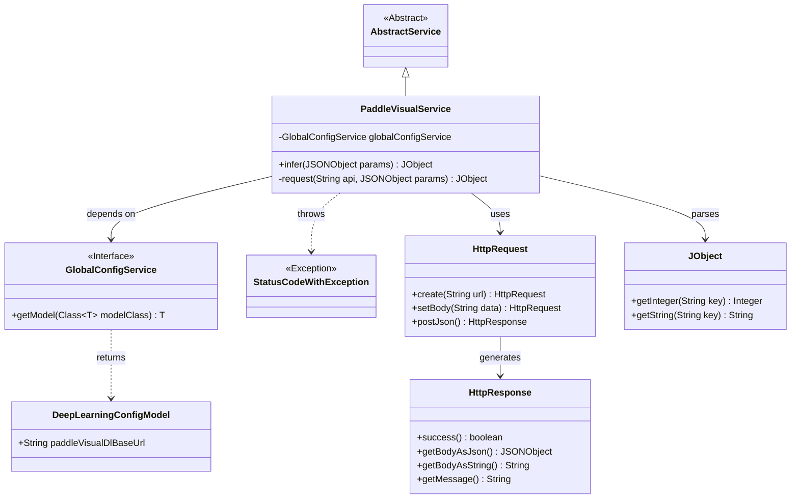
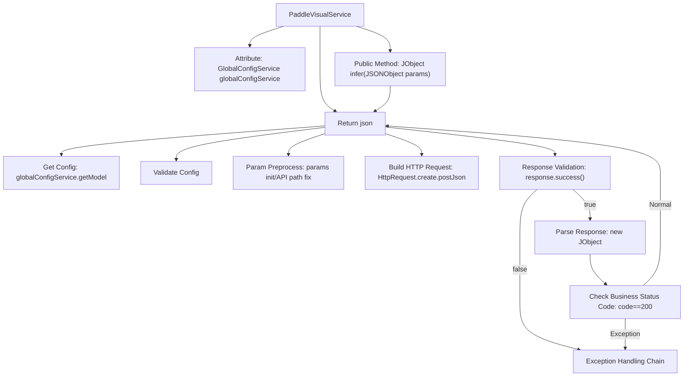

# Basic Information

|      |      |
|------|------|
| Name | PaddleVisualService |
| Language | .java |
| Code Path | WeFe/board/board-service/src/main/java/com/welab/wefe/board/service/sdk/PaddleVisualService.java |
| Package Name | com.welab.wefe.board.service.sdk |
| Dependencies | ['com.alibaba.fastjson.JSONException', 'com.alibaba.fastjson.JSONObject', 'com.welab.wefe.board.service.service.AbstractService', 'com.welab.wefe.board.service.service.globalconfig.GlobalConfigService', 'com.welab.wefe.common.StatusCode', 'com.welab.wefe.common.exception.StatusCodeWithException', 'com.welab.wefe.common.http.HttpRequest', 'com.welab.wefe.common.http.HttpResponse', 'com.welab.wefe.common.util.JObject', 'com.welab.wefe.common.util.StringUtil', 'com.welab.wefe.common.wefe.dto.global_config.DeepLearningConfigModel', 'org.springframework.beans.factory.annotation.Autowired', 'org.springframework.stereotype.Service'] |
| Brief Description | PaddleVisualService provides deep learning inference interfaces, invokes VisualFL services via HTTP requests, checks configurations and response statuses, and returns results or exceptions. |

# Description

PaddleVisualService is a service class based on AbstractService, which retrieves deep learning configurations via globalConfigService. The core method `infer` accepts JSON parameters and invokes the internal `request` method to send a POST request to the configured VisualFL service address. The `request` method validates configuration effectiveness, processes API paths, sends JSON requests, and parses responses. If the response status code is not 200 or parsing fails, it throws an RPC_ERROR exception. Upon success, it returns the response JSON object.

# Class Summary

| Name   | Type  | Description |
|-------|------|-------------|
| PaddleVisualService | class | PaddleVisualService provides deep learning inference services by invoking the VisualFL interface to process requests, checking configurations and response statuses, and returning results or exceptions. |

## Class PaddleVisualService

|      |      |
|------|------|
| Access Modifier | @Service;public |
| Type | class |
| Name | PaddleVisualService |
| Description | PaddleVisualService provides deep learning inference services by invoking the VisualFL interface to process requests, checking configurations and response statuses, and returning results or exceptions. |

### UML Class Diagram

Class Diagram Description: This diagram illustrates that the PaddleVisualService class inherits from AbstractService and depends on the GlobalConfigService interface to obtain configurations. The service initiates requests via HttpRequest and processes HttpResponse responses, parsing returned data using JObject. It throws StatusCodeWithException exceptions when errors occur. The overall structure clearly reflects the invocation flow and exception handling mechanism of the deep learning visualization service.

### Internal Method Call Graph

Flowchart Description: This flowchart illustrates the core processing logic of PaddleVisualService, starting from the infer entry method and completing the full call chain through the private request method. The process includes key steps such as configuration retrieval, parameter validation, HTTP request construction, and response handling, featuring three-layer exception checks (config validation, HTTP status validation, business status code validation). Any failure in these steps triggers the exception handling flow. Upon success, it returns parsed JSON data, fully encapsulating the interaction with the PaddleVisualDL service.

### Field List

| Name  | Type  | Description |
|-------|-------|------|
| globalConfigService | GlobalConfigService | Use @Autowired to automatically inject an instance of GlobalConfigService. |

### Method List

| Name  | Type  | Description |
|-------|-------|------|
| infer | JObject | Java Method: Sends a JSON request via the `/infer` path, returns a JObject, and may throw a StatusCodeWithException. |
| request | JObject | This method is used to send a POST request to the VisualFL service. It first checks the service address configuration, then processes the parameters and API path, sends the request, and verifies the response status and return code. If successful, it returns the JSON result; if failed, it throws an exception. |

