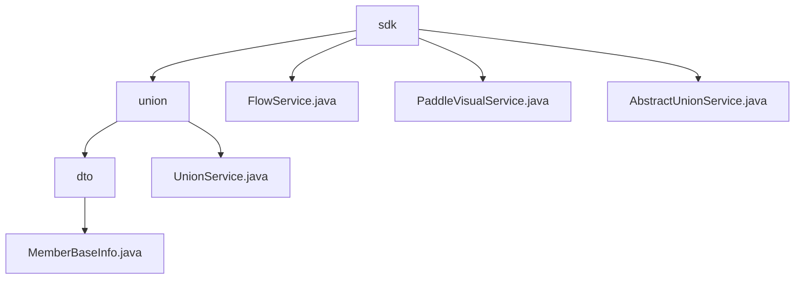

# Basic Information

|      |      |
|------|------|
| Name | sdk |
| Language | .java |
| Code Path | WeFe/board/board-service/src/main/java/com/welab/wefe/board/service/sdk |
| Package Name | docs.board.board-service.src.main.java.com.welab.wefe.board.service.sdk |
| Brief Description | Manage member basic information and alliance data services, including the MemberBaseInfo data structure and the UnionService service class. Supports member status management, data resource sharing, permission checks, and asynchronous caching. Depends on Java libraries and caching frameworks. |

# Description

## Overview  
This module serves as the data service hub for federated collaboration, with core responsibilities including member lifecycle management (e.g., status marking/real-name authentication) and cross-institution data resource sharing (similar to a data middle platform model). Key service classes `UnionService` and `FlowService` handle federated API integration and flow control respectively, both inheriting from an abstract base service class. The data structure encompasses `MemberBaseInfo` (member ID/status markers) and CA certificates (serial number/PEM format), adopting a hybrid interaction model: synchronous permission validation with asynchronous cache updates (e.g., `ExpiringMap` cache). External dependencies include Java core libraries, HTTP clients, and potential VisualFL deep learning services.  

## Key Business Scenarios  
Typical applications involve three scenarios: 1) Member status management (e.g., visibility control via `hidden` markers), 2) Federated data operations (e.g., asynchronous updates to `TableDataSet` or CA certificate retrieval), 3) Service health monitoring (e.g., `alive` detection in `FlowService`). Interactions follow a layered pattern: foundational services (e.g., `PaddleVisualService`) process raw requests, while upper-layer services (e.g., `UnionService`) implement business logic chains, akin to a gateway proxy model. The complete functional chain is reflected in end-to-end permission validation and error handling, such as automatic signature verification during file uploads. Integration cases cover diverse data types (`ImageDataSet`/`JObject`) and cross-protocol communication (HTTP/RPC).

### Package Internal Structure View

This flowchart illustrates the hierarchical structure of the sdk directory under the board-service module in the WeFe project. The root node "sdk" contains the "union" subdirectory and three service class files, while the "union" directory further includes the "dto" subdirectory and the "UnionService" class. The "dto" directory contains the "MemberBaseInfo" data transfer object file. The overall structure clearly presents the organization of SDK components within the service module.

# File List

| Name   | Type  | Description |
|-------|------|-------------|
| [FlowService.java](FlowService.md) | file | The FlowService provides methods to check service availability and liveness status by invoking APIs via internal network addresses and processing responses, throwing exceptions if configurations are missing or requests fail. |
| [PaddleVisualService.java](PaddleVisualService.md) | file | PaddleVisualService provides deep learning inference interfaces, invokes VisualFL services via HTTP requests, checks configurations and response statuses, and returns results or exceptions. |
| [AbstractUnionService.java](AbstractUnionService.md) | file | AbstractUnionService is an abstract class that provides member information management functionalities, including system initialization, information upload, public key reset, paginated queries, and more. It utilizes caching to optimize query performance, supports RSA signatures and file uploads, and interacts with the Union API via HTTP requests. |
| [union](union/_module.md) | package | The MemberBaseInfo class stores member ID, name, hidden status, lost contact status, and frozen status. The UnionService class provides member mapping, data resource operations, and CA certificate query functionality, supporting multiple data types and asynchronous processing. |

