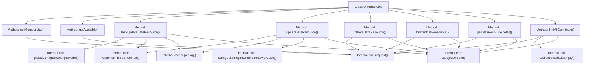

# Basic Information

|      |      |
|------|------|
| Name | UnionService |
| Language | .java |
| Code Path | WeFe/board/board-service/src/main/java/com/welab/wefe/board/service/sdk/union/UnionService.java |
| Package Name | com.welab.wefe.board.service.sdk.union |
| Dependencies | ['com.alibaba.fastjson.JSONArray', 'com.alibaba.fastjson.JSONObject', 'com.welab.wefe.board.service.cache.CaCertificateCache', 'com.welab.wefe.board.service.database.entity.data_resource.DataResourceMysqlModel', 'com.welab.wefe.board.service.dto.entity.data_resource.output.BloomFilterOutputModel', 'com.welab.wefe.board.service.dto.entity.data_resource.output.ImageDataSetOutputModel', 'com.welab.wefe.board.service.dto.entity.data_resource.output.TableDataSetOutputModel', 'com.welab.wefe.board.service.sdk.AbstractUnionService', 'com.welab.wefe.board.service.sdk.union.dto.MemberBaseInfo', 'com.welab.wefe.common.CommonThreadPool', 'com.welab.wefe.common.exception.StatusCodeWithException', 'com.welab.wefe.common.util.JObject', 'com.welab.wefe.common.util.StringUtil', 'com.welab.wefe.common.wefe.checkpoint.dto.ServiceAvailableCheckOutput', 'com.welab.wefe.common.wefe.dto.global_config.MemberInfoModel', 'com.welab.wefe.common.wefe.enums.DataResourcePublicLevel', 'com.welab.wefe.common.wefe.enums.DataResourceType', 'org.apache.commons.collections4.CollectionUtils', 'org.springframework.stereotype.Service', 'java.util.ArrayList', 'java.util.LinkedHashMap', 'java.util.List'] |
| Brief Description | The UnionService provides functionalities for member information retrieval, service availability checks, delayed data resource updates, CRUD operations, and certificate queries. It supports caching and asynchronous processing, incorporating permission verification and error handling. |

# Description

The UnionService class inherits from AbstractUnionService and provides various service functions related to members and data resources. Key methods include retrieving member mapping information, checking service availability, performing delayed updates on data resources, CRUD operations for data resources, fetching data resource details, and querying all CA certificates. Data resource operations involve permission checks, asynchronous processing, and caching mechanisms, supporting multiple data types such as ImageDataSet, TableDataSet, and BloomFilter. The CA certificate query functionality retrieves information like serial numbers, subject names, and certificate contents.

# Class Summary

| Name   | Type  | Description |
|-------|------|-------------|
| UnionService | class | The UnionService provides functionalities for member information retrieval, service availability checks, delayed updates of data resources, CRUD operations, and certificate queries. It includes caching mechanisms and permission verification. |


## Class UnionService

|      |      |
|------|------|
| Access Modifier | @Service;public |
| Type | class |
| Name | UnionService |
| Description | The UnionService provides functionalities for member information retrieval, service availability checks, delayed updates of data resources, CRUD operations, and certificate queries. It includes caching mechanisms and permission verification. |


### UML Class Diagram

```mermaid
classDiagram
    class AbstractUnionService {
        <<abstract>>
        +log(StatusCodeWithException e) void
    }

    class UnionService {
        -CACHE_MAP : Map~String, Object~
        +getMemberMap() LinkedHashMap~String, MemberBaseInfo~
        +getAvailable() ServiceAvailableCheckOutput
        +lazyUpdateDataResource(DataResourceMysqlModel model) void
        +upsertDataResource(DataResourceMysqlModel model) void
        +deleteDataResource(DataResourceMysqlModel model) void
        +hiddenDataResource(DataResourceMysqlModel model) void
        +getDataResourceDetail~OUT~(String dataResourceId, Class~OUT~ outputClass) OUT
        +getDataResourceDetail~OUT~(String dataResourceId, DataResourceType dataResourceType, Class~OUT~ outputClass) OUT
        +findAllCertificate() List~CaCertificateCache.CaCertificate~
    }

    class MemberBaseInfo {
        // Member basic information class
    }

    class ServiceAvailableCheckOutput {
        // Service availability check output class
    }

    class DataResourceMysqlModel {
        -id : String
        -publicLevel : DataResourcePublicLevel
        -dataResourceType : DataResourceType
        +getId() String
        +getPublicLevel() DataResourcePublicLevel
        +getDataResourceType() DataResourceType
    }

    class MemberInfoModel {
        -memberAllowPublicDataSet : Boolean
        -memberHidden : Boolean
        +getMemberAllowPublicDataSet() Boolean
        +getMemberHidden() Boolean
    }

    class DataResourcePublicLevel {
        <<enumeration>>
        OnlyMyself
        // Other enumeration values...
    }

    class DataResourceType {
        <<enumeration>>
        ImageDataSet
        TableDataSet
        BloomFilter
        // Other enumeration values...
    }

    class JObject {
        +create() JObject
        +create(Object obj) JObject
        +append(String key, Object value) JObject
        +put(String key, Object value) JObject
        +getStringByPath(String path) String
    }

    class CommonThreadPool {
        <<utility>>
        +run(Runnable task) void
    }

    class CaCertificateCache {
        class CaCertificate {
            -id : String
            -name : String
            -content : String
            +setId(String id) void
            +setName(String name) void
            +setContent(String content) void
        }
    }

    UnionService --|> AbstractUnionService : Inheritance
    UnionService --> MemberBaseInfo : Uses
    UnionService --> ServiceAvailableCheckOutput : Uses
    UnionService --> DataResourceMysqlModel : Uses
    UnionService --> MemberInfoModel : Uses
    UnionService --> DataResourcePublicLevel : Uses
    UnionService --> DataResourceType : Uses
    UnionService --> JObject : Uses
    UnionService --> CommonThreadPool : Uses
    UnionService --> CaCertificateCache : Uses
```

This code demonstrates a service class named UnionService, which inherits from AbstractUnionService and provides various functionalities related to member management and data resource operations. The class primarily handles member information retrieval, service availability checks, and CRUD operations for data resources. It utilizes thread pools for asynchronous processing of time-consuming tasks and optimizes performance through caching mechanisms. The code involves multiple model classes and enumeration types such as MemberBaseInfo and DataResourceMysqlModel, showcasing complex business logic processing capabilities.


### Internal Method Call Graph



This code represents the implementation of the UnionService class, which primarily provides functionalities such as member information retrieval, service availability checks, data resource operations, and certificate queries. The flowchart reveals that the class contains 8 main methods, with core logic relying on the request() method for remote calls, and involving auxiliary operations like thread pool asynchronous processing, global configuration retrieval, and exception logging. Data resource-related methods construct JObject parameter objects, while some methods implement caching mechanisms and type conversion features. The overall design follows a service layer pattern, inheriting from the AbstractUnionService base class.

### Field List

| Name  | Type  | Description |
|-------|-------|------|

### Method List

| Name  | Type  | Description |
|-------|-------|------|
| lazyUpdateDataResource | void | The method lazily updates data resources, asynchronously calling the update interface after checking member permissions. It directly returns if the member lacks permissions or is hidden. During the update, model parameters and IDs are passed, and exceptions are logged. |
| getMemberMap | LinkedHashMap<String, MemberBaseInfo> | Obtain Member Mapping Table: Retrieve member data via API request, parse it into JSON, and convert it into a LinkedHashMap with member IDs as keys and MemberBaseInfo objects as values. Throws StatusCodeWithException on exceptions. |
| getDataResourceDetail | OUT | The method retrieves data resource details through cache. If no cache exists, it requests the interface, processes the returned data, stores it in cache, and returns an object of the specified type. Parameters include resource ID, type, and output class, and exceptions may be thrown. |
| getDataResourceDetail | OUT | This method determines the data resource type based on the output class type and calls internal methods to retrieve resource details. It supports three types: image datasets, tabular datasets, and Bloom filters. |
| getAvailable | ServiceAvailableCheckOutput | Check service availability, return JSON results and convert them to specified class objects. Throw an exception if failed. |
| hiddenDataResource | void | Method for hiding data resources: Receive a DataResourceMysqlModel object, construct JSON parameters containing data_resource_id, and call the data_resource/hidden interface. May throw a StatusCodeWithException. |
| deleteDataResource | void | Method for deleting data resources, which takes a DataResourceMysqlModel parameter, constructs request parameters including the resource ID, and calls the deletion interface. Throws StatusCodeWithException in case of exceptions. |
| findAllCertificate | List<CaCertificateCache.CaCertificate> | This method queries all CA certificates, parses the returned data, and constructs a certificate list to return. If the data is empty, it returns an empty list. |
| upsertDataResource | void | The method `upsertDataResource` handles the upsert operation of data resources. It checks the global configuration and terminates if public access is prohibited. Asynchronous processing: private data invokes `hiddenDataResource` for removal, otherwise submits the data to the specified interface. Exceptions are logged. |


