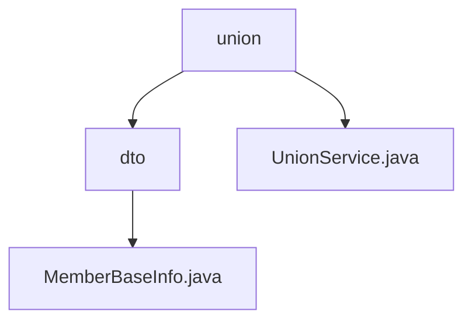

# Basic Information

|      |      |
|------|------|
| Name | union |
| Language | .java |
| Code Path | WeFe/board/board-service/src/main/java/com/welab/wefe/board/service/sdk/union |
| Package Name | docs.board.board-service.src.main.java.com.welab.wefe.board.service.sdk.union |
| Brief Description | The MemberBaseInfo class stores member ID, name, hidden status, lost contact status, and frozen status. The UnionService class provides member mapping, data resource operations, and CA certificate query functionality, supporting multiple data types and asynchronous processing. |

# Description

## Overview  
The core responsibility of this module is to manage member basic information and provide alliance data services, including the `MemberBaseInfo` data structure and the `UnionService` service class. The `MemberBaseInfo` class publicly stores member IDs, names, and status flags (e.g., hidden/missing), resembling a simple DTO pattern. `UnionService` inherits from `AbstractUnionService` and provides member mapping queries, CRUD operations for data resources, and CA certificate management functionalities. It employs permission checks and asynchronous caching mechanisms, supporting diverse data types such as `ImageDataSet`. Key data structures include `MemberBaseInfo` and CA certificates (containing serial numbers/subject names). External dependencies involve Java base libraries and potential caching frameworks.  

## Key Business Scenarios  
Typical scenarios include member status management (e.g., controlling visibility via the `hidden` flag) and alliance data resource sharing (e.g., asynchronously updating `TableDataSet`). Service interactions adopt a hybrid model: synchronous queries for member mappings and asynchronous processing for resource changes, resembling an event bus pattern. Functional completeness is reflected in end-to-end data operations, such as automatic permission validation during resource CRUD operations. Integration cases cover CA certificate retrieval (returning PEM-formatted content) and multi-type data resource retrieval, suitable for cross-institution data collaboration scenarios.

### Package Internal Structure View

This flowchart illustrates the hierarchical structure of the union package under the board-service module in the WeFe project. The top level is the union directory, which contains the UnionService.java file and the dto subdirectory. The dto directory contains the MemberBaseInfo.java file. The entire structure clearly reflects the organization of Java packages, where service classes and data transfer objects are logically layered.

# File List

| Name   | Type  | Description |
|-------|------|-------------|
| [UnionService.java](UnionService.md) | file | The UnionService provides functionalities for member information retrieval, service availability checks, delayed updates of data resources, CRUD operations, and certificate queries. It supports caching and asynchronous processing, incorporating permission verification and error handling. |
| [dto](dto/_module.md) | package | The MemberBaseInfo class includes member ID, name, and three status flags: hidden, lost contact, and frozen. |

