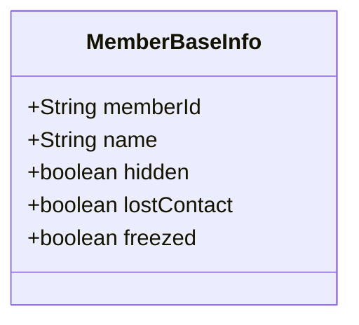
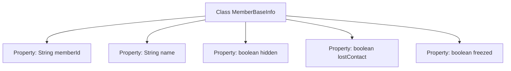

# Basic Information

|      |      |
|------|------|
| Name | MemberBaseInfo |
| Language | .java |
| Code Path | WeFe/board/board-service/src/main/java/com/welab/wefe/board/service/sdk/union/dto/MemberBaseInfo.java |
| Package Name | com.welab.wefe.board.service.sdk.union.dto |
| Dependencies | [] |
| Brief Description | The MemberBaseInfo class includes member ID, name, and three status flags: hidden, lost contact, and frozen. |

# Description

The content defines a public class named MemberBaseInfo, which is used to store basic member information. The class contains five member variables: memberId (string type, representing the member ID), name (string type, representing the member's name), hidden (boolean type, indicating whether it is hidden), lostContact (boolean type, indicating whether contact is lost), and freezed (boolean type, indicating whether it is frozen). These variables are all publicly accessible and not encapsulated.

# Class Summary

| Name   | Type  | Description |
|-------|------|-------------|
| MemberBaseInfo | class | Basic member information class, including member ID, name, and three status indicators: hidden, lost contact, and frozen. |

## Class MemberBaseInfo

|      |      |
|------|------|
| Access Modifier | public |
| Type | class |
| Name | MemberBaseInfo |
| Description | Basic member information class, including member ID, name, and three status indicators: hidden, lost contact, and frozen. |

### UML Class Diagram

This code defines a class named `MemberBaseInfo` for storing basic member information. The class contains five public fields: `memberId` (member ID), `name` (name), `hidden` (whether hidden), `lostContact` (whether out of contact), and `freezed` (whether frozen). These fields are all public attributes that can be directly accessed and modified. The class does not define any methods and serves solely as a data carrier, suitable for scenarios requiring the storage and transfer of basic member information.

### Internal Method Call Graph

This flowchart illustrates the structure of the MemberBaseInfo class, which contains 5 public properties: memberId (String type), name (String type), hidden (boolean type), lostContact (boolean type), and freezed (boolean type). Each property is connected to the class name via arrows, indicating they are member variables of the MemberBaseInfo class. This is a simple data carrier class used to store basic member information, without containing any methods.

### Field List

| Name  | Type  | Description |
|-------|-------|------|
| name | String | Declare a public string variable name. |
| hidden | boolean | The boolean variable `hidden` indicates whether to hide. |
| memberId | String | Define a public string type member variable memberId. |
| freezed | boolean | The variable `freezed` is of boolean type, indicating the frozen state. |
| lostContact | boolean | The boolean variable lostContact indicates whether contact is lost. |

### Method List

| Name  | Type  | Description |
|-------|-------|------|

