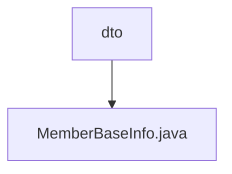

# Basic Information

|      |      |
|------|------|
| Name | dto |
| Language | .java |
| Code Path | WeFe/board/board-service/src/main/java/com/welab/wefe/board/service/sdk/union/dto |
| Package Name | docs.board.board-service.src.main.java.com.welab.wefe.board.service.sdk.union.dto |
| Brief Description | The MemberBaseInfo class includes member ID, name, and three status flags: hidden, lost contact, and frozen. |

# Description

The content defines a public class named `MemberBaseInfo`, which is used to store basic member information. The class contains five member variables: `memberId` (string type, representing the member ID), `name` (string type, representing the member's name), `hidden` (boolean type, indicating whether the member is hidden), `lostContact` (boolean type, indicating whether the member is out of contact), and `freezed` (boolean type, indicating whether the member is frozen). These variables are all publicly accessible and are not encapsulated.

### Package Internal Structure View

This flowchart illustrates the hierarchical relationship of Path 2, with the root node being the "dto" directory, which contains a Java file named "MemberBaseInfo.java". The structure is concise and clear, reflecting the storage location of the member basic information class in the DTO layer, in compliance with the standard Java project directory structure specifications.

# File List

| Name   | Type  | Description |
|-------|------|-------------|
| [MemberBaseInfo.java](MemberBaseInfo.md) | file | The MemberBaseInfo class includes member ID, name, and three status indicators: hidden, lost contact, and frozen. |

