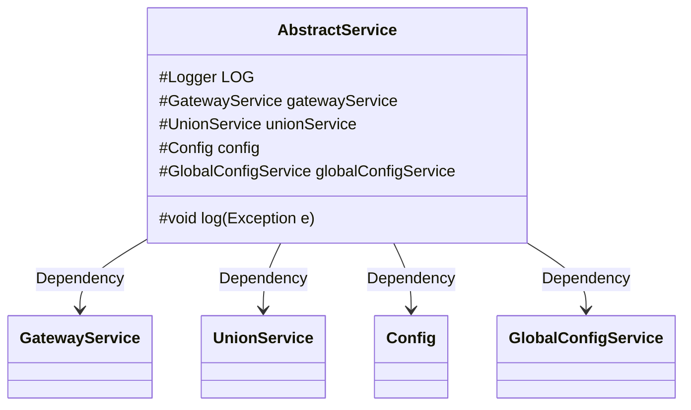
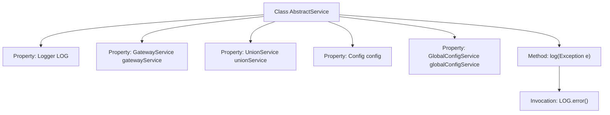

# Basic Information

|      |      |
|------|------|
| Name | AbstractService |
| Language | .java |
| Code Path | WeFe/board/board-service/src/main/java/com/welab/wefe/board/service/service/AbstractService.java |
| Package Name | com.welab.wefe.board.service.service |
| Dependencies | ['com.welab.wefe.board.service.constant.Config', 'com.welab.wefe.board.service.sdk.union.UnionService', 'com.welab.wefe.board.service.service.globalconfig.GlobalConfigService', 'org.slf4j.Logger', 'org.slf4j.LoggerFactory', 'org.springframework.beans.factory.annotation.Autowired'] |
| Brief Description | The abstract service class includes logging utilities and four auto-injected service components, providing exception logging methods. |

# Description

This is an abstract service class named AbstractService, which includes logging and dependency injection capabilities. The class defines a protected Logger object for logging purposes and automatically injects four service classes: GatewayService, UnionService, Config, and GlobalConfigService. Additionally, it provides a protected log method for recording exception information, including the exception type, message, and full stack trace. This class serves as a base class, offering common functionality support for other service classes.

# Class Summary

| Name   | Type  | Description |
|-------|------|-------------|
| AbstractService | class | Abstract service class, including logger and auto-injected gateway, federation, configuration, and global configuration services, providing exception logging methods. |

## Class AbstractService

|      |      |
|------|------|
| Access Modifier | public |
| Type | class |
| Name | AbstractService |
| Description | Abstract service class, including logger and auto-injected gateway, federation, configuration, and global configuration services, providing exception logging methods. |

### UML Class Diagram

This code illustrates an abstract service class AbstractService, which contains multiple auto-wired dependency components (GatewayService, UnionService, Config, and GlobalConfigService) along with a protected logging method. The class diagram clearly depicts these dependency relationships, where AbstractService serves as a base class utilizing other service classes and configuration classes through Spring's dependency injection mechanism. The log method provides unified exception logging functionality, with the protected modifier indicating its design intent to offer shared functionality for subclasses.

### Internal Method Call Graph

This flowchart illustrates the structure of the AbstractService class and its key method invocation relationships. The class contains 5 core properties: the logger LOG and 4 auto-injected service components, along with an exception logging method log(). The log method records exception information through LOG.error(), which concatenates and outputs the exception type and message. All properties are protected by the protected modifier, reflecting an inheritance-oriented design philosophy that facilitates subclass reuse of basic functionality.

### Field List

| Name  | Type  | Description |
|-------|-------|------|
| config | Config | Automatically inject configuration object instances. |
| unionService | UnionService | Automatically inject the UnionService instance. |
| globalConfigService | GlobalConfigService | Automatically inject global configuration service instances. |
| gatewayService | GatewayService | Automatically inject the GatewayService instance. |
| LOG = LoggerFactory.getLogger(this.getClass()) | Logger | A protected final log object LOG is defined in the class for recording log information of the current class. |

### Method List

| Name  | Type  | Description |
|-------|-------|------|
| log | void | Java method log captures exceptions and records error logs, including the exception class name and message. |

