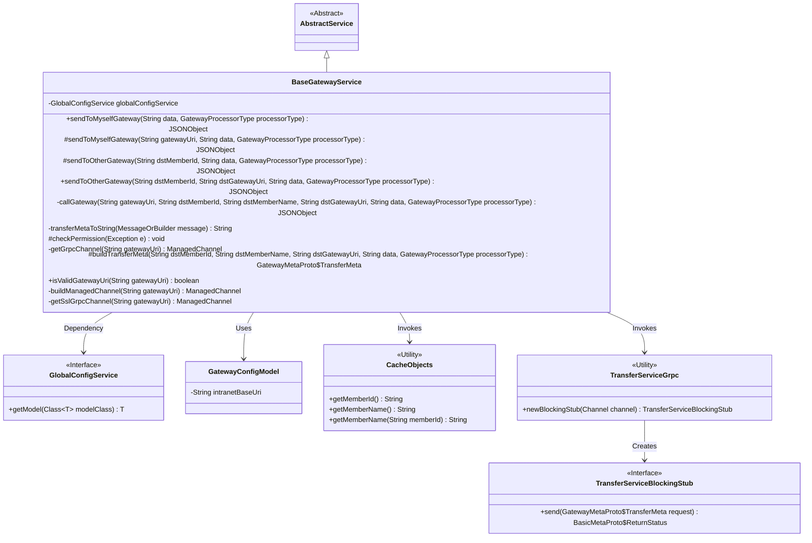
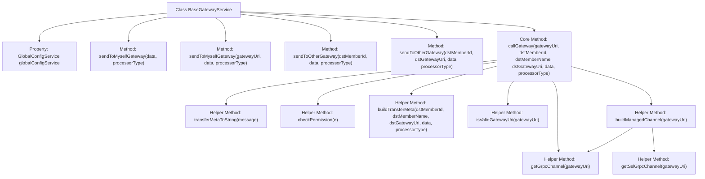

# Basic Information

|      |      |
|------|------|
| Name | BaseGatewayService |
| Language | .java |
| Code Path | WeFe/board/board-service/src/main/java/com/welab/wefe/board/service/service/BaseGatewayService.java |
| Package Name | com.welab.wefe.board.service.service |
| Dependencies | ['com.alibaba.fastjson.JSON', 'com.alibaba.fastjson.JSONObject', 'com.google.protobuf.MessageOrBuilder', 'com.google.protobuf.util.JsonFormat', 'com.welab.wefe.board.service.cache.CaCertificateCache', 'com.welab.wefe.board.service.proto.TransferServiceGrpc', 'com.welab.wefe.board.service.proto.meta.basic.BasicMetaProto', 'com.welab.wefe.board.service.proto.meta.basic.GatewayMetaProto', 'com.welab.wefe.board.service.service.globalconfig.GlobalConfigService', 'com.welab.wefe.board.service.util.TlsUtil', 'com.welab.wefe.common.StatusCode', 'com.welab.wefe.common.exception.StatusCodeWithException', 'com.welab.wefe.common.util.StringUtil', 'com.welab.wefe.common.wefe.dto.global_config.GatewayConfigModel', 'com.welab.wefe.common.wefe.enums.GatewayProcessorType', 'io.grpc.ManagedChannel', 'io.grpc.ManagedChannelBuilder', 'io.grpc.netty.GrpcSslContexts', 'io.grpc.netty.NegotiationType', 'io.grpc.netty.NettyChannelBuilder', 'io.netty.handler.ssl.SslContextBuilder', 'io.netty.handler.ssl.util.InsecureTrustManagerFactory', 'org.apache.commons.lang3.math.NumberUtils', 'org.springframework.beans.factory.annotation.Autowired', 'java.security.cert.X509Certificate', 'java.util.UUID', 'java.util.concurrent.TimeUnit'] |
| Brief Description | The BaseGatewayService class provides gateway message sending functionality, supporting message transmission to either its own or the counterpart gateway, while handling permission verification, exception handling, and GRPC communication. It includes methods such as address validation, metadata construction, and SSL channel creation. |

# Description

BaseGatewayService is a gateway service class inherited from AbstractService, primarily used for sending messages to its own or other members' gateway services via the gRPC protocol. This class includes multiple methods, such as sendToMyselfGateway for sending messages to its own gateway and sendToOtherGateway for sending messages to other members' gateways. The core method callGateway handles the actual message-sending logic, including constructing transmission metadata, establishing gRPC connections, processing responses, and handling exceptions. Additionally, it provides functionalities such as permission checks, gateway address format validation, and SSL channel construction. The global configuration service GlobalConfigService is used to obtain configuration information such as gateway addresses.

# Class Summary

| Name   | Type  | Description |
|-------|------|-------------|
| BaseGatewayService | class | The BaseGatewayService class provides gateway message sending functionality, supporting data transmission to either its own or the counterpart gateway, including address validation, permission checks, and GRPC communication implementation. |

## Class BaseGatewayService

|      |      |
|------|------|
| Access Modifier | public |
| Type | class |
| Name | BaseGatewayService |
| Description | The BaseGatewayService class provides gateway message sending functionality, supporting data transmission to either its own or the counterpart gateway, including address validation, permission checks, and GRPC communication implementation. |

### UML Class Diagram

This code demonstrates a gateway service class `BaseGatewayService` that inherits from `AbstractService`, primarily functioning to communicate with gateway services via the gRPC protocol. The class contains multiple message-sending methods supporting message delivery to both self-gateway and other member gateways, while handling various exceptions such as permission validation and address format verification. It retrieves gateway configurations through `GlobalConfigService`, obtains member information using `CacheObjects`, and ultimately implements message transmission via the gRPC client `TransferServiceGrpc`. The class design reflects a clear hierarchical structure and separation of responsibilities, with core logic centralized in the private method `callGateway`.

### Internal Method Call Graph

This code implements a gateway service communication framework, with core functionalities including sending messages to self or third-party gateways, constructing transfer metadata, handling gRPC communication, and permission verification. The flowchart illustrates the class structure and core method invocation relationships, where callGateway serves as the central method integrating parameter validation, gRPC channel management, exception handling, and logging. Other methods like sendToMyselfGateway and sendToOtherGateway are its higher-level wrappers. Helper methods such as metadata conversion, URI validation, and channel construction collectively support end-to-end gateway communication processing.

### Field List

| Name  | Type  | Description |
|-------|-------|------|
| globalConfigService | GlobalConfigService | Using @Autowired to automatically inject an instance of GlobalConfigService. |

### Method List

| Name  | Type  | Description |
|-------|-------|------|
| sendToMyselfGateway | JSONObject | The method `sendToMyselfGateway` sends data to the gateway via `gatewayUri` or configuration, invoking `callGateway` to process the request. Parameters include URI, member ID, name, data, and handler type. |
| checkPermission | void | Check permission exceptions and throw corresponding errors: connection unavailable prompts to check the gateway; IP restriction prompts to add to the whitelist; signature failure prompts to check the key. |
| sendToMyselfGateway | JSONObject | Java Method: Sends data to its own gateway, with parameters including data and handler type (nullable), may throw exceptions. |
| getGrpcChannel | ManagedChannel | Methods for obtaining a gRPC channel: Verify that the gateway address is non-empty and correctly formatted, otherwise throw an exception; create and return a plaintext transport channel with a maximum message size of 2GB. |
| sendToOtherGateway | JSONObject | The method `sendToOtherGateway` sends data to a specified gateway via `callGateway`, with parameters including the target member ID, gateway URI, data, and handler type, and returns a `JSONObject`. It may throw a `StatusCodeWithException` exception. |
| transferMetaToString | String | Convert the MessageOrBuilder object to a JSON string, log the error if an exception occurs, and return null. |
| callGateway | JSONObject | Invoke the gateway service method, validate the address and construct transmission metadata, send the request via gRPC, handle successful or exceptional results, log the outcomes, and close the connection. |
| sendToOtherGateway | JSONObject | The method `sendToOtherGateway` sends data `data` to the target member `dstMemberId` via `intranetBaseUri`, specifies the processor type `processorType`, and returns a `JSONObject` result. It throws `StatusCodeWithException` in case of exceptions. |
| buildTransferMeta | GatewayMetaProto.TransferMeta | Method for constructing transmission metadata: Receives target member ID, name, URI, data, and processor type, then generates a transmission metadata object containing target member information, content, session ID, and processor. |
| isValidGatewayUri | boolean | Check gateway URI validity: non-empty and formatted as "string:number". |
| buildManagedChannel | ManagedChannel | Construct a ManagedChannel method to validate the gateway address format, throwing an exception if invalid, otherwise returning a standard gRPC channel. |
| getSslGrpcChannel | ManagedChannel | Create an SSL-encrypted gRPC channel supporting custom certificates or default trust managers, configure target URI, TLS negotiation type, authorization override, and maximum message size. |

