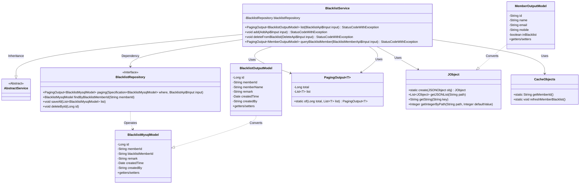
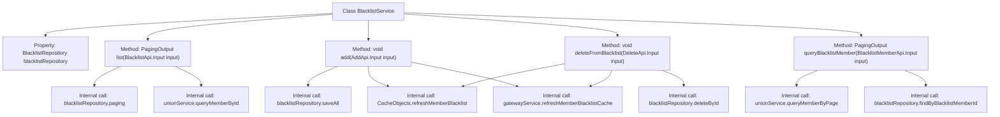
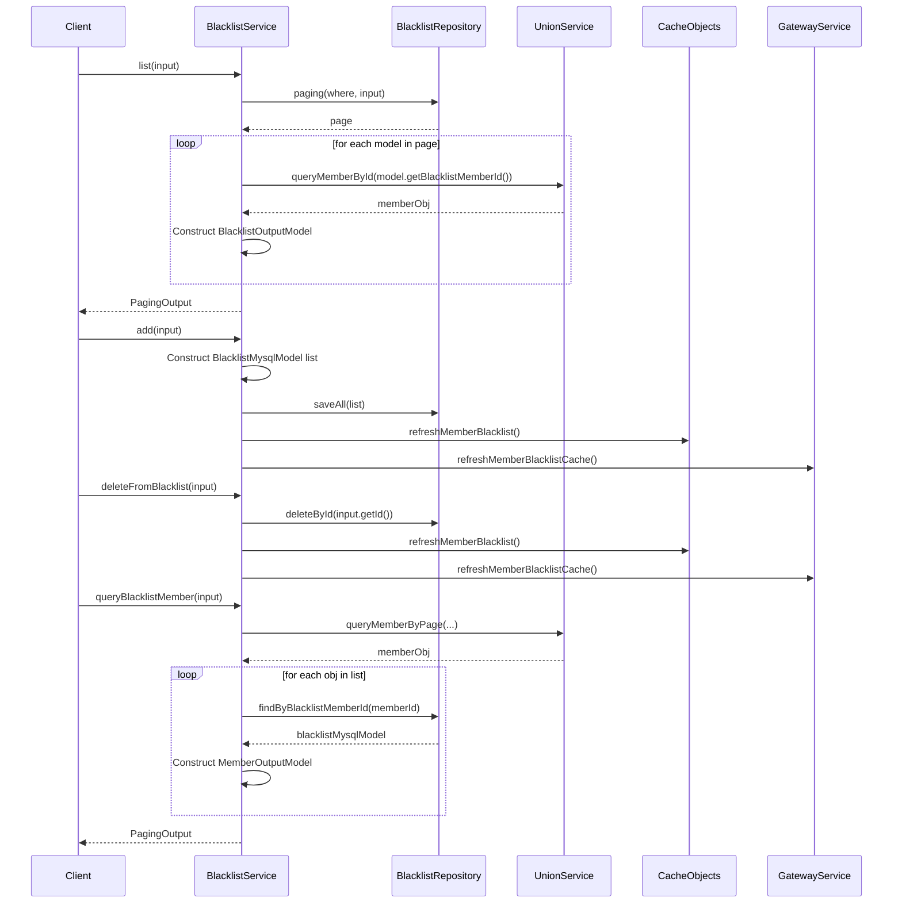

# Basic Information

|      |      |
|------|------|
| Name | BlacklistService |
| Language | .java |
| Code Path | WeFe/board/board-service/src/main/java/com/welab/wefe/board/service/service/BlacklistService.java |
| Package Name | com.welab.wefe.board.service.service |
| Dependencies | ['com.alibaba.fastjson.JSONObject', 'com.welab.wefe.board.service.api.blacklist.AddApi', 'com.welab.wefe.board.service.api.blacklist.BlacklistApi', 'com.welab.wefe.board.service.api.blacklist.BlacklistMemberApi', 'com.welab.wefe.board.service.api.blacklist.DeleteApi', 'com.welab.wefe.board.service.database.entity.BlacklistMysqlModel', 'com.welab.wefe.board.service.database.repository.BlacklistRepository', 'com.welab.wefe.board.service.dto.base.PagingOutput', 'com.welab.wefe.board.service.dto.entity.BlacklistOutputModel', 'com.welab.wefe.board.service.dto.entity.MemberOutputModel', 'com.welab.wefe.common.data.mysql.Where', 'com.welab.wefe.common.exception.StatusCodeWithException', 'com.welab.wefe.common.util.JObject', 'com.welab.wefe.common.web.util.CurrentAccountUtil', 'org.springframework.beans.factory.annotation.Autowired', 'org.springframework.data.jpa.domain.Specification', 'org.springframework.stereotype.Service', 'java.util.ArrayList', 'java.util.Date', 'java.util.List'] |
| Brief Description | The BlacklistService provides blacklist management functionalities, including paginated querying of blacklists, adding members to the blacklist, removing members from the blacklist, and querying blacklist member information. After operations, it updates the cache and notifies the gateway to refresh. |

# Description

The BlacklistService is a service class that handles blacklist-related operations, inheriting from AbstractService. Its main functionalities include: 1. Paginated querying of the blacklist, associating member information with blacklist records before returning the results; 2. Adding entries to the blacklist, supporting batch addition of members and cache updates; 3. Removing specified records from the blacklist and updating the cache; 4. Querying blacklisted member information, returning basic member details along with their blacklist status. The service interacts with the database through blacklistRepository and collaborates with unionService and gatewayService to fetch member data and update the cache. All operations maintain cache consistency to ensure data real-time performance.

# Class Summary

| Name   | Type  | Description |
|-------|------|-------------|
| BlacklistService | class | The BlacklistService provides blacklist management functionalities, including paginated queries, adding and removing members, and querying blacklist member information. After operations, it updates the cache and notifies the gateway. |

## Class BlacklistService

|      |      |
|------|------|
| Access Modifier | @Service;public |
| Type | class |
| Name | BlacklistService |
| Description | The BlacklistService provides blacklist management functionalities, including paginated queries, adding and removing members, and querying blacklist member information. After operations, it updates the cache and notifies the gateway. |

### UML Class Diagram

This class diagram illustrates the core structure of a blacklist management system. The BlacklistService acts as the main service class, inheriting from AbstractService. It operates on the database entity BlacklistMysqlModel through BlacklistRepository and generates two output models: BlacklistOutputModel and MemberOutputModel. The system uses JObject for JSON data processing and CacheObjects for cache management. Overall, it implements functionalities such as CRUD operations for blacklists, paginated queries, and cache synchronization. The design involves 6 core classes and 2 generic classes, reflecting a layered architecture and data conversion logic.

### Internal Method Call Graph

This code implements a blacklist management system with four core functions: querying blacklist entries, adding members to blacklist, removing members from blacklist, and querying blacklisted member information. The service layer interacts with the repository layer (BlacklistRepository) for data persistence operations, relies on UnionService to retrieve member information, and maintains cache consistency through CacheObjects and GatewayService. Each operation follows a clear workflow: parameter validation → data processing → persistence operations → cache updates → result return, demonstrating complete transaction boundaries and clear responsibility division.

### Field List

| Name  | Type  | Description |
|-------|-------|------|
| blacklistRepository | BlacklistRepository | Using @Autowired to automatically inject an instance of BlacklistRepository. |

### Method List

| Name  | Type  | Description |
|-------|-------|------|
| queryBlacklistMember | PagingOutput<MemberOutputModel> | Query blacklist member information, retrieve member data in pagination based on input parameters, check if they are in the blacklist, and return paginated results. |
| add | void | The method `add` takes the input parameter `input`, checks that the `memberIds` within it are not empty, creates a blacklist model for each ID and sets the attributes, then batch-saves them to the database, refreshes the cache, and notifies the gateway to update. |
| deleteFromBlacklist | void | Remove the specified ID from the blacklist, refresh the local cache, and notify the gateway to update its cache. |
| list | PagingOutput<BlacklistOutputModel> | This method queries the blacklist, retrieves data through pagination, and converts it into an output model containing fields such as member information and remarks. It returns paginated results. |

