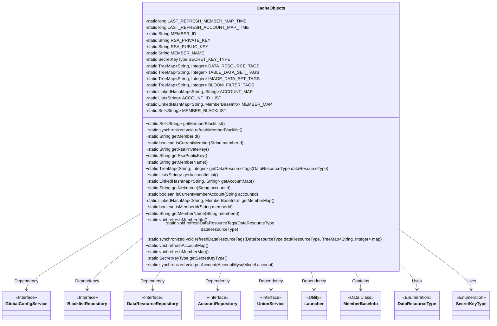
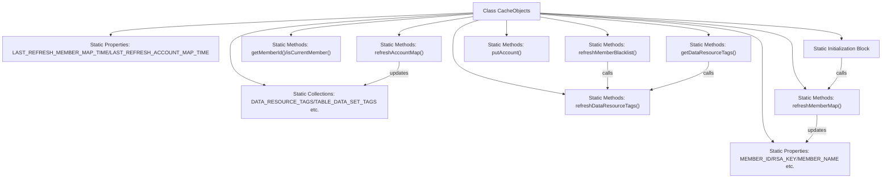

# Basic Information

|      |      |
|------|------|
| Name | CacheObjects |
| Language | .java |
| Code Path | WeFe/board/board-service/src/main/java/com/welab/wefe/board/service/service/CacheObjects.java |
| Package Name | com.welab.wefe.board.service.service |
| Dependencies | ['com.welab.wefe.board.service.database.entity.AccountMysqlModel', 'com.welab.wefe.board.service.database.repository.AccountRepository', 'com.welab.wefe.board.service.database.repository.BlacklistRepository', 'com.welab.wefe.board.service.database.repository.data_resource.DataResourceRepository', 'com.welab.wefe.board.service.sdk.union.UnionService', 'com.welab.wefe.board.service.sdk.union.dto.MemberBaseInfo', 'com.welab.wefe.board.service.service.globalconfig.GlobalConfigService', 'com.welab.wefe.common.Convert', 'com.welab.wefe.common.constant.SecretKeyType', 'com.welab.wefe.common.exception.StatusCodeWithException', 'com.welab.wefe.common.util.StringUtil', 'com.welab.wefe.common.web.Launcher', 'com.welab.wefe.common.wefe.dto.global_config.MemberInfoModel', 'com.welab.wefe.common.wefe.enums.DataResourceType', 'org.springframework.data.domain.Sort', 'java.util'] |
| Brief Description | The CacheObjects class manages cached data, including member information, account mappings, data resource tags, and blacklists. It provides refresh and retrieval methods to ensure data consistency. Key functionalities include member validation, tag statistics, and account management. |

# Description

The `CacheObjects` class is a utility class designed for caching various types of data, comprising static member variables and methods. It primarily caches member information (such as IDs, RSA keys, and names), data resource tags (classified and counted by type), account mappings (IDs to nicknames), member mappings (IDs to basic information), and blacklists. It provides methods to refresh these cached data, such as `refreshMemberInfo`, `refreshDataResourceTags`, `refreshAccountMap`, and `refreshMemberMap`. Additionally, it includes auxiliary methods, such as checking if an ID belongs to the current member, retrieving nicknames, and verifying if an ID is a member ID. Synchronization methods and timestamp controls are implemented to prevent high-frequency refreshes.

# Class Summary

| Name   | Type  | Description |
|-------|------|-------------|
| CacheObjects | class | The CacheObjects class manages cached data, including member information, account mappings, data resource tags, and blacklists. It provides refresh and retrieval methods to ensure data consistency and thread safety. |

## Class CacheObjects

|      |      |
|------|------|
| Access Modifier | public |
| Type | class |
| Name | CacheObjects |
| Description | The CacheObjects class manages cached data, including member information, account mappings, data resource tags, and blacklists. It provides refresh and retrieval methods to ensure data consistency and thread safety. |

### UML Class Diagram

Class Diagram Description: This diagram illustrates a cache management class `CacheObjects` that stores various cached data (e.g., member information, account mappings, blacklists) through static variables and provides synchronized refresh methods. The class has dependency relationships with multiple Repository interfaces (`BlacklistRepository`, `DataResourceRepository`, etc.), obtaining bean instances via the `Launcher` utility class. Enum types `DataResourceType` and `SecretKeyType` are used for method parameters and return types. The overall design adopts a singleton pattern to manage global cached data.

### Internal Method Call Graph

This flowchart illustrates the core structure and invocation relationships of the CacheObjects class. The class contains multiple static properties and collections for data caching, with static methods implementing data refresh and access control. Key methods include refreshMemberBlacklist(), getDataResourceTags(), refreshAccountMap(), etc., which have interdependencies. The static initialization block automatically refreshes member information during class loading, while refresh methods use timestamps to control invocation frequency for performance optimization. The overall design adopts a singleton pattern to manage global cached data.

### Field List

| Name  | Type  | Description |
|-------|-------|------|
| MEMBER_MAP = new LinkedHashMap<>() | LinkedHashMap<String, MemberBaseInfo> | Define a static member variable MEMBER_MAP, of type LinkedHashMap, with String as the key and MemberBaseInfo as the value. |
| RSA_PRIVATE_KEY | String | Define a private static string variable RSA_PRIVATE_KEY. |
| SECRET_KEY_TYPE = null | SecretKeyType | The static private key type variable SECRET_KEY_TYPE is initialized as empty. |
| LAST_REFRESH_MEMBER_MAP_TIME = 0 | long | A static variable records the timestamp of the last refresh of the member mapping table, with an initial value of 0. |
| DATA_RESOURCE_TAGS = new TreeMap<>() | TreeMap<String, Integer> | Define a static constant DATA_RESOURCE_TAGS, of type TreeMap, with String as the key and Integer as the value. |
| MEMBER_NAME | String | private static String memberName |
| LAST_REFRESH_ACCOUNT_MAP_TIME = 0 | long | Static long integer variable, recording the timestamp of the last account mapping table refresh, with an initial value of 0. |
| IMAGE_DATA_SET_TAGS = new TreeMap<>() | TreeMap<String, Integer> | Define a static immutable TreeMap variable IMAGE_DATA_SET_TAGS with string keys and integer values. |
| BLOOM_FILTER_TAGS = new TreeMap<>() | TreeMap<String, Integer> | Define a static constant BLOOM_FILTER_TAGS of type TreeMap with string keys and integer values. |
| ACCOUNT_MAP = new LinkedHashMap<>() | LinkedHashMap<String, String> | Define a static constant ACCOUNT_MAP, of type ordered hash table, with both keys and values being strings. |
| ACCOUNT_ID_LIST = new ArrayList<>() | List<String> | Declare a private static immutable list variable ACCOUNT_ID_LIST of strings, initialized as an empty ArrayList. |
| MEMBER_ID | String | The private static string variable MEMBER_ID is used to store the member ID. |
| MEMBER_BLACKLIST = new HashSet<>() | Set<String> | Declare a private static immutable string collection MEMBER_BLACKLIST, initialized as an empty HashSet. |
| RSA_PUBLIC_KEY | String | Private static String variable RSA public key. |
| TABLE_DATA_SET_TAGS = new TreeMap<>() | TreeMap<String, Integer> | Define a static immutable TreeMap variable TABLE_DATA_SET_TAGS with String type keys and Integer type values. |

### Method List

| Name  | Type  | Description |
|-------|-------|------|
| getMemberName | String | Retrieve the member name based on the member ID. If the ID is empty or the member does not exist, return null; if the cache misses, refresh the cache and query again. Return null in case of exceptions as well. |
| refreshMemberMap | void | The static method `refreshMemberMap` is used to refresh the member mapping table, with a restriction preventing repeated refreshes within 1 minute. It retrieves the latest data via `UnionService` and updates the cache. |
| getAccountIdList | List<String> | The static method getAccountIdList returns ACCOUNT_ID_LIST; if it is empty, it calls refreshAccountMap to update before returning. |
| isCurrentMemberAccount | boolean | Check if the current account ID is in the account list. |
| getRsaPublicKey | String | Static method to obtain the RSA public key, directly returning the predefined constant RSA_PUBLIC_KEY. |
| getRsaPrivateKey | String | Static method for obtaining an RSA private key. |
| isCurrentMember | boolean | The static method `isCurrentMember` checks whether the passed `memberId` is the same as the current member ID and returns a boolean value. |
| refreshDataResourceTags | void | This method is used to refresh data resource tags. It first retrieves the tag mapping of the specified type, then calls the refresh method to update the tags. |
| isMemberId | boolean | Check if the memberId exists in the member mapping. Return true if it exists, and return false in case of an exception. |
| refreshMemberInfo | void | The static method `refreshMemberInfo` retrieves the `MemberInfoModel` from `GlobalConfigService` and updates global variables such as member ID, RSA public/private keys, member name, and key type. If the model is null, it returns directly. |
| getAccountMap | LinkedHashMap<String, String> | This is a Java method used to retrieve an account mapping table. If the table is empty, it refreshes the data and finally returns the mapping table. |
| getMemberMap | LinkedHashMap<String, MemberBaseInfo> | Get the member mapping table, return it after refreshing if empty. |
| getMemberName | String | The static method returns the value of the member variable MEMBER_NAME. |
| refreshDataResourceTags | void | The static synchronous method `refreshDataResourceTags` queries database tags based on type, counts the number of datasets corresponding to each tag, and updates them into the map. |
| getMemberId | String | Static method to get member ID, directly returns the constant MEMBER_ID. |
| getNickname | String | The static method `getNickname` retrieves a nickname based on the `accountId`: if `accountId` is null, it returns null; otherwise, it searches in `AccountMap`, and if not found, it calls `getMemberName` to fetch the result. |
| refreshAccountMap | void | Refresh the account mapping table, skipping if it has been refreshed within the last 10 seconds. Update the last refresh time, fetch the account list from the database, and sort it by nickname. After clearing the old data, repopulate the mapping table of account IDs and nicknames along with the ID list. |
| getDataResourceTags | TreeMap<String, Integer> | Static methods return corresponding label mappings based on data types, returning default labels if empty, and refreshing data before returning when null. |
| refreshMemberBlacklist | void | The static method `refreshMemberBlacklist` is used to refresh the member blacklist. It first clears the existing list, then loads all blacklisted member IDs from the database and stores them in the static variable `MEMBER_BLACKLIST`. |
| getSecretKeyType | SecretKeyType | This method returns the key type, defaulting to rsa type if not set. |
| putAccount | void | The static synchronized method `putAccount` accepts an `AccountMysqlModel` object, and when it is non-null, stores its ID and nickname in `ACCOUNT_MAP` while adding the ID to `ACCOUNT_ID_LIST`. |
| getMemberBlackList | Set<String> | Get the member blacklist. If it is empty, refresh and return the blacklist collection. |

