# Basic Information

|      |      |
|------|------|
| Name | CertOperationService |
| Language | .java |
| Code Path | WeFe/board/board-service/src/main/java/com/welab/wefe/board/service/service/CertOperationService.java |
| Package Name | com.welab.wefe.board.service.service |
| Dependencies | ['com.webank.cert.toolkit.enums.CertDigestAlgEnums', 'com.webank.cert.toolkit.enums.CertStatusEnums', 'com.webank.cert.toolkit.enums.KeyAlgorithmEnums', 'com.webank.cert.toolkit.model.X500NameInfo', 'com.webank.cert.toolkit.service.CertService', 'com.webank.cert.toolkit.utils.CertUtils', 'com.webank.cert.toolkit.utils.KeyUtils', 'com.welab.wefe.board.service.database.entity.cert.CertInfoMysqlModel', 'com.welab.wefe.board.service.database.entity.cert.CertKeyInfoMysqlModel', 'com.welab.wefe.board.service.database.entity.cert.CertRequestInfoMysqlModel', 'com.welab.wefe.board.service.database.repository.CertInfoRepository', 'com.welab.wefe.board.service.database.repository.CertKeyInfoRepository', 'com.welab.wefe.board.service.database.repository.CertRequestInfoRepository', 'com.welab.wefe.board.service.sdk.union.UnionService', 'com.welab.wefe.board.service.service.globalconfig.GlobalConfigService', 'com.welab.wefe.common.StatusCode', 'com.welab.wefe.common.exception.StatusCodeWithException', 'com.welab.wefe.common.util.AESUtil', 'com.welab.wefe.common.web.util.CurrentAccountUtil', 'com.welab.wefe.common.wefe.dto.global_config.MemberInfoModel', 'org.apache.commons.lang3.StringUtils', 'org.bouncycastle.jce.provider.BouncyCastleProvider', 'org.bouncycastle.pkcs.PKCS10CertificationRequest', 'org.slf4j.Logger', 'org.slf4j.LoggerFactory', 'org.springframework.beans.factory.annotation.Autowired', 'org.springframework.stereotype.Service', 'java.math.BigInteger', 'java.security.KeyPair', 'java.security.PublicKey', 'java.security.Security', 'java.security.cert.CertificateException', 'java.security.cert.X509Certificate', 'java.util.Date', 'java.util.List'] |
| Brief Description | The CertOperationService class provides certificate management functionalities, including updating status, saving certificate information, exporting certificates, querying certificates and private keys, creating certificate requests, and other operations. |

# Description

The CertOperationService is a Spring service class that handles certificate operations, including certificate status updates, certificate information storage, certificate export, and certificate request creation. It relies on multiple repositories and services for data operations, such as CertInfoRepository and CertRequestInfoRepository. Key methods include `updateStatus` for updating certificate status, `saveCertInfo` for storing certificate information, `exportCertToDerFile` for exporting certificate files, and `createCertRequestInfo` for creating certificate requests. During service initialization, it checks and adds the BouncyCastle security provider. The processing involves certificate status validation, public/private key generation, certificate content conversion, and exception handling.

# Class Summary

| Name   | Type  | Description |
|-------|------|-------------|
| CertOperationService | class | CertOperationService is a certificate operation service class that provides functionalities such as certificate status updates, certificate information storage, certificate export, and certificate request creation. It involves CRUD operations for certificates, keys, and request information, supporting algorithms like RSA and ECDSA. |

## Class CertOperationService

|      |      |
|------|------|
| Access Modifier | @Service;public |
| Type | class |
| Name | CertOperationService |
| Description | CertOperationService is a certificate operation service class that provides functionalities such as certificate status updates, certificate information storage, certificate export, and certificate request creation. It involves CRUD operations for certificates, keys, and request information, supporting algorithms like RSA and ECDSA. |

### UML Class Diagram

```mermaid
classDiagram
    class CertOperationService {
        -LOG: Logger
        -certInfoRepository: CertInfoRepository
        -certRequestInfoRepository: CertRequestInfoRepository
        -certKeyInfoRepository: CertKeyInfoRepository
        -certService: CertService
        -globalConfigService: GlobalConfigService
        -gatewayService: GatewayService
        -unionService: UnionService
        +updateStatus(String serialNumber, String status) void
        +resetCert() void
        +saveCertInfo(String certRequestId, String certPemContent, String certStatus) void
        +exportCertToDerFile(String certId, String filePath) void
        +queryCertInfoById(String id) CertInfoMysqlModel
        +queryAllCertInfo() List~CertInfoMysqlModel~
        +findCertRequestById(String id) CertRequestInfoMysqlModel
        +queryAllCertRequestInfo() List~CertRequestInfoMysqlModel~
        +findBySerialNumber(String serialNumber) CertInfoMysqlModel
        +queryCertKeyInfoById(String id) CertKeyInfoMysqlModel
        +queryAllCertKey() List~CertKeyInfoMysqlModel~
        +createCertRequestInfo(String commonName, String organizationName, String organizationUnitName) CertRequestInfoMysqlModel
        -savePrivateKey(String memberId, String pemPrivateKey, String priAlg) CertKeyInfoMysqlModel
        -buildCertRequestInfo(String csrStr, String subjectKeyId, String commonName, String organizationName, String memberId, boolean issue) CertRequestInfoMysqlModel
        -buildCertInfo(String certificatePemStr, String subjectCommonName, String subjectOrgName, PublicKey publicKey, String memberId, BigInteger serialNumber, String csrId, String certStatus) CertInfoMysqlModel
        -getCertDigestAlg(KeyAlgorithmEnums keyAlgorithm) CertDigestAlgEnums
        +getKeyPair(KeyAlgorithmEnums keyAlgorithm, String pemPrivateKey) KeyPair
    }

    class CertInfoMysqlModel {
        <<Entity>>
    }

    class CertRequestInfoMysqlModel {
        <<Entity>>
    }

    class CertKeyInfoMysqlModel {
        <<Entity>>
    }

    class CertService {
        <<Service>>
        +createCertRequest(X500NameInfo subject, PublicKey publicKey, PrivateKey privateKey, String algorithmName) PKCS10CertificationRequest
    }

    class GlobalConfigService {
        <<Service>>
        +getModel(Class~T~ clazz) T
        +put(Object model) void
    }

    class GatewayService {
        <<Service>>
        +restartExternalGrpcServer() void
    }

    class UnionService {
        <<Service>>
        +uploadMemberInfoExcludeLogo(MemberInfoModel model) void
    }

    class CertUtils {
        <<Utility>>
        +convertStrToCert(String certPemContent) X509Certificate
        +writeCrt(X509Certificate certificate, String filePath) void
        +readPEMAsString(Object obj) String
    }

    class KeyUtils {
        <<Utility>>
        +generateKeyPair() KeyPair
        +getECKeyPair(String pemPrivateKey) KeyPair
        +getRSAKeyPair(String pemPrivateKey) KeyPair
    }

    class AESUtil {
        <<Utility>>
        +encrypt(String data, String key) String
        +decrypt(String encryptedData, String key) String
    }

    class CacheObjects {
        <<Utility>>
        +getMemberId() String
        +refreshMemberInfo() void
    }

    CertOperationService --> CertInfoRepository : Dependency
    CertOperationService --> CertRequestInfoRepository : Dependency
    CertOperationService --> CertKeyInfoRepository : Dependency
    CertOperationService --> CertService : Dependency
    CertOperationService --> GlobalConfigService : Dependency
    CertOperationService --> GatewayService : Dependency
    CertOperationService --> UnionService : Dependency
    CertOperationService --> CertUtils : Dependency
    CertOperationService --> KeyUtils : Dependency
    CertOperationService --> AESUtil : Dependency
    CertOperationService --> CacheObjects : Dependency
    CertService --> KeyUtils : Dependency
    CertService --> CertUtils : Dependency
```

This code implements a certificate operation service class CertOperationService, whose main functions include certificate status updates, certificate information storage, certificate exports, and certificate request creation. It depends on multiple repository interfaces (e.g., CertInfoRepository) and service classes (e.g., CertService), and utilizes static utility classes (e.g., CertUtils, KeyUtils) for operations such as certificate conversion and key generation. The class diagram illustrates the interaction between core business entities (e.g., CertInfoMysqlModel) and various service components, reflecting the layered architecture design of the certificate management system.

### Internal Method Call Graph

The flowchart illustrates the main structure and method invocation relationships of the CertOperationService class, including core functionalities such as certificate status updates, saving certificate information, and exporting certificates. The sequence diagram details the execution flow of two key methods, updateStatus and saveCertInfo, involving interactions with multiple repository services and utility classes. The class utilizes auto-wired repository services to complete data persistence and handles business logic during certificate status changes, including edge cases like gateway service restarts.

### Field List

| Name  | Type  | Description |
|-------|-------|------|
| globalConfigService | GlobalConfigService | Automatically inject global configuration service instances. |
| gatewayService | GatewayService | Using @Autowired to automatically inject an instance of GatewayService. |
| LOG = LoggerFactory.getLogger(CertOperationService.class) | Logger | The CertOperationService class defines a protected static final log object LOG for logging purposes. |
| certInfoRepository | CertInfoRepository | Automatically inject the CertInfoRepository instance. |
| unionService | UnionService | Automatically inject the UnionService instance. |
| certService | CertService | Automatically inject the CertService instance. |
| certKeyInfoRepository | CertKeyInfoRepository | Automatically inject the CertKeyInfoRepository instance. |
| certRequestInfoRepository | CertRequestInfoRepository | Automatically inject certificate request information repository instance. |

### Method List

| Name  | Type  | Description |
|-------|-------|------|
| createCertRequestInfo | CertRequestInfoMysqlModel | Create certificate request information, generate RSA public and private keys, save the private key and generate a certificate request, then return the request information model. |
| findBySerialNumber | CertInfoMysqlModel | This method queries certificate information by serial number, calling the findOne method of certInfoRepository to return a CertInfoMysqlModel object. |
| saveCertInfo | void | The method saves certificate information, handles status updates and key pair operations, disables gateway TLS and restarts the service if the status is invalid. Throws a status code error in case of exceptions. |
| queryAllCertKey | List<CertKeyInfoMysqlModel> | Query all certificate key information and return it in list format. |
| exportCertToDerFile | void | This method exports the certificate file in DER format based on the certificate ID. If the certificate exists and its content is not empty, it will be written to the specified path; otherwise, a data non-existence exception will be thrown. |
| resetCert | void | Reset the certificate status to invalid. |
| queryCertInfoById | CertInfoMysqlModel | Query certificate information by ID and return a CertInfoMysqlModel object. Call the findOne method of certInfoRepository with the field name, ID, and model class as parameters. |
| updateStatus | void | Method for updating certificate status: Search for the certificate by serial number, throw an exception if it does not exist; if it exists, update the status, modifier, and timestamp, then save. |
| queryAllCertInfo | List<CertInfoMysqlModel> | Query all certificate information and return a list of certificate details. |
| savePrivateKey | CertKeyInfoMysqlModel | Method to save private key to database, checks if memberId is not empty and validates RSA key pair, encrypts and stores it, then returns the model object. |
| buildCertRequestInfo | CertRequestInfoMysqlModel | Construct a certificate request information model, including member ID, subject key ID, common name, organization name, CSR content, issuance flag, and creation time. |
| buildCertInfo | CertInfoMysqlModel | Build a certificate information model, including member ID, subject name, organization, creation time, public key, certificate content, serial number, CSR ID, and status. |
| getCertDigestAlg | CertDigestAlgEnums | The method `getCertDigestAlg` returns the corresponding certificate digest algorithm based on the input key algorithm. If the input is empty or unsupported, it throws an exception indicating that the key algorithm is not supported. |
| getKeyPair | KeyPair | The method generates a key pair from a PEM-format private key based on the key algorithm type (ECDSA/SM2 or RSA), throwing an exception if unsupported. |
| queryCertKeyInfoById | CertKeyInfoMysqlModel | Query the certificate key information for the specified ID and return the corresponding database model object. |
| queryAllCertRequestInfo | List<CertRequestInfoMysqlModel> | This method queries and returns all certificate request information by invoking the `findAll` method of `certRequestInfoRepository` to retrieve the data list. |
| findCertRequestById | CertRequestInfoMysqlModel | This method queries certificate request information by ID and invokes the repository method to return the corresponding data model object. |

