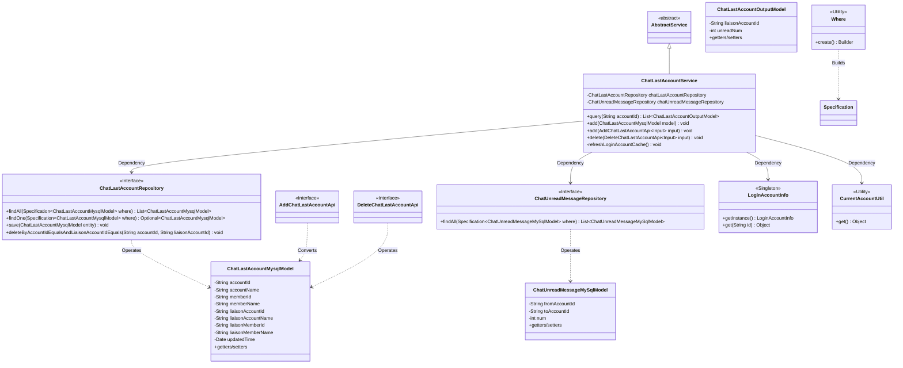
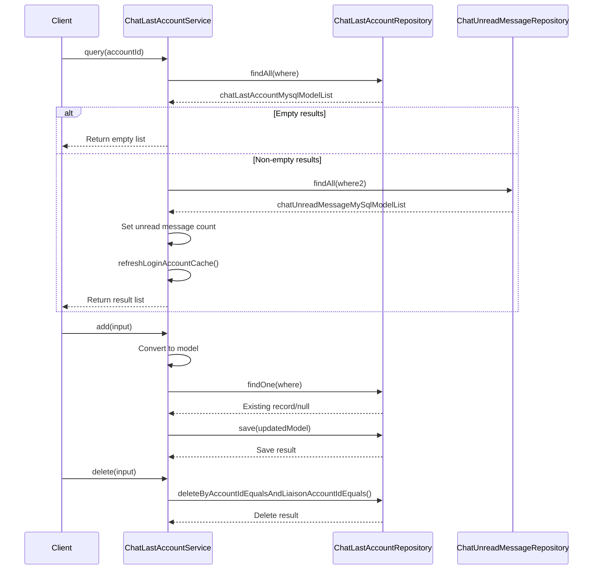

# Basic Information

|      |      |
|------|------|
| Name | ChatLastAccountService |
| Language | .java |
| Code Path | WeFe/board/board-service/src/main/java/com/welab/wefe/board/service/service/ChatLastAccountService.java |
| Package Name | com.welab.wefe.board.service.service |
| Dependencies | ['com.welab.wefe.board.service.api.chat.AddChatLastAccountApi', 'com.welab.wefe.board.service.api.chat.DeleteChatLastAccountApi', 'com.welab.wefe.board.service.base.LoginAccountInfo', 'com.welab.wefe.board.service.database.entity.chat.ChatLastAccountMysqlModel', 'com.welab.wefe.board.service.database.entity.chat.ChatUnreadMessageMySqlModel', 'com.welab.wefe.board.service.database.repository.ChatLastAccountRepository', 'com.welab.wefe.board.service.database.repository.ChatUnreadMessageRepository', 'com.welab.wefe.board.service.dto.entity.ChatLastAccountOutputModel', 'com.welab.wefe.common.data.mysql.Where', 'com.welab.wefe.common.data.mysql.enums.OrderBy', 'com.welab.wefe.common.web.util.CurrentAccountUtil', 'org.apache.commons.collections4.CollectionUtils', 'org.springframework.beans.BeanUtils', 'org.springframework.beans.factory.annotation.Autowired', 'org.springframework.data.jpa.domain.Specification', 'org.springframework.stereotype.Service', 'org.springframework.transaction.annotation.Transactional', 'java.util.ArrayList', 'java.util.Date', 'java.util.List'] |
| Brief Description | The ChatLastAccountService provides functionality for querying, adding, and deleting recently chatted accounts, along with associating the count of unread messages. Queries are sorted by update time, while adding updates or creates new records. Deletion is performed based on account ID and contact ID. It includes logic for refreshing the cache of the logged-in user. |

# Description

ChatLastAccountService is a service class designed to manage recently chatted account records. Its primary functions include querying the list of recently chatted accounts, retrieving all recent chat account information based on the master account ID, and counting the number of unread messages for each contact. It provides methods for adding recent chat account records, supporting addition via model objects or input parameters, and updating existing records or creating new ones. The class also includes deletion functionality, allowing records to be removed based on account ID and contact account ID. After each query, it refreshes the cache of the currently logged-in user to prevent expiration. It interacts with the database through an auto-injected repository class, handling data related to ChatLastAccount and ChatUnreadMessage.

# Class Summary

| Name   | Type  | Description |
|-------|------|-------------|
| ChatLastAccountService | class | ChatLastAccountService provides functionalities for querying, adding, and deleting recently chatted accounts, supports checking the count of unread messages, and refreshes user cache. |

## Class ChatLastAccountService

|      |      |
|------|------|
| Access Modifier | @Service;public |
| Type | class |
| Name | ChatLastAccountService |
| Description | ChatLastAccountService provides functionalities for querying, adding, and deleting recently chatted accounts, supports checking the count of unread messages, and refreshes user cache. |

### UML Class Diagram

This code implements a chat recent contacts service, with core functionalities including querying recent chat account lists, adding/deleting chat history records, and maintaining unread message counts. The class diagram illustrates the interaction relationships between the core service class and multiple Repository, Model classes, and utility classes. The ChatLastAccountService inherits from AbstractService, operates databases through two JPA Repositories, and relies on utility classes for account information management. The system adopts a layered design with separated model classes and interfaces, conforming to typical Spring service-layer architecture patterns.

### Internal Method Call Graph

```mermaid
graph TD
    A["ChatLastAccountService"]
    B["Property: ChatLastAccountRepository"]
    C["Property: ChatUnreadMessageRepository"]
    D["Method: query(String accountId)"]
    E["Method: add(ChatLastAccountMysqlModel model)"]
    F["Method: add(AddChatLastAccountApi.Input input)"]
    G["Method: delete(DeleteChatLastAccountApi.Input input)"]
    H["Private Method: refreshLoginAccountCache()"]

    A --> B
    A --> C
    A --> D
    A --> E
    A --> F
    A --> G
    A -.-> H

    D --> D1["Create empty result list"]
    D --> D2["Build query conditions and fetch recent chat accounts"]
    D --> D3["Check if results are empty"]
    D --> D4["Collect contact ID list and transform output model"]
    D --> D5["Build unread message query conditions"]
    D --> D6["Set unread message count"]
    D --> D7["Refresh logged-in user cache"]

    E --> E1["Check if input model is null"]
    E --> E2["Query or create new record"]
    E --> E3["Update record fields"]
    E --> E4["Save record"]

    F --> F1["Convert input to model"]
    F --> F2["Call add(model) method"]

    G --> G1["Delete record by ID"]
```

This code implements a recent contacts service for a chat system, with core functionalities including: querying recent chat account lists (with unread message counts), adding/updating recent chat records, and deleting recent chat records. The service interacts with databases through two Repository components, uses Specification to build query conditions, and automatically refreshes logged-in user cache after query operations. The key query method implements complex data aggregation logic - first retrieving recent contact lists, then querying corresponding unread message counts before returning merged results.

### Field List

| Name  | Type  | Description |
|-------|-------|------|
| chatUnreadMessageRepository | ChatUnreadMessageRepository | Using @Autowired to automatically inject an instance of ChatUnreadMessageRepository. |
| chatLastAccountRepository | ChatLastAccountRepository | Automatically inject the ChatLastAccountRepository instance. |

### Method List

| Name  | Type  | Description |
|-------|-------|------|
| add | void | The method `add` is used to add or update a chat account model. It returns if the model is empty. It queries existing records based on the account ID and contact account ID, and creates a new record if none exists. After updating the record's time, account name, member name, and other information, it saves the record. |
| query | List<ChatLastAccountOutputModel> | This method queries the recent chat records and the count of unread messages for a specified account, returning a list containing the contact account IDs and unread message counts, and finally refreshes the cache of the logged-in user. |
| add | void | The method takes input parameters, creates a model object, sets various attributes, and finally calls the add method to save the model. The attributes include account and member IDs and names, as well as related contact information. |
| delete | void | The method uses transactional annotations to ensure rollback in case of exceptions, deleting chat records that match the specified account ID and contact account ID through the repository. |
| refreshLoginAccountCache | void | Refresh login account cache: Retrieve and update the account information instance using the current account ID. |

