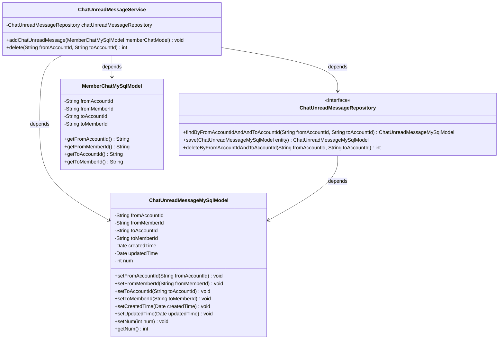
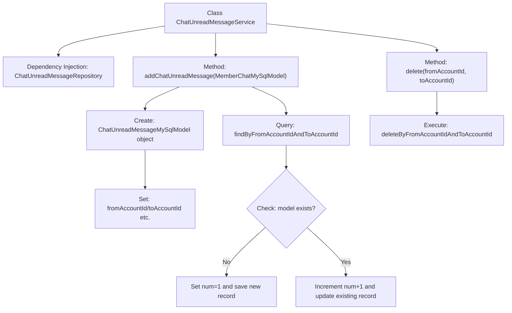

# Basic Information

|      |      |
|------|------|
| Name | ChatUnreadMessageService |
| Language | .java |
| Code Path | WeFe/board/board-service/src/main/java/com/welab/wefe/board/service/service/ChatUnreadMessageService.java |
| Package Name | com.welab.wefe.board.service.service |
| Dependencies | ['com.welab.wefe.board.service.database.entity.chat.ChatUnreadMessageMySqlModel', 'com.welab.wefe.board.service.database.entity.chat.MemberChatMySqlModel', 'com.welab.wefe.board.service.database.repository.ChatUnreadMessageRepository', 'org.springframework.beans.factory.annotation.Autowired', 'org.springframework.stereotype.Service', 'java.util.Date'] |
| Brief Description | The ChatUnreadMessageService class operates on unread message data through chatUnreadMessageRepository. The addChatUnreadMessage method adds or increments the unread message count, while the delete method removes unread message records for specified sender and recipient accounts. |

# Description

This is a Spring service class named ChatUnreadMessageService, primarily used for managing unread chat messages. It interacts with the database through ChatUnreadMessageRepository. Key functionalities include: 1. Incrementing the unread message count—if no record exists, a new record is created and set to 1; otherwise, the count of the existing record is incremented by 1; 2. Deleting unread message records between specified sender and recipient account IDs, returning the number of deleted records. The class handles account IDs of message senders and recipients, member IDs, as well as creation and update timestamps.

# Class Summary

| Name   | Type  | Description |
|-------|------|-------------|
| ChatUnreadMessageService | class | The ChatUnreadMessageService class provides unread message management functionality, including methods for incrementing unread message counts and deleting records, utilizing Repository for database operations. |

## Class ChatUnreadMessageService

|      |      |
|------|------|
| Access Modifier | @Service;public |
| Type | class |
| Name | ChatUnreadMessageService |
| Description | The ChatUnreadMessageService class provides unread message management functionality, including methods for incrementing unread message counts and deleting records, utilizing Repository for database operations. |

### UML Class Diagram

This code demonstrates a service class ChatUnreadMessageService for handling unread messages, which interacts with the database through the ChatUnreadMessageRepository interface. Its main functionalities include incrementing unread message counts (creating new records when messages don't exist, updating counts when they do) and deleting unread records for specified sender/receiver pairs. The class diagram clearly illustrates the dependency relationships between the service class, data models (MemberChatMySqlModel and ChatUnreadMessageMySqlModel), and repository interface, embodying a typical Spring service-layer architectural pattern.

### Internal Method Call Graph

This flowchart illustrates the core logic of the ChatUnreadMessageService class, which primarily includes two functionalities: incrementing unread message count (addChatUnreadMessage) and deleting unread message records (delete). When incrementing the message count, it first creates a new model object and sets basic properties, then checks whether a record already exists. If not, it creates a new record (num=1); if exists, it increments the count (num+1). The delete functionality directly calls the repository layer's delete method. The entire process clearly demonstrates the interaction logic between the service layer and repository layer.

### Field List

| Name  | Type  | Description |
|-------|-------|------|
| chatUnreadMessageRepository | ChatUnreadMessageRepository | Using @Autowired to automatically inject an instance of ChatUnreadMessageRepository. |

### Method List

| Name  | Type  | Description |
|-------|-------|------|
| addChatUnreadMessage | void | The method is used to add an unread message record. If the record does not exist, a new record is created with the unread count set to 1; if it exists, the unread count is incremented by 1. The record is then updated or saved to the database. |
| delete | int | Delete unread chat messages for specified sender and recipient, returning the number of deletions. |

