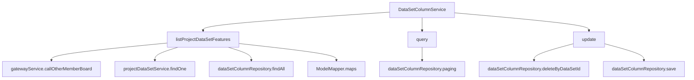
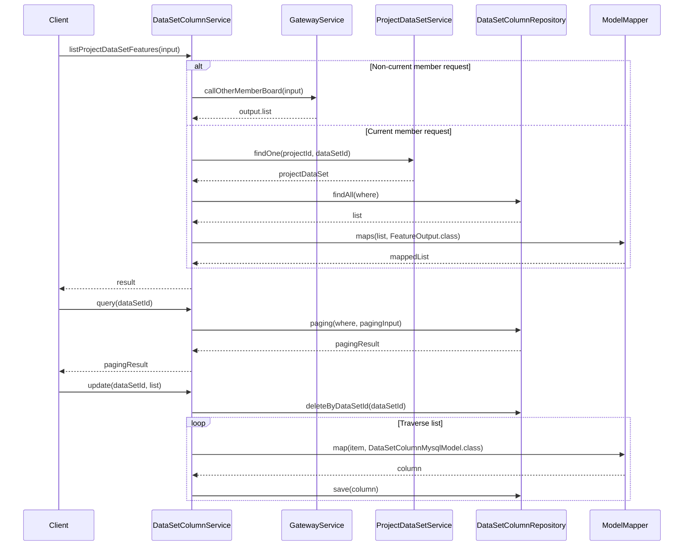

# Basic Information

|      |      |
|------|------|
| Name | DataSetColumnService |
| Language | .java |
| Code Path | WeFe/board/board-service/src/main/java/com/welab/wefe/board/service/service/DataSetColumnService.java |
| Package Name | com.welab.wefe.board.service.service |
| Dependencies | ['com.welab.wefe.board.service.api.project.dataset.GetFeaturesApi', 'com.welab.wefe.board.service.database.entity.data_set.DataSetColumnMysqlModel', 'com.welab.wefe.board.service.database.entity.job.ProjectDataSetMySqlModel', 'com.welab.wefe.board.service.database.repository.DataSetColumnRepository', 'com.welab.wefe.board.service.dto.base.PagingInput', 'com.welab.wefe.board.service.dto.base.PagingOutput', 'com.welab.wefe.board.service.dto.entity.data_set.DataSetColumnInputModel', 'com.welab.wefe.board.service.dto.entity.data_set.DataSetColumnOutputModel', 'com.welab.wefe.board.service.dto.vo.FeatureOutput', 'com.welab.wefe.common.data.mysql.Where', 'com.welab.wefe.common.data.mysql.enums.OrderBy', 'com.welab.wefe.common.exception.StatusCodeWithException', 'com.welab.wefe.common.web.util.ModelMapper', 'com.welab.wefe.common.wefe.enums.AuditStatus', 'org.springframework.beans.factory.annotation.Autowired', 'org.springframework.data.jpa.domain.Specification', 'org.springframework.stereotype.Service', 'java.util.List'] |
| Brief Description | The DataSetColumnService provides functionalities for querying dataset feature lists, paginated queries, and updates. It invokes other member feature lists via the gateway, checks the dataset status, and returns feature data. It supports paginated field queries by dataset ID and allows updating dataset field information. |

# Description

The DataSetColumnService is a service class designed to manage operations related to dataset columns. Its primary functionalities include: retrieving the feature list of datasets within a project and accessing feature data of other members via gateway calls; querying dataset column information with support for pagination; and updating dataset columns by first deleting existing columns and then saving new column data. This class relies on DataSetColumnRepository and ProjectDataSetService for data operations, while also handling member ID validation and dataset review status checks.

# Class Summary

| Name   | Type  | Description |
|-------|------|-------------|
| DataSetColumnService | class | The DataSetColumnService provides functionalities for querying dataset feature lists, paginated queries, and updates. It invokes other member feature lists via the gateway, supports querying and updating column information by dataset ID, and ensures data consistency and sorting. |


## Class DataSetColumnService

|      |      |
|------|------|
| Access Modifier | @Service;public |
| Type | class |
| Name | DataSetColumnService |
| Description | The DataSetColumnService provides functionalities for querying dataset feature lists, paginated queries, and updates. It invokes other member feature lists via the gateway, supports querying and updating column information by dataset ID, and ensures data consistency and sorting. |


### UML Class Diagram

```mermaid
classDiagram
    class DataSetColumnService {
        -DataSetColumnRepository dataSetColumnRepository
        -ProjectDataSetService projectDataSetService
        +listProjectDataSetFeatures(GetFeaturesApi$Input input) List~FeatureOutput~
        +query(String dataSetId) PagingOutput~DataSetColumnOutputModel~
        +update(String dataSetId, List~DataSetColumnInputModel~ list) void
    }

    class AbstractService {
        <<abstract>>
    }

    class DataSetColumnRepository {
        <<Interface>>
        +findAll(Specification~DataSetColumnMysqlModel~ where) List~DataSetColumnMysqlModel~
        +paging(Specification~DataSetColumnMysqlModel~ where, PagingInput paging, Class~R~ clazz) PagingOutput~R~
        +deleteByDataSetId(String dataSetId) void
        +save(DataSetColumnMysqlModel column) void
    }

    class ProjectDataSetService {
        +findOne(String projectId, String dataSetId) ProjectDataSetMySqlModel
    }

    class GetFeaturesApi {
        class Input {
            +String memberId
            +String projectId
            +String dataSetId
        }
        class Output {
            +List~FeatureOutput~ list
        }
    }

    class FeatureOutput {
        // Feature output model
    }

    class DataSetColumnMysqlModel {
        +String dataSetId
        +int index
        // Other fields...
    }

    class DataSetColumnOutputModel {
        // Dataset column output model
    }

    class DataSetColumnInputModel {
        // Dataset column input model
    }

    class Where {
        +create() WhereBuilder
    }

    class ModelMapper {
        <<static>>
        +maps(List~S~ source, Class~D~ destinationClass) List~D~
        +map(S source, Class~D~ destinationClass) D
    }

    DataSetColumnService --> DataSetColumnRepository : Dependency
    DataSetColumnService --> ProjectDataSetService : Dependency
    DataSetColumnService --> GetFeaturesApi : Dependency
    DataSetColumnService --> ModelMapper : Dependency
    DataSetColumnService --> Where : Dependency
    DataSetColumnService --|> AbstractService : Inheritance
    DataSetColumnRepository ..> DataSetColumnMysqlModel : Operates
    ProjectDataSetService ..> ProjectDataSetMySqlModel : Operates
    GetFeaturesApi ..> FeatureOutput : Contains
```

This diagram illustrates the DataSetColumnService class and its related dependencies. DataSetColumnService inherits from AbstractService, depends on DataSetColumnRepository and ProjectDataSetService for data operations, utilizes ModelMapper for model conversion, and Where for query condition construction. GetFeaturesApi contains input/output models, FeatureOutput represents feature data, while DataSetColumnMysqlModel/InputModel/OutputModel handle column data storage and transmission respectively. The overall structure clearly demonstrates the service layer's data processing and business logic relationships.


### Internal Method Call Graph





Flowchart Description: This flowchart illustrates the invocation relationships of three core methods in the DataSetColumnService class. The listProjectDataSetFeatures method handles data requests from different members through conditional branching, potentially invoking gateway services or local database queries. The query method directly performs paginated queries for dataset column information. The update method first clears old data and then batch-saves new data. The sequence diagram details the inter-service interaction sequence and data flow process within each method.

### Field List

| Name  | Type  | Description |
|-------|-------|------|
| projectDataSetService | ProjectDataSetService | Use @Autowired to automatically inject an instance of ProjectDataSetService. |
| dataSetColumnRepository | DataSetColumnRepository | Use @Autowired to automatically inject an instance of DataSetColumnRepository. |

### Method List

| Name  | Type  | Description |
|-------|-------|------|
| query | PagingOutput<DataSetColumnOutputModel> | This method queries field columns based on the dataset ID and returns results in paginated form, with a default of 10,000 entries per page sorted in ascending order by index. |
| listProjectDataSetFeatures | List<FeatureOutput> | This method retrieves the feature list of a project dataset based on input parameters. If requesting data from other members, it invokes through the gateway; otherwise, it queries the local database and returns the matching feature list. |
| update | void | This method is used to update dataset columns: first delete all columns of the specified dataset, then save the new column data, including the dataset ID and index. |


