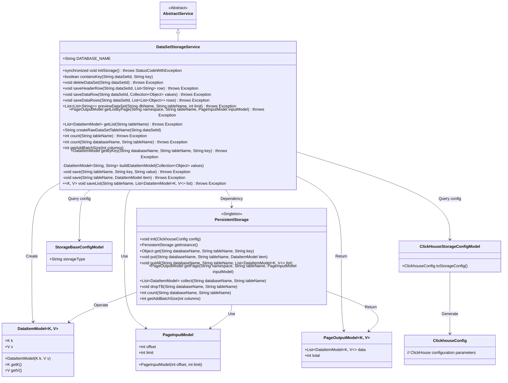
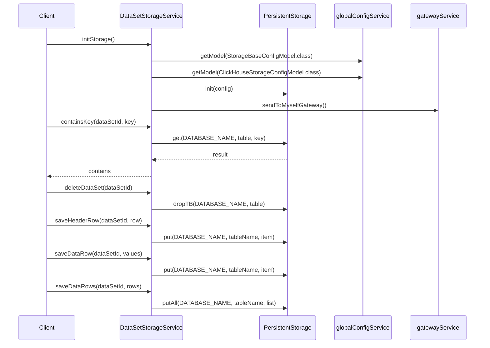

# Basic Information

|      |      |
|------|------|
| Name | DataSetStorageService |
| Language | .java |
| Code Path | WeFe/board/board-service/src/main/java/com/welab/wefe/board/service/service/DataSetStorageService.java |
| Package Name | com.welab.wefe.board.service.service |
| Dependencies | ['com.alibaba.fastjson.JSON', 'com.welab.wefe.common.data.storage.common.Constant', 'com.welab.wefe.common.data.storage.model.DataItemModel', 'com.welab.wefe.common.data.storage.model.PageInputModel', 'com.welab.wefe.common.data.storage.model.PageOutputModel', 'com.welab.wefe.common.data.storage.service.persistent.PersistentStorage', 'com.welab.wefe.common.exception.StatusCodeWithException', 'com.welab.wefe.common.util.StringUtil', 'com.welab.wefe.common.wefe.dto.global_config.storage.ClickHouseStorageConfigModel', 'com.welab.wefe.common.wefe.dto.global_config.storage.StorageBaseConfigModel', 'com.welab.wefe.common.wefe.dto.storage.ClickhouseConfig', 'com.welab.wefe.common.wefe.enums.GatewayProcessorType', 'org.springframework.stereotype.Service', 'java.util.ArrayList', 'java.util.Collection', 'java.util.List', 'java.util.stream.Collectors'] |
| Brief Description | The DataSetStorageService provides dataset storage management functionalities, including initializing storage, checking key existence, deleting datasets, saving and reading data rows, paginated queries, and data preview operations, with support for the ClickHouse storage type. |

# Description

The DataSetStorageService is a service class for dataset storage management, inheriting from AbstractService. It provides functionalities such as initializing storage, checking key existence, deleting datasets, saving dataset headers and row data, previewing datasets, paginated data reading, and retrieving record counts. The service supports multiple storage types like ClickHouse and performs underlying operations through PersistentStorage. Methods include synchronous storage initialization, key-value queries, batch data saving, paginated data retrieval, while handling data conversion and table name generation.

# Class Summary

| Name   | Type  | Description |
|-------|------|-------------|
| DataSetStorageService | class | The DataSetStorageService provides dataset storage management functionalities, including initializing storage, checking key existence, deleting datasets, saving data rows and metadata, paginated queries, counting operations, and supports ClickHouse as a storage type. |

## Class DataSetStorageService

|      |      |
|------|------|
| Access Modifier | @Service;public |
| Type | class |
| Name | DataSetStorageService |
| Description | The DataSetStorageService provides dataset storage management functionalities, including initializing storage, checking key existence, deleting datasets, saving data rows and metadata, paginated queries, counting operations, and supports ClickHouse as a storage type. |

### UML Class Diagram

This code demonstrates a dataset storage service `DataSetStorageService`, which inherits from `AbstractService` and is primarily responsible for dataset storage, querying, deletion, and other operations. The class interacts with the underlying storage system through the `PersistentStorage` singleton, supporting storage types like ClickHouse. Core functionalities include storage initialization, saving dataset header information/data rows, paginated queries, and dataset previews. The class diagram clearly illustrates the relationships with configuration models (`StorageBaseConfigModel`/`ClickHouseStorageConfigModel`), data models (`DataItemModel`), and pagination models (`PageInputModel`/`PageOutputModel`), reflecting a complete data storage processing workflow.

### Internal Method Call Graph

```mermaid
graph TD
    A["Class DataSetStorageService"]
    B["Constant: DATABASE_NAME"]
    C["Method: initStorage()"]
    D["Method: containsKey()"]
    E["Method: deleteDataSet()"]
    F["Method: saveHeaderRow()"]
    G["Method: saveDataRow()"]
    H["Method: saveDataRows()"]
    I["Method: buildDataItemModel()"]
    J["Method: previewDataSet()"]
    K["Method: save()"]
    L["Method: saveList()"]
    M["Method: getListByPage()"]
    N["Method: getList()"]
    O["Method: createRawDataSetTableName()"]
    P["Method: count()"]
    Q["Method: getAddBatchSize()"]
    R["Method: getByKey()"]
    S["Call: PersistentStorage.getInstance()"]

    A --> B
    A --> C
    A --> D
    A --> E
    A --> F
    A --> G
    A --> H
    A --> I
    A --> J
    A --> K
    A --> L
    A --> M
    A --> N
    A --> O
    A --> P
    A --> Q
    A --> R
    D --> S
    E --> S
    F --> S
    G --> S
    H --> S
    J --> S
    K --> S
    L --> S
    M --> S
    N --> S
    P --> S
    Q --> S
    R --> S
```

This code implements a dataset storage service with core functionalities including storage initialization, key existence checking, dataset deletion, header/row data saving, and dataset preview. The core logic revolves around the PersistentStorage class, whose methods are invoked to achieve data persistence. The class diagram illustrates the structure and method invocation relationships, while the sequence diagram details the execution flow and component interactions of key methods. The service supports multiple storage types (e.g., ClickHouse) and implements notification mechanisms through gatewayService.

### Field List

| Name  | Type  | Description |
|-------|-------|------|
| DATABASE_NAME = Constant.DBName.WEFE_DATA | String | The static constant DATABASE_NAME, with the value WEFE_DATA, is referenced from Constant.DBName. |

### Method List

| Name  | Type  | Description |
|-------|-------|------|
| saveDataRow | void | Save dataset row data to the specified table, with parameters being the dataset ID and value collection, may throw exceptions. |
| initStorage | void | The synchronous method `initStorage` initializes the storage based on the configuration. If the type is `CLICKHOUSE`, it loads the configuration and initializes the persistent storage, then notifies the gateway to refresh upon completion. |
| getListByPage | PageOutputModel | This method retrieves paginated data by passing namespace, table name, and pagination parameters to the persistent storage instance, then returns the results. It throws an Exception in case of errors. |
| buildDataItemModel | DataItemModel<String, String> | Construct the DataItemModel method, iterate through the collection, use the first element as the key, and concatenate the remaining elements into a comma-separated string for return. |
| saveHeaderRow | void | The method `saveHeaderRow` processes the header row of a dataset: it extracts the first element as `sid` and the remaining elements as `header`. After converting `sid` and `header` into a JSON string, it saves them to the `.meta` table named after the dataset ID. |
| save | void | This method is used to save data items into a specified database table by invoking the persistence storage interface to perform the storage operation. |
| containsKey | boolean | Check if a specified key exists in the dataset table. Return true if it exists, otherwise false. Log the error and return false in case of an exception. |
| previewDataSet | List<List<String>> | This method retrieves paginated data from the specified database table, converts the keys and comma-separated values of each row into a string list, and returns a collection of lists containing all rows. |
| getList | List<DataItemModel> | This method retrieves the data list of a specified table through PersistentStorage, returning a collection of DataItemModel, and may throw exceptions. |
| createRawDataSetTableName | String | This method generates dataset table names in the format of "data_set_" followed by the dataset ID. |
| count | int | This method is used to count the number of data rows in a specified database table by invoking the count method of the persistence storage instance. It requires passing the database name and table name as parameters and may throw exceptions. |
| save | void | Save data to persistent storage: Specify the database name, table name, and key-value pairs. Throw an exception on failure. |
| saveList | void | Java method saveList: Saves a list of DataItemModel into the specified database table, using generics K, V, and may throw exceptions. |
| saveDataRows | void | The method `saveDataRows` receives a dataset ID and a list of row data, converts each row of data into a `DataItemModel` object, and then saves it to the specified data table. |
| deleteDataSet | void | Delete the specified dataset by generating table names and invoking the persistent storage interface to remove the corresponding database tables. |
| count | int | This method counts the number of data entries in a specified database table through a PersistentStorage instance, with parameters being the database name and table name, and may throw exceptions. |
| getAddBatchSize | int | This method returns the batch addition size corresponding to the specified number of columns, implemented by invoking the getAddBatchSize method of the PersistentStorage singleton. |
| getByKey | DataItemModel | Retrieve data items based on the database name, table name, and key value, and throw an error if an exception occurs. |

