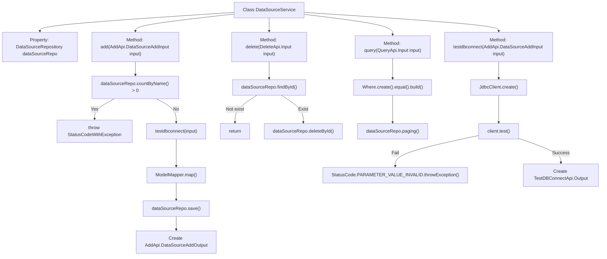

# Basic Information

|      |      |
|------|------|
| Name | DataSourceService |
| Language | .java |
| Code Path | WeFe/board/board-service/src/main/java/com/welab/wefe/board/service/service/DataSourceService.java |
| Package Name | com.welab.wefe.board.service.service |
| Dependencies | ['com.welab.wefe.board.service.api.datasource.AddApi', 'com.welab.wefe.board.service.api.datasource.DeleteApi', 'com.welab.wefe.board.service.api.datasource.QueryApi', 'com.welab.wefe.board.service.api.datasource.TestDBConnectApi', 'com.welab.wefe.board.service.database.entity.DataSourceMysqlModel', 'com.welab.wefe.board.service.database.repository.DataSourceRepository', 'com.welab.wefe.board.service.dto.base.PagingOutput', 'com.welab.wefe.common.StatusCode', 'com.welab.wefe.common.data.mysql.Where', 'com.welab.wefe.common.exception.StatusCodeWithException', 'com.welab.wefe.common.jdbc.JdbcClient', 'com.welab.wefe.common.web.util.CurrentAccountUtil', 'com.welab.wefe.common.web.util.ModelMapper', 'org.springframework.beans.factory.annotation.Autowired', 'org.springframework.data.jpa.domain.Specification', 'org.springframework.stereotype.Service'] |
| Brief Description | The DataSourceService provides data source management functionalities, including adding (with name uniqueness validation and connection testing), deleting, and paginated querying of data sources, as well as testing database connections. |

# Description

DataSourceService is a service class that provides data source management functionalities. Key methods include: checking for duplicate names and testing connection validity when adding a data source, then saving the data source information; deleting a data source by specified ID; querying data sources with pagination; and testing whether a database connection is available. Parameter validity is verified during addition and connection testing, with exceptions thrown upon operation failure. Data storage utilizes DataSourceRepository, with the model being DataSourceMysqlModel.

# Class Summary

| Name   | Type  | Description |
|-------|------|-------------|
| DataSourceService | class | The DataSourceService provides data source management functionalities, including adding (with validation for name uniqueness and connection testing), deleting, and paginated querying of data sources, as well as testing database connections. |


## Class DataSourceService

|      |      |
|------|------|
| Access Modifier | @Service;public |
| Type | class |
| Name | DataSourceService |
| Description | The DataSourceService provides data source management functionalities, including adding (with validation for name uniqueness and connection testing), deleting, and paginated querying of data sources, as well as testing database connections. |


### UML Class Diagram

```mermaid
classDiagram
    class AbstractService {
        <<Abstract>>
    }

    class DataSourceService {
        -DataSourceRepository dataSourceRepo
        +add(AddApi.DataSourceAddInput input) AddApi.DataSourceAddOutput
        +delete(DeleteApi.Input input) void
        +query(QueryApi.Input input) PagingOutput~QueryApi.Output~
        +testdbconnect(AddApi.DataSourceAddInput input) TestDBConnectApi.Output
    }

    class DataSourceRepository {
        <<Interface>>
        +countByName(String name) long
        +save(DataSourceMysqlModel model) void
        +deleteById(Long id) void
        +findById(Long id) Optional~DataSourceMysqlModel~
        +paging(Specification~DataSourceMysqlModel~ where, QueryApi.Input input, Class~QueryApi.Output~ clazz) PagingOutput~QueryApi.Output~
    }

    class DataSourceMysqlModel {
        -Long id
        -String name
        -String createdBy
        +setCreatedBy(Long id) void
        +getId() Long
    }

    class JdbcClient {
        <<Static>>
        +create(String databaseType, String host, int port, String userName, String password, String databaseName) JdbcClient
        +test() String
    }

    class StatusCodeWithException {
        +StatusCodeWithException(StatusCode code, String message)
    }

    class AddApi {
        class DataSourceAddInput {
            -String name
            -String databaseType
            -String host
            -int port
            -String userName
            -String password
            -String databaseName
        }
        class DataSourceAddOutput {
            -Long id
            +setId(Long id) void
        }
    }

    class DeleteApi {
        class Input {
            -Long id
        }
    }

    class QueryApi {
        class Input {
            -String name
        }
        class Output {
        }
    }

    class TestDBConnectApi {
        class Output {
            -boolean result
            +setResult(boolean result) void
        }
    }

    AbstractService <|-- DataSourceService
    DataSourceService --> DataSourceRepository : depends
    DataSourceService --> JdbcClient : depends
    DataSourceService --> StatusCodeWithException : depends
    DataSourceService --> AddApi.DataSourceAddInput : uses
    DataSourceService --> AddApi.DataSourceAddOutput : uses
    DataSourceService --> DeleteApi.Input : uses
    DataSourceService --> QueryApi.Input : uses
    DataSourceService --> QueryApi.Output : uses
    DataSourceService --> TestDBConnectApi.Output : uses
    DataSourceRepository --> DataSourceMysqlModel : operates
```

This code describes a data source service class (DataSourceService) that inherits from an abstract service class (AbstractService), primarily providing CRUD functionality for data sources. The class diagram illustrates the interaction relationships between DataSourceService and multiple classes, including the data access interface DataSourceRepository, database connection testing class JdbcClient, exception class StatusCodeWithException, and several API input/output data transfer objects. The service class uses the data access interface through dependency injection to operate on the data source model while also providing functionality to test database connections. The overall design adopts a layered architecture, with the service layer handling business logic and the data access layer managing persistence operations.


### Internal Method Call Graph



This code implements DataSourceService, primarily containing CRUD operations and connection testing for datasources. The flowchart illustrates the class structure and key method invocation relationships, including core processes like datasource name validation, database connection testing, model mapping persistence, as well as branch handling for deletion and query operations. Each method clearly demonstrates its internal invocation steps and exception handling paths through directional arrows.

### Field List

| Name  | Type  | Description |
|-------|-------|------|
| dataSourceRepo | DataSourceRepository | Automatically inject data source repository instances. |

### Method List

| Name  | Type  | Description |
|-------|-------|------|
| testdbconnect | TestDBConnectApi.Output | Test database connection method, which takes input parameters to create a JDBC client and tests the connection, throwing an exception on failure and returning the result on success. |
| delete | void | The method searches for data in the database based on the input ID, and if it exists, deletes the corresponding record. |
| add | AddApi.DataSourceAddOutput | The method `add` takes the input parameter `input`, checks whether the data source name already exists, tests the database connection, maps and saves the model, and returns the output containing the ID. If the name is duplicated or the connection fails, an exception is thrown. |
| query | PagingOutput<QueryApi.Output> | This method queries the data source based on input parameters and returns paginated results. It uses a condition builder to create query conditions, matches the name field, and invokes the repository's pagination method to obtain the output. |


