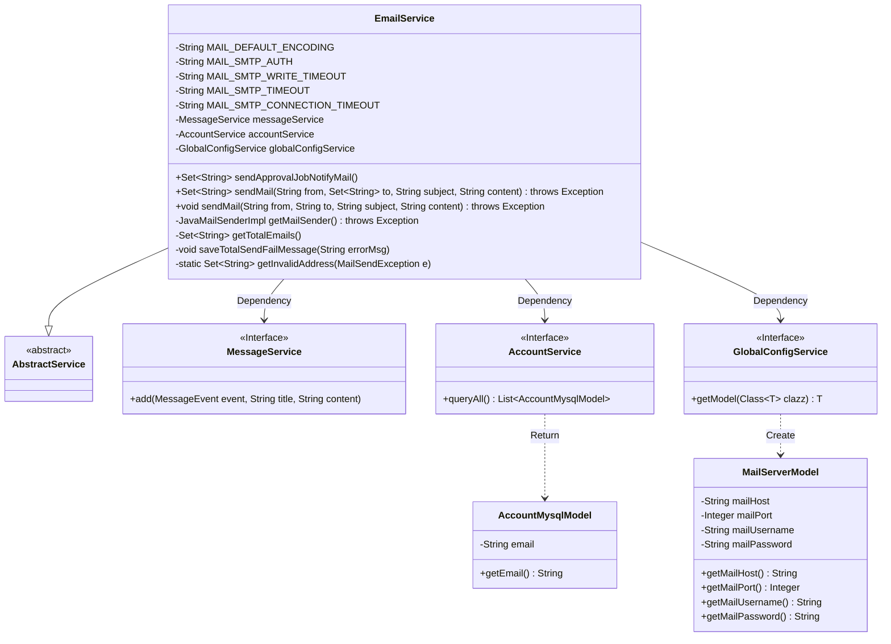
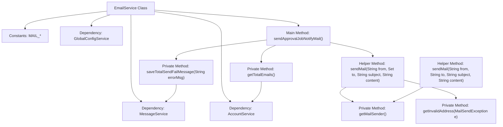

# Basic Information

|      |      |
|------|------|
| Name | EmailService |
| Language | .java |
| Code Path | WeFe/board/board-service/src/main/java/com/welab/wefe/board/service/service/EmailService.java |
| Package Name | com.welab.wefe.board.service.service |
| Dependencies | ['com.welab.wefe.board.service.database.entity.AccountMysqlModel', 'com.welab.wefe.board.service.service.account.AccountService', 'com.welab.wefe.board.service.service.globalconfig.GlobalConfigService', 'com.welab.wefe.common.util.StringUtil', 'com.welab.wefe.common.wefe.dto.global_config.MailServerModel', 'com.welab.wefe.common.wefe.enums.MessageEvent', 'org.apache.commons.collections4.CollectionUtils', 'org.springframework.beans.factory.annotation.Autowired', 'org.springframework.mail.MailSendException', 'org.springframework.mail.javamail.JavaMailSenderImpl', 'org.springframework.mail.javamail.MimeMessageHelper', 'org.springframework.stereotype.Service', 'javax.mail.Address', 'javax.mail.SendFailedException', 'javax.mail.internet.MimeMessage', 'java.util.HashSet', 'java.util.List', 'java.util.Properties', 'java.util.Set'] |
| Brief Description | The EmailService class provides email sending functionality, supporting batch sending of approval notification emails, handling retries for invalid addresses, and logging failed delivery information. It relies on global configuration to obtain SMTP parameters, including timeout and encoding settings. |

# Description

The EmailService is a service class designed for sending emails, inheriting from AbstractService. It includes multiple email-sending related methods and configuration parameters, such as encoding and SMTP timeout settings. Its primary functions encompass sending approval task notification emails, handling send failures, filtering invalid recipient addresses, and resending emails. The service relies on MessageService, AccountService, and GlobalConfigService to retrieve recipient lists and email server configurations. When sending emails, it verifies whether the server configuration is complete and handles potential exceptions, such as invalid addresses or send failures. In case of failure, it logs error messages and returns a list of failed addresses.

# Class Summary

| Name   | Type  | Description |
|-------|------|-------------|
| EmailService | class | The EmailService provides email sending functionality, supporting batch sending of approval notification emails, automatically filtering invalid addresses and retrying, including email server configuration and error handling. |

## Class EmailService

|      |      |
|------|------|
| Access Modifier | @Service;public |
| Type | class |
| Name | EmailService |
| Description | The EmailService provides email sending functionality, supporting batch sending of approval notification emails, automatically filtering invalid addresses and retrying, including email server configuration and error handling. |

### UML Class Diagram

This code illustrates an email service class `EmailService` that inherits from `AbstractService` and depends on three service interfaces: `MessageService`, `AccountService`, and `GlobalConfigService`. Its primary functionalities include sending approval task notification emails, handling email sending failures, and retrieving mail server configurations. The class diagram clearly depicts inheritance and dependency relationships between classes, along with each class's member variables and methods. `EmailService` obtains `MailServerModel` configuration via `GlobalConfigService`, fetches email address lists from `AccountMysqlModel` through `AccountService`, and records failed sending attempts via `MessageService`.

### Internal Method Call Graph

This code represents an email service implementation class, whose main functionalities include sending approval task notification emails and general email delivery. The flowchart illustrates the core method invocation relationships: The main method sendApprovalJobNotifyMail() retrieves recipient lists via getTotalEmails(), uses sendMail() to dispatch emails, and invokes saveTotalSendFailMessage() to log errors when exceptions occur. The core email sending logic relies on getMailSender() to create mail senders and handles exceptions like invalid addresses. The entire process demonstrates the complete email delivery workflow and exception handling mechanism.

### Field List

| Name  | Type  | Description |
|-------|-------|------|
| globalConfigService | GlobalConfigService | The code snippet uses the @Autowired annotation to automatically inject an instance of GlobalConfigService. |
| MAIL_DEFAULT_ENCODING = "UTF-8" | String | Define the constant string MAIL_DEFAULT_ENCODING with the value UTF-8, representing the default email encoding format. |
| accountService | AccountService | Use @Autowired to automatically inject an instance of AccountService. |
| MAIL_SMTP_CONNECTION_TIMEOUT = "30000" | String | Define the SMTP connection timeout for emails as 30000 milliseconds. |
| MAIL_SMTP_AUTH = "true" | String | The code defines a static constant string MAIL_SMTP_AUTH with the value "true", which is used for SMTP authentication configuration. |
| MAIL_SMTP_WRITE_TIMEOUT = "30000" | String | Define a static constant for the email SMTP write timeout as 30000 milliseconds. |
| messageService | MessageService | Automatically inject the MessageService instance. |
| MAIL_SMTP_TIMEOUT = "30000" | String | The code defines a private static constant string MAIL_SMTP_TIMEOUT with the value "30000", indicating an SMTP email sending timeout of 30 seconds. |

### Method List

| Name  | Type  | Description |
|-------|-------|------|
| getMailSender | JavaMailSenderImpl | Get the mail sender instance, check the required server configuration items, set SMTP parameters, and return the JavaMailSenderImpl object. |
| sendApprovalJobNotifyMail | Set<String> | Method for sending approval task emails, handling failure scenarios: check recipient list, filter invalid addresses and resend upon failure, log error messages. |
| getTotalEmails | Set<String> | This method queries the email addresses of all accounts, filters out null values, and stores them in a Set before returning. |
| saveTotalSendFailMessage | void | The method `saveTotalSendFailMessage` records the failure information of approval task email sending and invokes `messageService.add` to store the event type, title, and error message. |
| sendMail | void | This method is used to send emails, including parameters for sender, recipient, subject, and content. It utilizes JavaMailSender to dispatch the email, captures and logs any exceptions before rethrowing them. |
| sendMail | Set<String> | Java Email Sending Method: Use JavaMailSender to send emails with attachments, handle invalid address exceptions and return a collection of invalid addresses, while directly throwing other exceptions. Returns an empty collection upon success. |
| getInvalidAddress | Set<String> | The method extracts invalid addresses from email sending exceptions, iterates through the exceptions in the failure messages, and if it encounters a SendFailedException, collects the invalid addresses into a set and returns them. |

