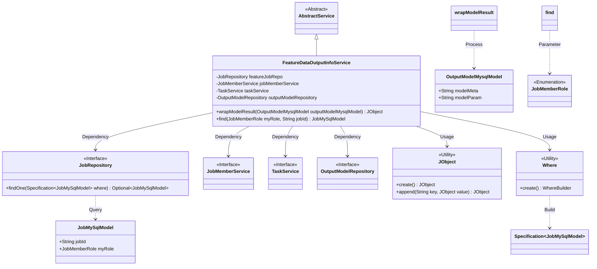
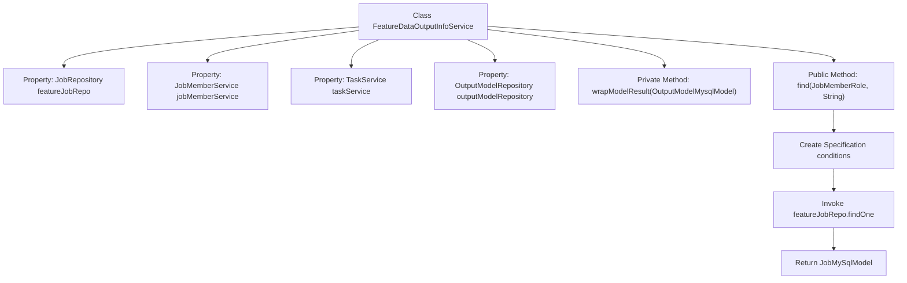

# Basic Information

|      |      |
|------|------|
| Name | FeatureDataOutputInfoService |
| Language | .java |
| Code Path | WeFe/board/board-service/src/main/java/com/welab/wefe/board/service/service/FeatureDataOutputInfoService.java |
| Package Name | com.welab.wefe.board.service.service |
| Dependencies | ['com.welab.wefe.board.service.database.entity.OutputModelMysqlModel', 'com.welab.wefe.board.service.database.entity.job.JobMySqlModel', 'com.welab.wefe.board.service.database.repository.JobRepository', 'com.welab.wefe.board.service.database.repository.OutputModelRepository', 'com.welab.wefe.common.data.mysql.Where', 'com.welab.wefe.common.util.JObject', 'com.welab.wefe.common.wefe.enums.JobMemberRole', 'org.springframework.beans.factory.annotation.Autowired', 'org.springframework.data.jpa.domain.Specification', 'org.springframework.stereotype.Service'] |
| Brief Description | The FeatureDataOutputInfoService class inherits from AbstractService and includes task query and result encapsulation functionalities. It implements task fuzzy matching through dependencies like JobRepository, while the wrapModelResult method encapsulates model metadata and parameters. |

# Description

The code defines a Spring service class named `FeatureDataOutputInfoService`, which extends `AbstractService`. It injects four dependencies: `JobRepository`, `JobMemberService`, `TaskService`, and `OutputModelRepository`. The class contains two main methods: `wrapModelResult` is used to encapsulate an `OutputModelMysqlModel` object into `JObject` format; the `find` method performs a fuzzy match query for `JobMySqlModel` records by task ID and role, using `Specification` to construct query conditions and fetching results from `featureJobRepo`. The entire class primarily handles business logic related to feature data output.

# Class Summary

| Name   | Type  | Description |
|-------|------|-------------|
| FeatureDataOutputInfoService | class | The FeatureDataOutputInfoService service class includes functionalities for wrapping model results and fuzzy-matching task records based on task IDs and names. It relies on components such as JobRepository to provide data operation support. |

## Class FeatureDataOutputInfoService

|      |      |
|------|------|
| Access Modifier | @Service;public |
| Type | class |
| Name | FeatureDataOutputInfoService |
| Description | The FeatureDataOutputInfoService service class includes functionalities for wrapping model results and fuzzy-matching task records based on task IDs and names. It relies on components such as JobRepository to provide data operation support. |

### UML Class Diagram

This class diagram illustrates the core structure of FeatureDataOutputInfoService and its dependencies. As a subclass of AbstractService, it implements data access through four interfaces (JobRepository, JobMemberService, TaskService, OutputModelRepository) and relies on utility classes JObject and Where for data processing. The main method wrapModelResult is used to encapsulate model results, while the find method retrieves task records through conditional queries. The enumeration type JobMemberRole and entity classes JobMySqlModel, OutputModelMysqlModel collectively form the foundation of the business model.

### Internal Method Call Graph

This code illustrates a Spring service class FeatureDataOutputInfoService, which extends AbstractService and contains four auto-wired dependencies. Key functionalities include: 1) The private method wrapModelResult encapsulates output model metadata and parameters into JObject; 2) The public method find performs fuzzy matching queries by task ID and member role, using Specification to construct query conditions and retrieving data via repository. The flowchart clearly demonstrates the class structure, property dependencies, and method invocation relationships, particularly showcasing the complete query process of the find method from condition construction to result return.

### Field List

| Name  | Type  | Description |
|-------|-------|------|
| jobMemberService | JobMemberService | Using @Autowired to automatically inject an instance of JobMemberService. |
| taskService | TaskService | Automatically inject the TaskService instance. |
| outputModelRepository | OutputModelRepository | Using @Autowired to automatically inject an instance of OutputModelRepository. |
| featureJobRepo | JobRepository | Using @Autowired to automatically inject the JobRepository instance featureJobRepo. |

### Method List

| Name  | Type  | Description |
|-------|-------|------|
| wrapModelResult | JObject | Convert the OutputModelMysqlModel object into a JObject containing model_meta and model_param, returning an empty object if the input is null. |
| find | JobMySqlModel | This method queries the database based on the role and task ID, returning the matched JobMySqlModel object. It uses Specification to construct the query conditions and returns null if no match is found. |

